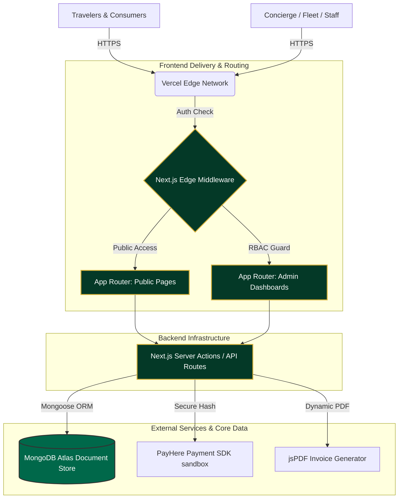

# Yatara Ceylon - Sovereign Tourism Management System (TOMS)

An exclusive, highly-curated luxury travel platform designed for high-net-worth foreign travelers seeking profound heritage experiences in Sri Lanka. This ecosystem includes an elite public interface with a premium glass-morphic design system, a dynamic map-based bespoke tour builder, and a robust administrative backend for Concierge, Fleet, and Finance management.

---

## 🏛️ Live Sovereign Access

**Public Gateway**: [https://yatara-ceylon.vercel.app](https://yatara-ceylon.vercel.app)

**Elite Concierge Portal (Admin)**:
Access the internal management dashboard using the official credentials:
- **Login Portal**: `/login` *(Glassmorphic Access)*
- **Username**: `admin@yataraceylon.com`
- **Password**: `Admin@123`

*(Note: The database natively seeds core 'Yatara Gems' via `npm run seed` if initializing a sandbox)*

---

## 💎 Elite Features & Architecture

### **The Public Journey:**
- **Signature Experiences**: A curated collection of Sri Lanka's finest pre-built itineraries (e.g., The Hill Country Tea Trail).
- **Interactive GeoJSON Explorer**: A custom map enabling guests to visually select districts, view curated 'Yatara Gems', and pull live data from the Headless CMS.
- **Bespoke Tour Builder**: A multi-day draft generator allowing granular customization of places, interests, and Sovereign Investment Scales (LKR Focus).
- **Premium Glassmorphic UI**: High-end aesthetic utilizing frosted glass, translucent dark gradients, and golden interactive hover effects for an elite user experience.
- **Dual Currency Engine**: Seamlessly converts internal LKR base pricing to USD aesthetics dynamically.
- **Concierge API Integration**: Direct floating Tawk.to chat bridge styled natively to the brand.

### **The Management Engine (TOMS):**
- **Multi-Role Protocol (RBAC)**: Secure routing systems granting distinct access to 5 tiers: `Admin`, `Staff`, `User`, `Vehicle Owner`, and `Hotel Owner`.
- **Financial Module & Receipt Generator**: Native Server-side generation of branded PDF 'Luxury Receipts' outlining Order IDs, Advances, Remaining Balances, and the official HQ Address (142 Sir James Peiris Mawatha, Colombo 02).
- **Automated Fleet Calendar**: Mongoose pre/post save hooks instantly block `VehicleBlock` databases when a booking confirms, eliminating double-booking flaws natively.
- **Supplier Rate Cards**: Instantly align Guide, Driver, or Hotel service providers with active client bookings.
- **PayHere Advance Gateway**: Dynamic 20% Advance calculation natively triggering the Sandbox PayHere SDK Popup.

---

## 📐 System Architecture

The following diagram illustrates the flow of data and interaction between the differing layers of the Yatara Ceylon platform.



---

## 📂 Project Folder Structure

The project utilizes a modern strict modular approach via Next.js App Router paradigm.

```text
ITP-Project-Tourism-WEB/
├── public/                 # Static assets (images, fonts, raw icons)
├── src/                    # Core source code
│   ├── app/                # Next.js App Router (Pages, Layouts, API Routes)
│   │   ├── (admin)/        # Authenticated portals with dedicated layouts
│   │   ├── (public)/       # Elite public-facing marketing & booking pages
│   │   ├── api/            # Serverless HTTP endpoints (auth, payhere, webhooks)
│   │   ├── auth/           # Login, registration, and role selection systems
│   │   └── globals.css     # Global stylesheets (Tailwind config & Liquid Glass classes)
│   ├── components/         # Reusable React UI Components
│   │   ├── admin/          # Dashboard specialized components (datatables, charts)
│   │   ├── layout/         # High-level structure (Navbar, Footer, Sidebars)
│   │   ├── public/         # Interactive public cards (DestinationCard, PackageCard)
│   │   └── ui/             # Shadcn base primitive components (Buttons, Inputs)
│   ├── lib/                # Utility core logic
│   │   ├── db.ts           # Mongoose native connection pooling strings
│   │   ├── utils.ts        # Tailwind merge & layout helpers
│   │   └── CurrencyContext # Dual LKR/USD real-time conversion state
│   └── models/             # Mongoose Schemas (User, Booking, Vehicle, Destination)
├── scripts/                # Database seeders to initially populating data
├── next.config.ts          # Core Next.js compilation, images, & environment settings
├── tailwind.config.ts      # UI Design System enforcing custom luxury colors/fonts
└── package.json            # NPM dependencies and script executions
```

---

## 🛠️ The Tech Stack

| Module | Technology | Purpose |
|-------------|--------------|----------------|
| **Framework** | Next.js | App Router, Server Actions, API Routes |
| **Aesthetics** | Tailwind CSS & shadcn/ui | Custom Deep Emerald (`#043927`) & Gold (`#D4AF37`) themes with liquid glass filters |
| **Logic** | TypeScript | Strict type safety across financial and map domains |
| **Database** | MongoDB & Mongoose 8.9 | High-performance document clustering |
| **Maps** | Leaflet.js | GeoJSON plotting and CircleMarker rendering |
| **Financials**| jsPDF & autoTable | Dynamic Server-Side PDF rendering |

---

## ⚙️ Initializing the System

### Prerequisites
- Node.js 18.x or higher
- MongoDB Atlas Connection String
- PayHere Sandbox Merchant Account

### 1. Installation

```bash
git clone https://github.com/sahansbandara/ITP-Project-Tourism-WEB.git
cd ITP-Project-Tourism-WEB
npm install
```

### 2. Environment Configuration

Create a `.env.local` file in the root structure matching this blueprint:

```env
# Database
MONGODB_URI=your_mongodb_cluster_string

# Authentication & Security
JWT_SECRET=your_secure_jwt_secret
NEXT_PUBLIC_APP_URL=http://localhost:3000

# PayHere Integration (Vercel Build Requirements)
PAYHERE_MODE=sandbox
PAYHERE_MERCHANT_ID=your_merchant_id
PAYHERE_MERCHANT_SECRET=your_merchant_secret
PAYHERE_CURRENCY=LKR
```

### 3. Native Seeding & Compilation

Populate the database with sample Sovereign Data, compile the TS framework, and start the local environment:

```bash
npm run seed
npm run build
npm run dev
```
Execute the build globally at `http://localhost:3000`.

---

## 📜 Official Office & Contact

**Yatara Ceylon Headquarters**
142 Sir James Peiris Mawatha,
Colombo 02, Sri Lanka

**Concierge Contact**: concierge@yataraceylon.com

---

## 🛡️ License
Distributed under the MIT License. See `LICENSE` for more information.
