<div align="center">

# 🏝️ Yatara Ceylon — Tourism Operations Management System

### *Luxury Sri Lankan Tourism · Intelligent Booking · Real-Time Finance*

[](https://nextjs.org/)
[](https://www.mongodb.com/)
[](https://www.typescriptlang.org/)
[](https://www.payhere.lk/)
[](#license)

---

*A full-stack Tourism Operations Management System (TOMS) built for **Yatara Ceylon**, a luxury inbound tourism operator in Sri Lanka. The platform manages the complete lifecycle — from public-facing package discovery to booking, 20% advance payment via PayHere, role-based dashboards, fleet & partner coordination, and real-time financial tracking.*

</div>

---

## 📑 Table of Contents

- [System Architecture](#-system-architecture)
- [Use Case Diagram](#-use-case-diagram)
- [Data Flow Diagram (DFD)](#-data-flow-diagram-dfd)
- [High-Level Flow](#-high-level-flow)
- [Tech Stack](#-tech-stack)
- [Management Modules](#-management-modules)
- [Role-Based Dashboards](#-role-based-dashboards)
- [Payment Integration](#-payment-integration)
- [Test Credentials](#-test-credentials)
- [Project Structure](#-project-structure)
- [Getting Started](#-getting-started)
- [Module Documentation](#-module-documentation)
- [API Reference](#-api-reference)
- [Security](#-security)
- [License](#-license)

---

## 🏗 System Architecture

The system follows a **layered architecture** separating the public tourism website, authentication layer, role-based portals, and backend operations.

<div align="center">
  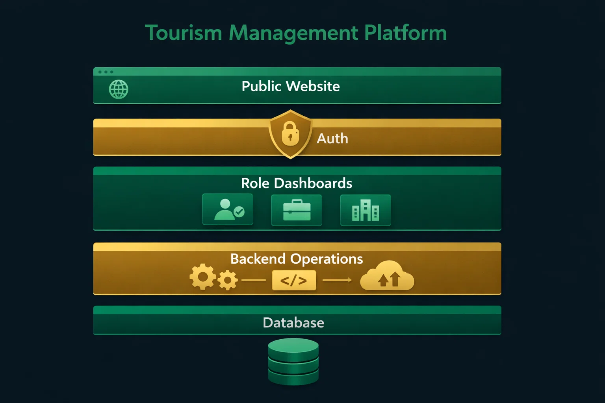
</div>

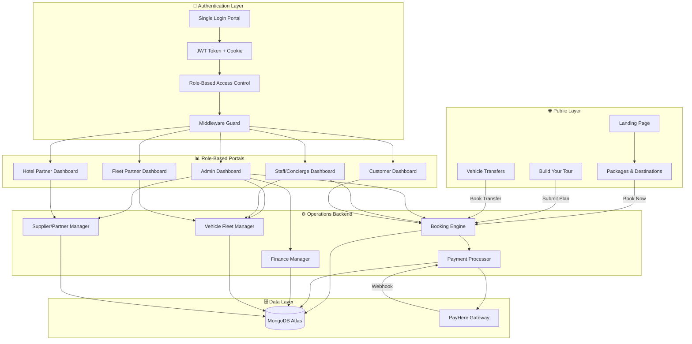
```mermaid
graph TB
    subgraph Public["🌐 Public Layer"]
        LP["Landing Page"]
        PKG["Packages & Destinations"]
        BT["Build Your Tour"]
        VH["Vehicle Transfers"]
    end

    subgraph Auth["🔐 Authentication Layer"]
        LOGIN["Single Login Portal"]
        JWT["JWT Token + Cookie"]
        RBAC["Role-Based Access Control"]
        MW["Middleware Guard"]
    end

    subgraph Dashboards["📊 Role-Based Portals"]
        AD["Admin Dashboard"]
        SD["Staff/Concierge Dashboard"]
        CD["Customer Dashboard"]
        FD["Fleet Partner Dashboard"]
        HD["Hotel Partner Dashboard"]
    end

    subgraph Backend["⚙️ Operations Backend"]
        BK["Booking Engine"]
        PM["Payment Processor"]
        FM["Finance Manager"]
        VM["Vehicle Fleet Manager"]
        SM["Supplier/Partner Manager"]
    end

    subgraph Data["🗄️ Data Layer"]
        DB[(MongoDB Atlas)]
        PH[PayHere Gateway]
    end

    LP --> PKG
    PKG -->|Book Now| BK
    BT -->|Submit Plan| BK
    VH -->|Book Transfer| BK
    BK --> PM
    PM --> PH
    PH -->|Webhook| PM

    LOGIN --> JWT --> RBAC --> MW
    MW --> AD & SD & CD & FD & HD

    AD --> BK & FM & VM & SM
    SD --> BK & VM
    CD --> BK
    FD --> VM
    HD --> SM

    BK & PM & FM & VM & SM --> DB
```

---

## 👤 Use Case Diagram

The Use Case Diagram illustrates the interactions between different user roles (actors) and the core functionalities of the TOMS platform.

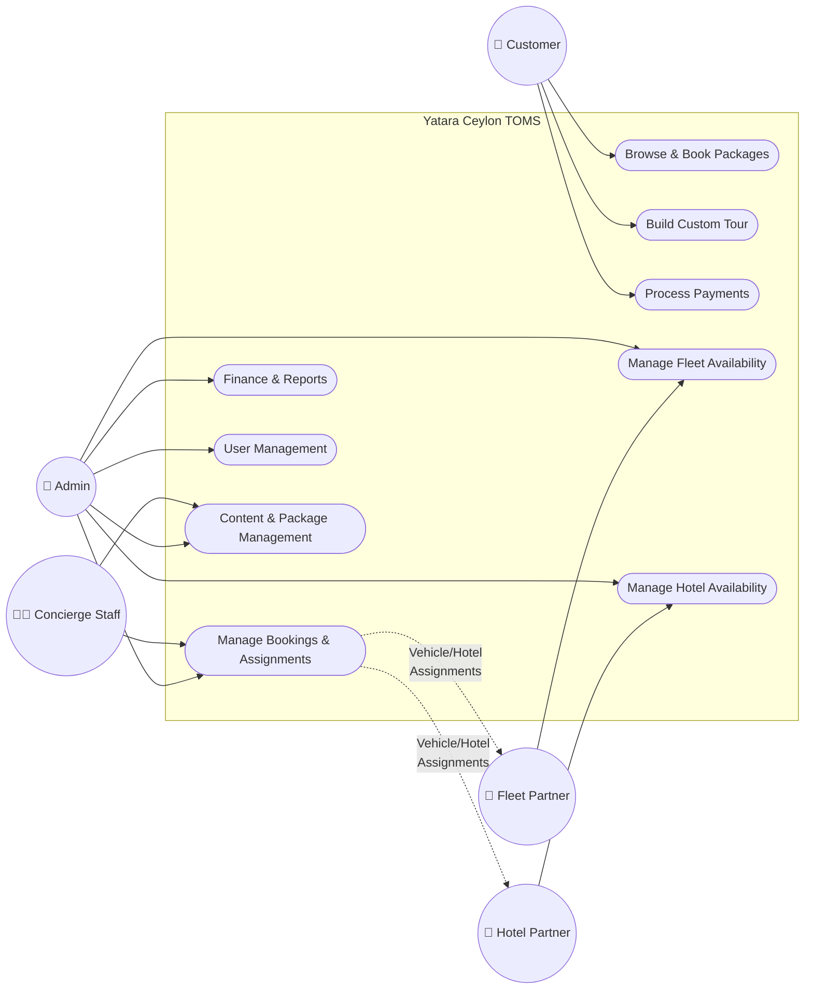
```mermaid
flowchart LR
    %% Actors
    C(("👤 Customer"))
    S(("👨‍💼 Concierge Staff"))
    A(("🔑 Admin"))
    F(("🚗 Fleet Partner"))
    H(("🏨 Hotel Partner"))

    %% System
    subgraph TOMS["Yatara Ceylon TOMS"]
        direction TB
        UC1(["Browse & Book Packages"])
        UC2(["Build Custom Tour"])
        UC3(["Process Payments"])
        UC4(["Manage Bookings & Assignments"])
        UC5(["Manage Fleet Availability"])
        UC6(["Manage Hotel Availability"])
        UC7(["Finance & Reports"])
        UC8(["User Management"])
        UC9(["Content & Package Management"])
    end

    C --> UC1
    C --> UC2
    C --> UC3
    
    S --> UC4
    S --> UC9
    
    A --> UC4
    A --> UC7
    A --> UC8
    A --> UC9
    A --> UC5
    A --> UC6
    
    F --> UC5
    H --> UC6
    
    UC4 -. "Vehicle/Hotel<br>Assignments" .-> F & H
```

---

## 🌊 Data Flow Diagram (DFD)

The Level 1 Data Flow Diagram maps the flow of information between external entities, system processes, and core data stores.

```mermaid
flowchart TD
    %% External Entities
    Cust["👤 Customer"]
    Admin["👨‍💼 Admin/Staff"]
    PH["💳 PayHere Gateway"]
    Part["🤝 Partners (Fleet/Hotel)"]

    %% Processes (Circles)
    P1(("1.0<br>Booking<br>Management"))
    P2(("2.0<br>Payment<br>Processing"))
    P3(("3.0<br>Resource<br>Assignment"))
    P4(("4.0<br>Content<br>Management"))

    %% Data Stores
    D1[(D1: Users & Roles)]
    D2[(D2: Packages & Destinations)]
    D3[(D3: Bookings)]
    D4[(D4: Payments & Finances)]
    D5[(D5: Vehicles & Partners)]

    %% Data Flows
    Cust -- "Browses Tours" --> P4
    P4 -- "Package Info" --> Cust
    P4 <--> "Reads/Updates" D2

    Cust -- "Submits Booking" --> P1
    P1 -- "Stores Booking" --> D3
    P1 -- "Booking Details" --> P2

    P2 -- "Payment Request" --> PH
    PH -- "Payment Status (Webhook)" --> P2
    P2 -- "Records Payment" --> D4
    P2 -- "Updates Status" --> P1
    P2 -. "Receipt" .-> Cust

    Admin -- "Manages Bookings" --> P1
    Admin -- "Assigns Resources" --> P3
    P3 -- "Updates Assignment" --> D3
    P3 <--> "Reads/Updates" D5
    
    Part -- "Updates Availability" --> P3
    P3 -- "Notifies Assignment" --> Part
    Admin -- "Manages Users" --> D1
```

---

## 🔄 High-Level Flow

The end-to-end user journey from package discovery to booking completion:

<div align="center">
  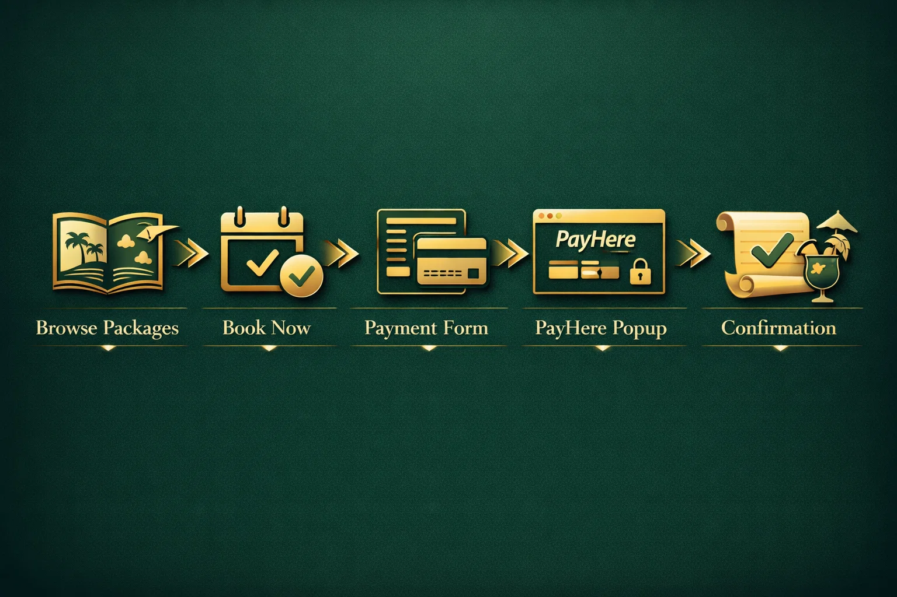
</div>

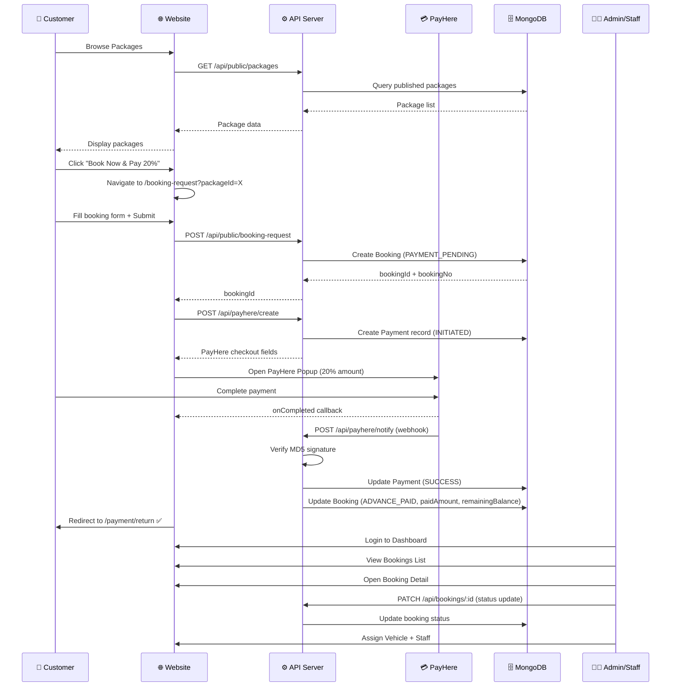
```mermaid
sequenceDiagram
    participant C as 🧑 Customer
    participant W as 🌐 Website
    participant API as ⚙️ API Server
    participant PH as 💳 PayHere
    participant DB as 🗄️ MongoDB
    participant A as 👨‍💼 Admin/Staff

    C->>W: Browse Packages
    W->>API: GET /api/public/packages
    API->>DB: Query published packages
    DB-->>API: Package list
    API-->>W: Package data
    W-->>C: Display packages

    C->>W: Click "Book Now & Pay 20%"
    W->>W: Navigate to /booking-request?packageId=X

    C->>W: Fill booking form + Submit
    W->>API: POST /api/public/booking-request
    API->>DB: Create Booking (PAYMENT_PENDING)
    DB-->>API: bookingId + bookingNo
    API-->>W: bookingId

    W->>API: POST /api/payhere/create
    API->>DB: Create Payment record (INITIATED)
    API-->>W: PayHere checkout fields

    W->>PH: Open PayHere Popup (20% amount)
    C->>PH: Complete payment
    PH-->>W: onCompleted callback
    PH->>API: POST /api/payhere/notify (webhook)
    API->>API: Verify MD5 signature
    API->>DB: Update Payment (SUCCESS)
    API->>DB: Update Booking (ADVANCE_PAID, paidAmount, remainingBalance)

    W->>C: Redirect to /payment/return ✅

    A->>W: Login to Dashboard
    A->>W: View Bookings List
    A->>W: Open Booking Detail
    A->>API: PATCH /api/bookings/:id (status update)
    API->>DB: Update booking status
    A->>W: Assign Vehicle + Staff
```

---

## 🛠 Tech Stack

| Layer | Technology |
|-------|-----------|
| **Framework** | Next.js 15 (App Router, Server Components) |
| **Language** | TypeScript 5.x |
| **Database** | MongoDB with Mongoose ODM |
| **Auth** | JWT + bcryptjs + HttpOnly Cookies |
| **Payments** | PayHere (Sri Lankan Gateway, Sandbox + Production) |
| **Validation** | Zod schemas for all API inputs |
| **Styling** | Tailwind CSS + Custom Design System (Glassmorphism) |
| **UI Components** | shadcn/ui + Radix Primitives |
| **Icons** | Lucide React |
| **Maps** | Leaflet (OpenStreetMap) |
| **Rate Limiting** | In-memory rate limiter |
| **Audit** | Custom audit logging system |

---

## 🗄️ Core Database Schema (ER Diagram)

This entity-relationship diagram maps out how the primary collections in the MongoDB database interact to form the complete tourism management system.

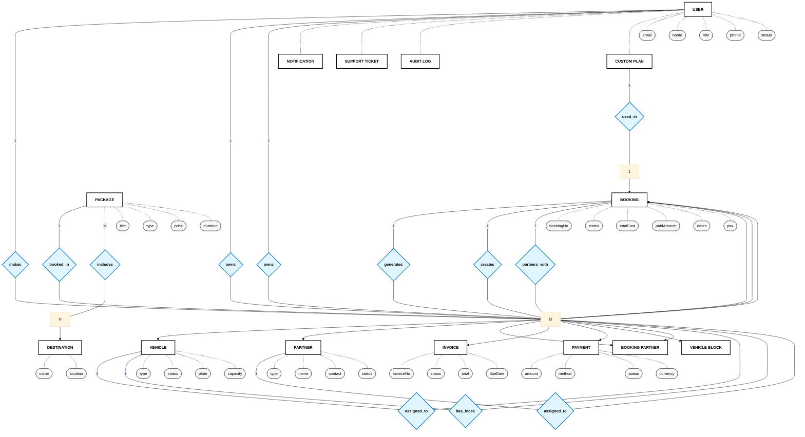
```mermaid
%%{init: {'theme': 'base', 'themeVariables': { 'fontSize': '14px', 'fontFamily': 'Helvetica'}}}%%
flowchart TB
    %% ===== ENTITIES =====
    U["  USER  "]
    B["  BOOKING  "]
    PKG["  PACKAGE  "]
    DEST["  DESTINATION  "]
    V["  VEHICLE  "]
    P["  PARTNER  "]
    INV["  INVOICE  "]
    PAY["  PAYMENT  "]
    CP["  CUSTOM PLAN  "]
    VB["  VEHICLE BLOCK  "]
    NT["  NOTIFICATION  "]
    ST["  SUPPORT TICKET  "]
    AL["  AUDIT LOG  "]
    BPA["  BOOKING PARTNER  "]

    %% ===== RELATIONSHIPS =====
    R1{" makes "}
    R2{" owns "}
    R3{" owns "}
    R4{" booked_in "}
    R5{" includes "}
    R6{" assigned_to "}
    R7{" assigned_to "}
    R8{" generates "}
    R9{" creates "}
    R10{" used_in "}
    R11{" has_block "}
    R12{" partners_with "}

    %% ===== CONNECTIONS =====
    U -- 1 ---- R1
    R1 ---- M --> B

    U -- 1 ---- R2
    R2 ---- M --> V

    U -- 1 ---- R3
    R3 ---- M --> P

    PKG -- 1 ---- R4
    R4 ---- M --> B

    PKG -- M ---- R5
    R5 ---- N --> DEST

    V -- 1 ---- R6
    R6 ---- M --> B

    P -- 1 ---- R7
    R7 ---- M --> BPA

    B -- 1 ---- R8
    R8 ---- M --> INV

    B -- 1 ---- R9
    R9 ---- M --> PAY

    CP -- 1 ---- R10
    R10 ---- 1 --> B

    V -- 1 ---- R11
    R11 ---- M --> VB

    B -- 1 ---- R12
    R12 ---- M --> BPA

    U -..- NT
    U -..- ST
    U -..- AL
    U -..- CP

    %% ===== USER ATTRIBUTES =====
    U1(["  email  "])
    U2(["  name  "])
    U3(["  role  "])
    U4(["  phone  "])
    U5(["  status  "])
    U -.- U1
    U -.- U2
    U -.- U3
    U -.- U4
    U -.- U5

    %% ===== BOOKING ATTRIBUTES =====
    B1(["  bookingNo  "])
    B2(["  status  "])
    B3(["  totalCost  "])
    B4(["  paidAmount  "])
    B5(["  dates  "])
    B6(["  pax  "])
    B -.- B1
    B -.- B2
    B -.- B3
    B -.- B4
    B -.- B5
    B -.- B6

    %% ===== PACKAGE ATTRIBUTES =====
    PK1(["  title  "])
    PK2(["  type  "])
    PK3(["  price  "])
    PK4(["  duration  "])
    PKG -.- PK1
    PKG -.- PK2
    PKG -.- PK3
    PKG -.- PK4

    %% ===== VEHICLE ATTRIBUTES =====
    V1(["  type  "])
    V2(["  status  "])
    V3(["  plate  "])
    V4(["  capacity  "])
    V -.- V1
    V -.- V2
    V -.- V3
    V -.- V4

    %% ===== PARTNER ATTRIBUTES =====
    P1(["  type  "])
    P2(["  name  "])
    P3(["  contact  "])
    P4(["  status  "])
    P -.- P1
    P -.- P2
    P -.- P3
    P -.- P4

    %% ===== PAYMENT ATTRIBUTES =====
    PA1(["  amount  "])
    PA2(["  method  "])
    PA3(["  status  "])
    PA4(["  currency  "])
    PAY -.- PA1
    PAY -.- PA2
    PAY -.- PA3
    PAY -.- PA4

    %% ===== INVOICE ATTRIBUTES =====
    IN1(["  invoiceNo  "])
    IN2(["  status  "])
    IN3(["  total  "])
    IN4(["  dueDate  "])
    INV -.- IN1
    INV -.- IN2
    INV -.- IN3
    INV -.- IN4

    %% ===== DESTINATION ATTRIBUTES =====
    D1(["  name  "])
    D2(["  location  "])
    DEST -.- D1
    DEST -.- D2

    %% ===== STYLES =====
    classDef entity fill:#ffffff,stroke:#000000,stroke-width:2px,color:#000000,font-weight:bolder
    classDef relationship fill:#e1f5fe,stroke:#0277bd,stroke-width:2px,color:#000000,font-weight:bolder
    classDef attribute fill:#f8f9fa,stroke:#555555,stroke-width:1px,color:#000000

    class U,B,PKG,DEST,V,P,INV,PAY,CP,VB,NT,ST,AL,BPA entity
    class R1,R2,R3,R4,R5,R6,R7,R8,R9,R10,R11,R12 relationship
    class U1,U2,U3,U4,U5,B1,B2,B3,B4,B5,B6,PK1,PK2,PK3,PK4,V1,V2,V3,V4,P1,P2,P3,P4,PA1,PA2,PA3,PA4,IN1,IN2,IN3,IN4,D1,D2 attribute
```

**Key Relationships Explained:**
- **Users:** Control the system based on their `role` (Admin, Staff, Customer, etc.). Customers generate Bookings. Fleet/Hotel roles manage Vehicles and Partner properties respectively.
- **Packages & Destinations:** The public catalog. Packages are standard tours built out of multiple Destinations. Bookings are attached to a specific Package choice.
- **Bookings:** The core operational entity. Everything revolves around the Booking document.
- **Finance (Payment & Invoice):** Track the lifecycle of money. Payments register inbound cash (via PayHere gateway or manual cash). Invoices are generated by staff against Bookings.
- **Resources (Vehicle & Partner):** Staff assigns available Vehicles (from Fleet module) and Partners (Hotels, Guides, Restaurants) to confirmed Bookings to fulfill the trip requirements.

---

## 📦 Management Modules

The system is organized into **6 core management modules**, each documented separately in the [`/docs`](./docs/) folder:

| # | Module | Scope | Docs |
|---|--------|-------|------|
| 1 | **Account Management** | User registration, auth, RBAC, 5 roles | [📄 Read →](./docs/account-management.md) |
| 2 | **Products & Content Management** | Packages, destinations, FAQs, gallery, testimonials | [📄 Read →](./docs/products-content-management.md) |
| 3 | **Vehicle Fleet Management** | Vehicles, availability blocking, booking assignments | [📄 Read →](./docs/vehicle-fleet-management.md) |
| 4 | **Booking & Reservation Management** | Booking lifecycle, custom plans, status pipeline | [📄 Read →](./docs/booking-reservation-management.md) |
| 5 | **Finance Management** | Payments, invoices, advance tracking, receipts | [📄 Read →](./docs/finance-management.md) |
| 6 | **Supplier/Partner Management** | Partners, services, rate cards, assignments | [📄 Read →](./docs/supplier-partner-management.md) |

---

## 🖥 Role-Based Dashboards

Each user role sees a **different dashboard** with permissions enforced at both middleware and API levels. The dashboards utilize a custom *liquid glass* design system.

### Admin Dashboard
<div align="center">
  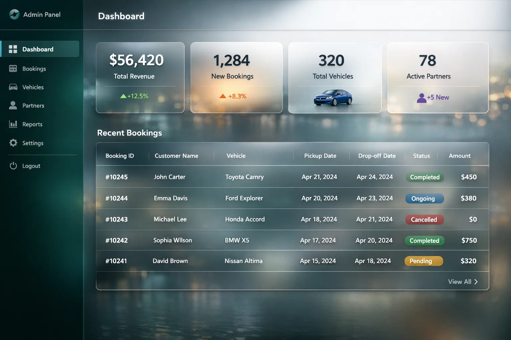
</div>

### Customer Dashboard
<div align="center">
  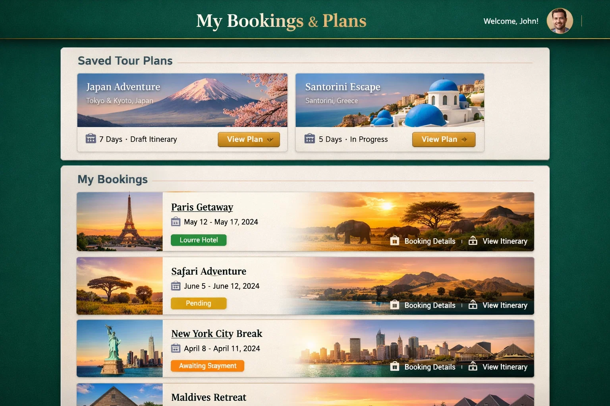
</div>

### Fleet Partner Dashboard
<div align="center">
  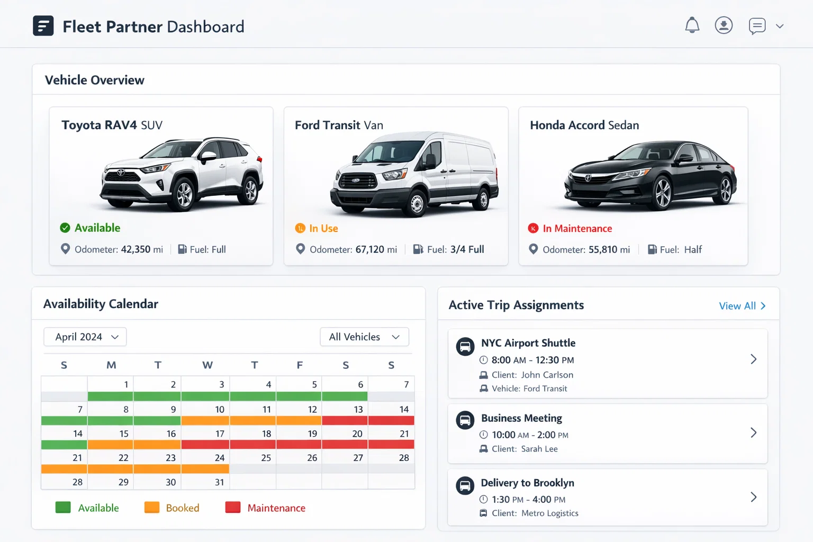
</div>

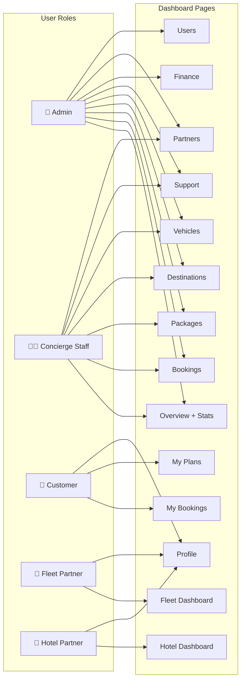
```mermaid
graph LR
    subgraph Roles["User Roles"]
        ADMIN["🔑 Admin"]
        STAFF["👨‍💼 Concierge Staff"]
        USER["🧑 Customer"]
        VEHICLE["🚗 Fleet Partner"]
        HOTEL["🏨 Hotel Partner"]
    end

    subgraph Pages["Dashboard Pages"]
        OV["Overview + Stats"]
        BK["Bookings"]
        PKG["Packages"]
        DST["Destinations"]
        VEH["Vehicles"]
        SUP["Support"]
        FIN["Finance"]
        PTR["Partners"]
        USR["Users"]
        MB["My Bookings"]
        MP["My Plans"]
        FL["Fleet Dashboard"]
        HT["Hotel Dashboard"]
        PR["Profile"]
    end

    ADMIN --> OV & BK & PKG & DST & VEH & SUP & FIN & PTR & USR
    STAFF --> OV & BK & PKG & DST & VEH & SUP & PTR
    USER --> MB & MP & PR
    VEHICLE --> FL & PR
    HOTEL --> HT & PR
```

### Dashboard Features by Role

| Feature | Admin | Staff | Customer | Fleet | Hotel |
|---------|:-----:|:-----:|:--------:|:-----:|:-----:|
| Overview with stat cards | ✅ | ✅ | — | — | — |
| Manage all bookings | ✅ | ✅ (restricted) | — | — | — |
| View my bookings | — | — | ✅ | — | — |
| Manage packages | ✅ | ✅ | — | — | — |
| Manage destinations | ✅ | ✅ | — | — | — |
| Manage vehicles | ✅ | View only | — | — | — |
| Fleet dashboard | — | — | — | ✅ | — |
| Hotel dashboard | — | — | — | — | ✅ |
| Finance overview | ✅ | — | — | — | — |
| Manage partners | ✅ | ✅ | — | — | — |
| Manage users | ✅ | — | — | — | — |
| Support tickets | ✅ | ✅ | — | — | — |
| Update booking status | ✅ | ✅ | — | — | — |
| Assign vehicles/staff | ✅ | ✅ | — | — | — |
| Custom plan builder | — | — | ✅ | — | — |
| Profile management | ✅ | ✅ | ✅ | ✅ | ✅ |

---

## 💳 Payment Integration

The system integrates **PayHere**, Sri Lanka's leading payment gateway, for secure 20% advance collection.

<div align="center">
  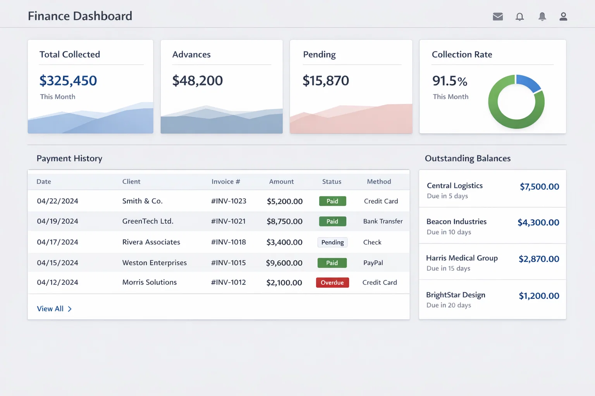
</div>

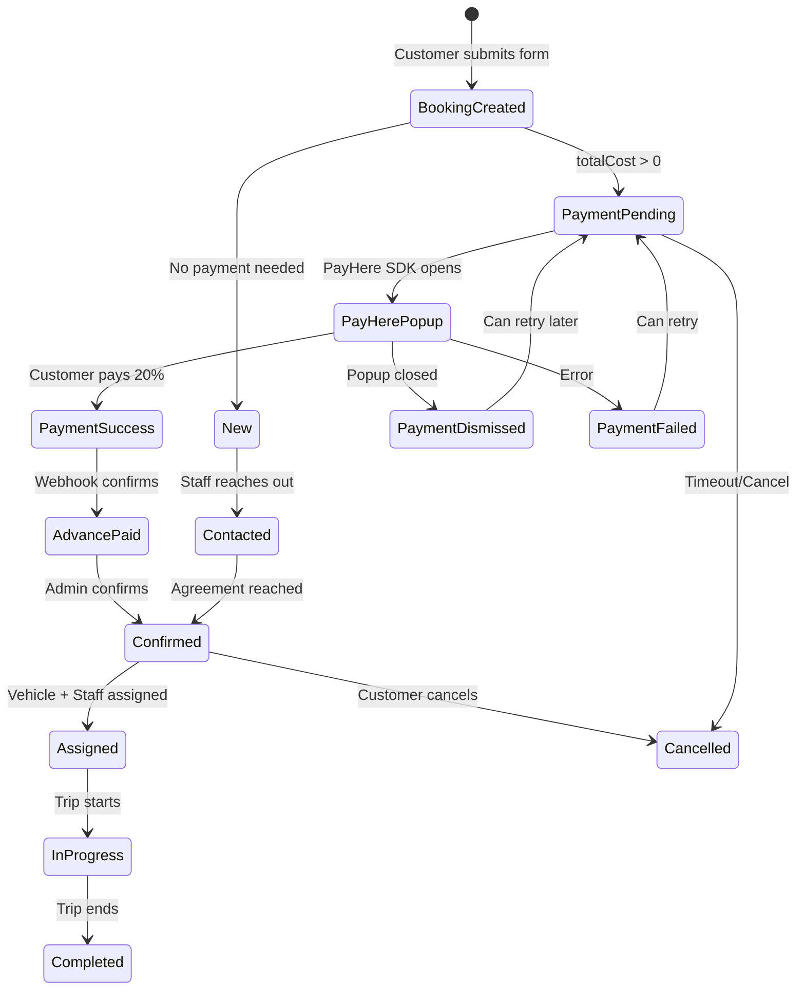
```mermaid
stateDiagram-v2
    [*] --> BookingCreated: Customer submits form
    BookingCreated --> PaymentPending: totalCost > 0
    BookingCreated --> New: No payment needed

    PaymentPending --> PayHerePopup: PayHere SDK opens
    PayHerePopup --> PaymentSuccess: Customer pays 20%
    PayHerePopup --> PaymentDismissed: Popup closed
    PayHerePopup --> PaymentFailed: Error

    PaymentSuccess --> AdvancePaid: Webhook confirms
    PaymentDismissed --> PaymentPending: Can retry later
    PaymentFailed --> PaymentPending: Can retry

    AdvancePaid --> Confirmed: Admin confirms
    New --> Contacted: Staff reaches out
    Contacted --> Confirmed: Agreement reached

    Confirmed --> Assigned: Vehicle + Staff assigned
    Assigned --> InProgress: Trip starts
    InProgress --> Completed: Trip ends

    Confirmed --> Cancelled: Customer cancels
    PaymentPending --> Cancelled: Timeout/Cancel
```

### Payment Flow Details

| Step | Action | Status Change |
|------|--------|--------------|
| 1 | Customer fills booking form | Booking: `PAYMENT_PENDING` |
| 2 | System calculates 20% advance | `advanceAmount = totalCost × 0.20` |
| 3 | PayHere popup opens | Payment: `INITIATED` |
| 4 | Customer completes payment | Payment: `SUCCESS` |
| 5 | PayHere sends webhook | Booking: `ADVANCE_PAID` |
| 6 | System updates `paidAmount` | `remainingBalance = totalCost - paidAmount` |
| 7 | Admin sees payment in dashboard | Financial summary updated |

---

## 🔑 Test Credentials

After running `npm run seed`, these demo accounts are available:

| Role | Email | Password | Dashboard |
|------|-------|----------|-----------|
| **Administrator** | `admin@yataraceylon.com` | `Admin@123` | `/dashboard` (full access) |
| **Concierge Staff** | `concierge@yataraceylon.com` | `Concierge@123` | `/dashboard` (no Finance/Users) |
| **Hotel Partner** | `hotel.partner@yataraceylon.com` | `Hotel@123` | `/dashboard/hotel` |
| **Fleet Partner** | `fleet.partner@yataraceylon.com` | `Fleet@123` | `/dashboard/fleet` |
| **Customer** | `customer1@yataraceylon.com` | `Customer@123` | `/dashboard/my-bookings` |
| **Legacy Admin** | `admin@ceylonescapes.lk` | `Admin@123` | `/dashboard` |

> **PayHere Sandbox**: Use test card `4916217501611292` with any future expiry and CVV `123`.

---

## 📁 Project Structure

```
Yatara-Ceylon/
├── docs/                          # Module documentation
│   ├── account-management.md
│   ├── products-content-management.md
│   ├── vehicle-fleet-management.md
│   ├── booking-reservation-management.md
│   ├── finance-management.md
│   └── supplier-partner-management.md
├── public/                        # Static assets & images
├── src/
│   ├── app/
│   │   ├── (public)/              # Public-facing pages
│   │   │   ├── packages/          # Package listing & detail
│   │   │   ├── destinations/      # Destination pages
│   │   │   ├── booking-request/   # Booking form + payment
│   │   │   ├── payment/           # Payment return/cancel
│   │   │   ├── build-tour/        # Custom tour builder
│   │   │   ├── transfers/         # Vehicle transfer pages
│   │   │   └── ...
│   │   ├── auth/
│   │   │   └── login/             # Unified login page (all roles)
│   │   ├── dashboard/
│   │   │   ├── page.tsx           # Admin overview (real DB stats)
│   │   │   ├── bookings/          # Booking list + detail
│   │   │   ├── packages/          # Package CRUD
│   │   │   ├── destinations/      # Destination CRUD
│   │   │   ├── vehicles/          # Vehicle CRUD
│   │   │   ├── finance/           # Finance overview
│   │   │   ├── partners/          # Partner management
│   │   │   ├── users/             # User management (admin only)
│   │   │   ├── support/           # Support tickets
│   │   │   ├── fleet/             # Fleet partner dashboard
│   │   │   ├── hotel/             # Hotel partner dashboard
│   │   │   ├── my-bookings/       # Customer bookings
│   │   │   ├── my-plans/          # Customer saved plans
│   │   │   └── profile/           # Shared profile page
│   │   └── api/
│   │       ├── auth/              # Login, register, logout, me
│   │       ├── bookings/          # Booking CRUD + status
│   │       ├── packages/          # Package CRUD
│   │       ├── payhere/           # PayHere create + notify
│   │       ├── payments/          # Payment management
│   │       ├── public/            # Public booking + tickets
│   │       └── ...
│   ├── components/
│   │   ├── layout/                # DashboardSidebar, Navbar
│   │   ├── public/                # BookingRequestClient, etc.
│   │   └── ui/                    # shadcn/ui primitives
│   ├── lib/
│   │   ├── auth.ts                # JWT signing, hashing
│   │   ├── rbac.ts                # Role-based access helpers
│   │   ├── constants.ts           # Enums & status constants
│   │   ├── validations.ts         # Zod schemas
│   │   ├── seed.ts                # Database seeder
│   │   ├── payhere/               # PayHere config + hash
│   │   └── ...
│   ├── models/                    # Mongoose models
│   │   ├── User.ts
│   │   ├── Booking.ts
│   │   ├── Payment.ts
│   │   ├── Invoice.ts
│   │   ├── Package.ts
│   │   ├── Vehicle.ts
│   │   ├── Partner.ts
│   │   └── ...
│   └── middleware.ts              # Route protection
├── .env.local                     # Environment variables
├── package.json
└── README.md
```

---

## 🚀 Getting Started

### Prerequisites

- **Node.js** 20+ (or 25.x LTS)
- **MongoDB** Atlas cluster or local instance
- **PayHere** sandbox merchant account

### Installation

```bash
# Clone the repository
git clone https://github.com/sahansbandara/Yatara-Ceylon.git
cd Yatara-Ceylon

# Install dependencies
npm install

# Set up environment variables
cp .env.example .env.local
```

### Environment Variables

```env
MONGODB_URI=mongodb+srv://...
JWT_SECRET=your-secret-key-here
JWT_EXPIRES_IN=1d
PAYHERE_MODE=sandbox
PAYHERE_MERCHANT_ID=your-merchant-id
PAYHERE_MERCHANT_SECRET=your-merchant-secret
PAYHERE_CURRENCY=LKR
NEXT_PUBLIC_APP_URL=http://localhost:3000
```

### Run

```bash
# Seed demo data (users, packages, destinations, vehicles)
npm run seed

# Start development server
npm run dev

# Build for production
npm run build

# Run tests
npm test
```

---

## 📚 Module Documentation

Detailed documentation for each management module with flow diagrams, entity schemas, and API endpoints:

| Document | Description |
|----------|-------------|
| [📄 Account Management](./docs/account-management.md) | User roles, authentication flow, JWT lifecycle, RBAC enforcement |
| [📄 Products & Content](./docs/products-content-management.md) | Package CRUD, destination management, SEO, content publishing |
| [📄 Vehicle Fleet](./docs/vehicle-fleet-management.md) | Vehicle registry, availability blocking, booking assignments |
| [📄 Booking & Reservation](./docs/booking-reservation-management.md) | Full booking lifecycle, status pipeline, custom plans |
| [📄 Finance](./docs/finance-management.md) | Payment processing, invoice system, advance tracking, receipts |
| [📄 Supplier/Partner](./docs/supplier-partner-management.md) | Partner registry, service rates, booking partner assignments |

---

## 🔌 API Reference

### Authentication

| Method | Endpoint | Auth | Description |
|--------|----------|------|-------------|
| `POST` | `/api/auth/login` | — | Login with email/password |
| `POST` | `/api/auth/register` | — | Register new user |
| `POST` | `/api/auth/logout` | — | Clear auth cookie |
| `GET` | `/api/auth/me` | JWT | Get current user profile |

### Bookings

| Method | Endpoint | Auth | Description |
|--------|----------|------|-------------|
| `GET` | `/api/bookings` | Staff+ | List bookings (filter, search, paginate) |
| `POST` | `/api/bookings` | Staff+ | Create booking (staff-initiated) |
| `GET` | `/api/bookings/:id` | Staff+ | Get booking detail |
| `PATCH` | `/api/bookings/:id` | Staff+ | Update booking status |
| `POST` | `/api/public/booking-request` | — | Public booking + 20% advance |

### Payments

| Method | Endpoint | Auth | Description |
|--------|----------|------|-------------|
| `POST` | `/api/payhere/create` | — | Create PayHere payment session |
| `POST` | `/api/payhere/notify` | — | PayHere webhook (signature verified) |
| `GET` | `/api/payments` | Admin | List payment records |
| `POST` | `/api/payments` | Staff+ | Record manual payment |

### Packages, Vehicles, Partners

| Method | Endpoint | Auth | Description |
|--------|----------|------|-------------|
| `GET/POST` | `/api/packages` | Staff+ | Package CRUD |
| `GET/POST` | `/api/vehicles` | Staff+ | Vehicle CRUD |
| `GET/POST` | `/api/partners` | Staff+ | Partner CRUD |

---

## 🔒 Security

| Feature | Implementation |
|---------|---------------|
| **Password hashing** | bcryptjs with 12 salt rounds |
| **JWT tokens** | Signed with `HS256`, stored in HttpOnly cookies |
| **Cookie security** | `SameSite=Strict`, `Secure` in production |
| **RBAC middleware** | Every `/dashboard` route enforces role-based access |
| **Rate limiting** | Login and public APIs rate-limited per IP |
| **Input validation** | Zod schemas on all POST/PATCH endpoints |
| **PayHere verification** | MD5 signature verification on webhooks |
| **Security headers** | `X-Frame-Options`, `X-Content-Type-Options`, `X-XSS-Protection` |
| **Audit logging** | All admin/staff actions logged with actor ID |

---

## 📄 License

This project is developed as part of the **SLIIT ITP (Industry Training Project)** module — `ITP_IT_101`. For academic use only.

---

<div align="center">

**Built with ❤️ by the Yatara Ceylon Team**

*SLIIT · Faculty of Computing · BSc (Hons) Information Technology*

</div>
