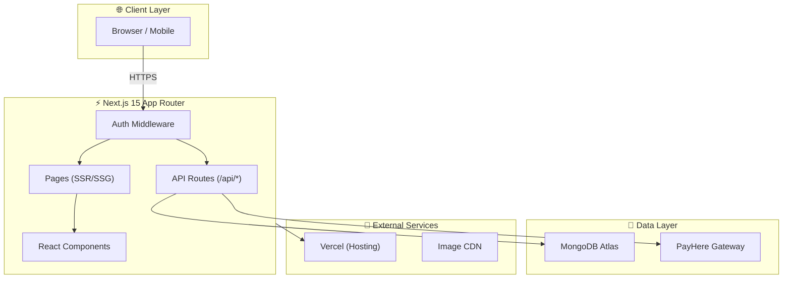
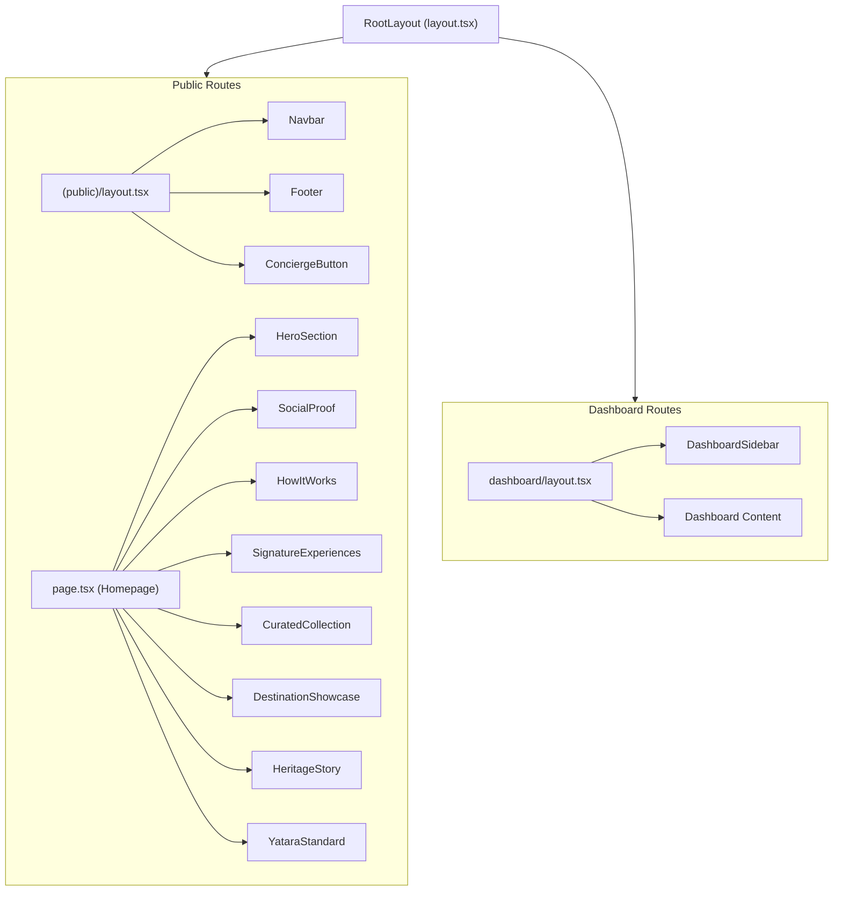
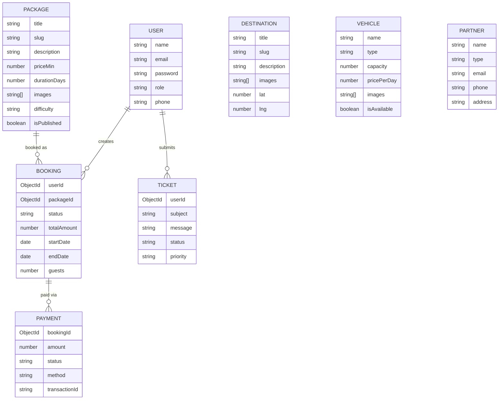
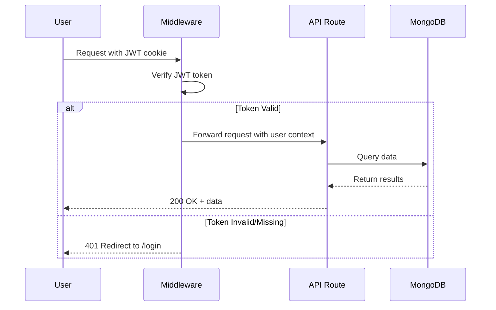

# 🏗️ System Architecture

## Overview

Yatara Ceylon (TOMS) is built as a **full-stack monolithic Next.js application** using the App Router architecture. It combines server-side rendering, API routes, and client-side interactivity in a single deployable unit.

---

## High-Level Architecture



---

## Application Layers

### 1. Presentation Layer
- **Public Pages**: Homepage, Packages, Destinations, Vehicles, Build Tour, Guide, Inquire
- **Dashboard Pages**: Admin overview, bookings, packages, destinations, vehicles, finance, users, partners, support
- **Auth Pages**: Login, registration

### 2. Business Logic Layer
- **API Routes** (`src/app/api/`): RESTful endpoints for CRUD operations
- **Server Components**: Data fetching with `async` server components
- **Client Components**: Interactive UI with React hooks

### 3. Data Access Layer
- **Mongoose Models** (`src/models/`): Schema definitions with validation
- **Database Connection** (`src/lib/mongodb.ts`): Singleton connection pool

---

## Component Hierarchy



---

## Database Schema



---

## Authentication Flow



---

## Folder Structure

```
Yatara-Ceylon/
├── docs/                    # Documentation
├── public/                  # Static assets (images, videos)
│   ├── images/              # Page images
│   └── Hero-Section.mp4     # Hero video
├── src/
│   ├── app/                 # Next.js App Router
│   │   ├── (public)/        # Public-facing pages
│   │   │   ├── page.tsx     # Homepage
│   │   │   ├── packages/    # Package listing & detail
│   │   │   ├── destinations/# Destination listing & detail
│   │   │   ├── vehicles/    # Vehicle fleet page
│   │   │   ├── build-tour/  # Interactive tour builder
│   │   │   ├── guide/       # Sri Lanka travel guide
│   │   │   ├── inquire/     # Inquiry form
│   │   │   └── layout.tsx   # Public layout (Navbar + Footer)
│   │   ├── dashboard/       # Admin dashboard pages
│   │   │   ├── page.tsx     # Dashboard overview
│   │   │   ├── bookings/    # Booking management
│   │   │   ├── packages/    # Package CRUD
│   │   │   ├── destinations/# Destination CRUD
│   │   │   ├── vehicles/    # Vehicle fleet management
│   │   │   ├── finance/     # Financial reports
│   │   │   ├── users/       # User management
│   │   │   ├── partners/    # Partner management
│   │   │   ├── support/     # Support tickets
│   │   │   └── layout.tsx   # Dashboard layout (Sidebar)
│   │   ├── api/             # API routes
│   │   ├── auth/            # Authentication pages
│   │   ├── globals.css      # Global styles + Liquid Glass System
│   │   └── layout.tsx       # Root layout
│   ├── components/
│   │   ├── layout/          # Navbar, Footer, DashboardSidebar
│   │   ├── public/          # Homepage sections, cards
│   │   ├── dashboard/       # Dashboard tables, forms
│   │   └── ui/              # Radix UI primitives
│   ├── lib/                 # Utilities (DB, auth, currency)
│   ├── models/              # Mongoose schemas
│   └── middleware.ts        # Auth middleware
├── tailwind.config.ts       # Design tokens + animations
├── next.config.ts           # Next.js configuration
└── package.json
```
