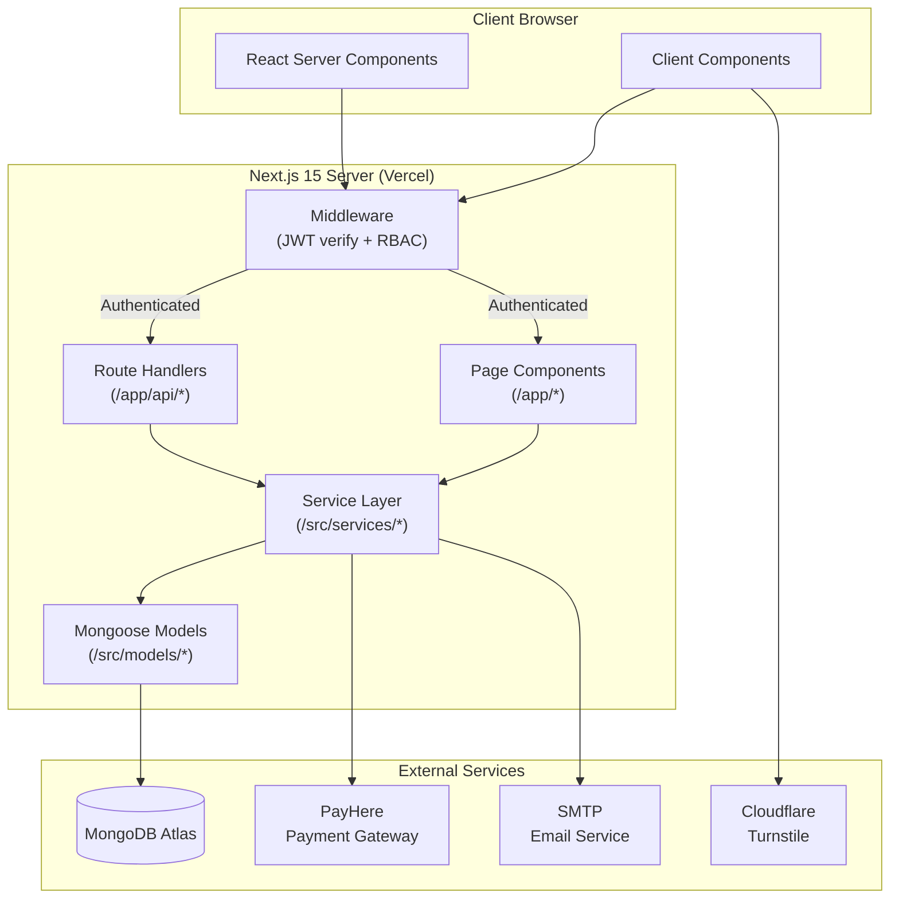
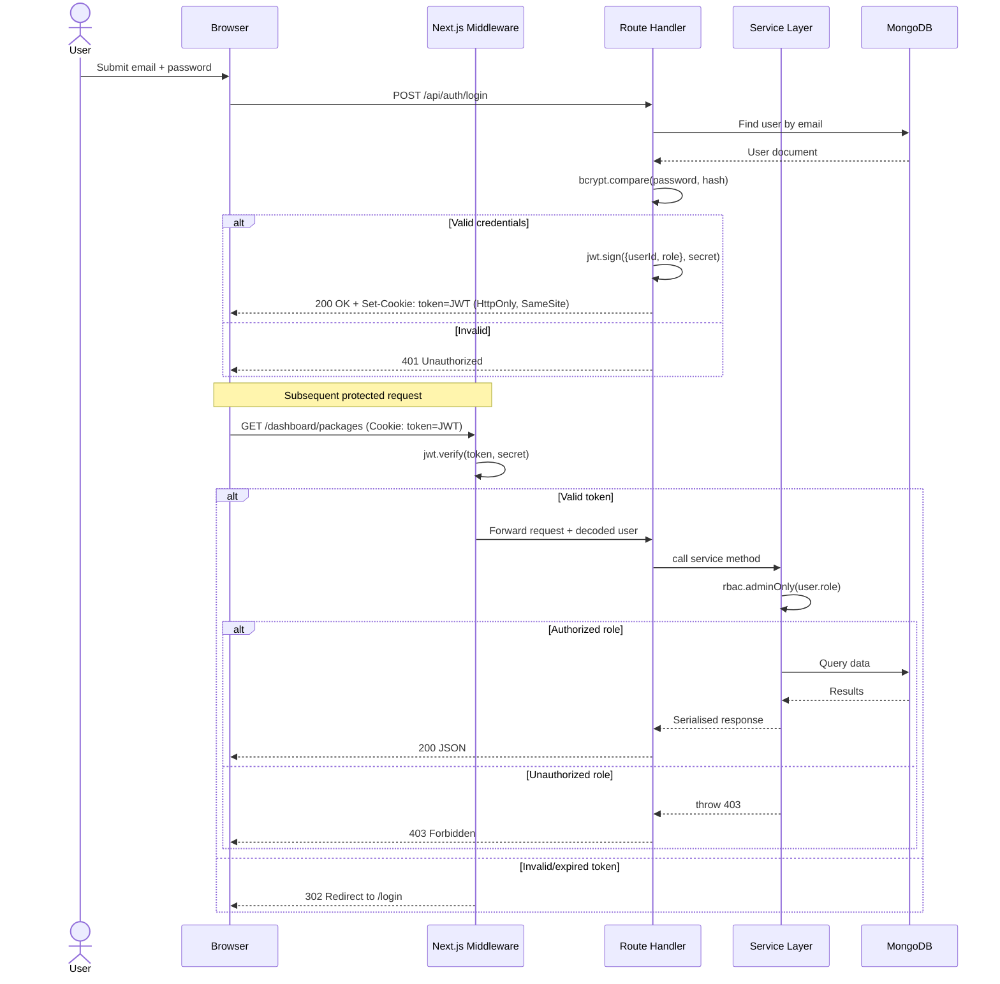
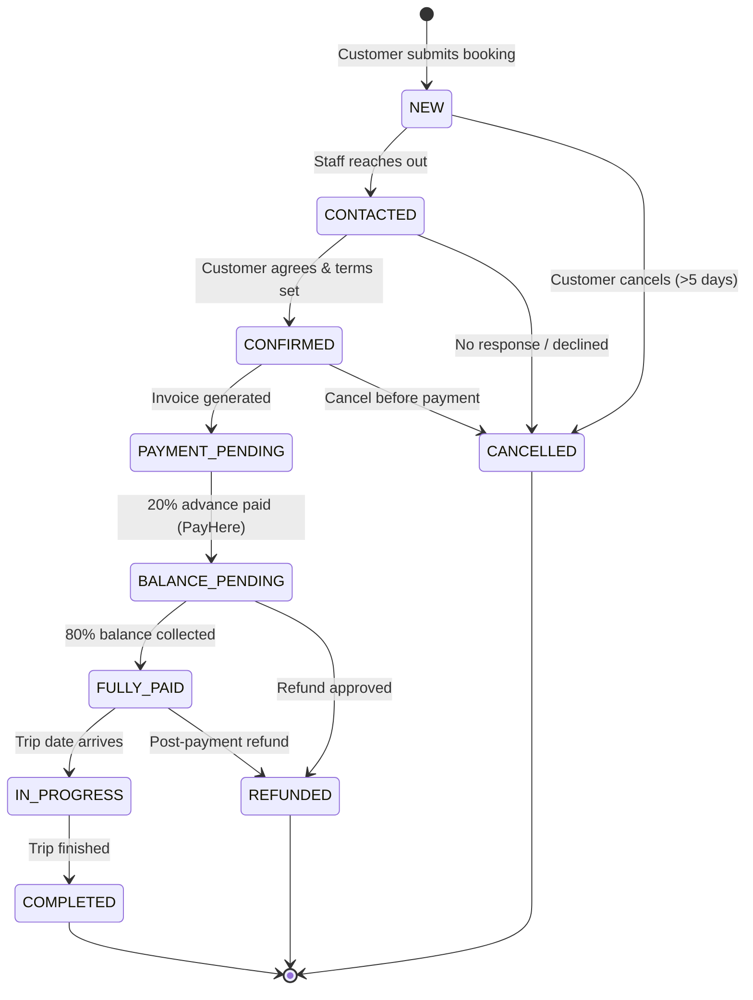
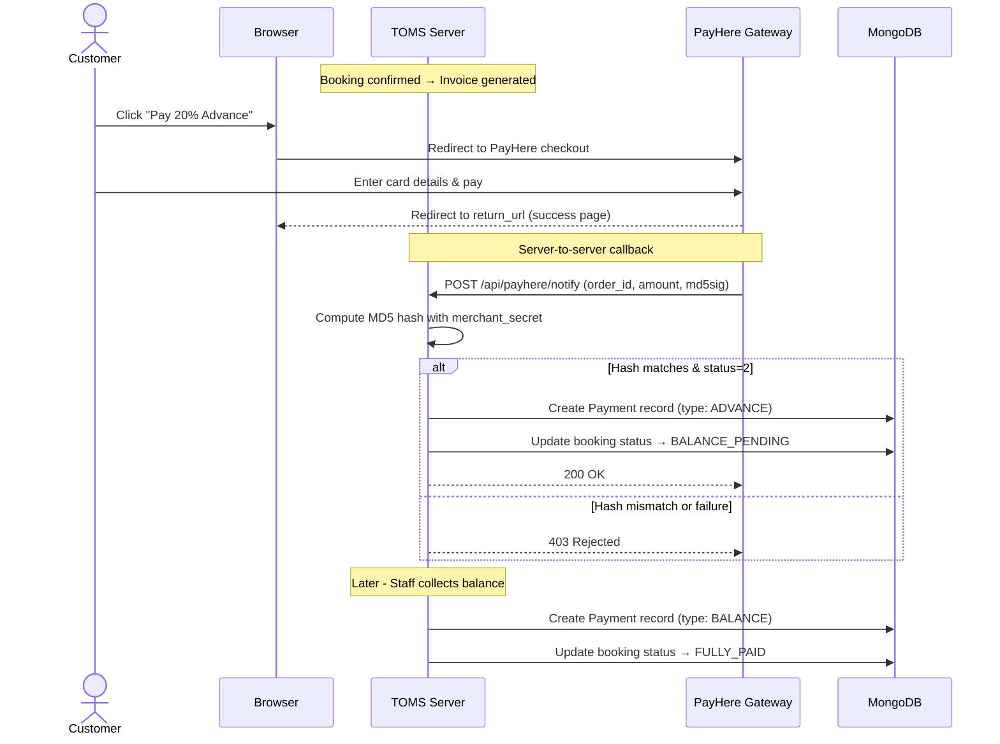
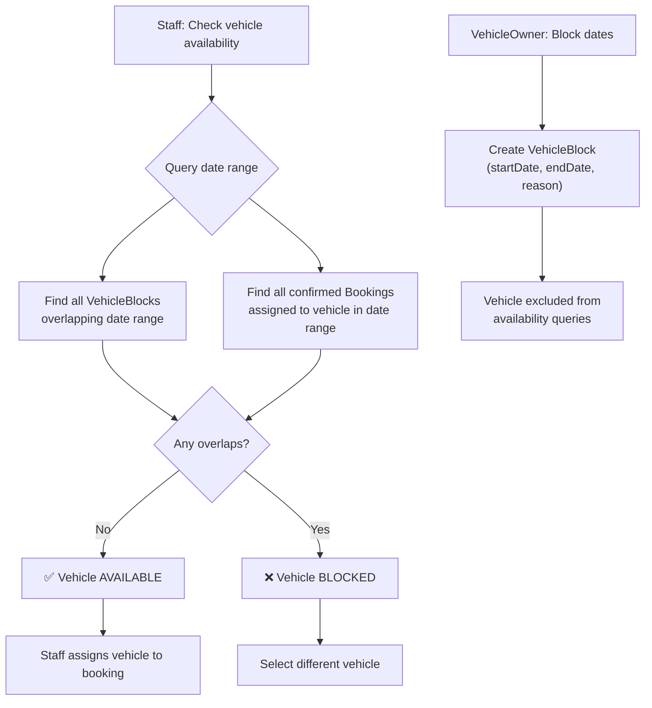
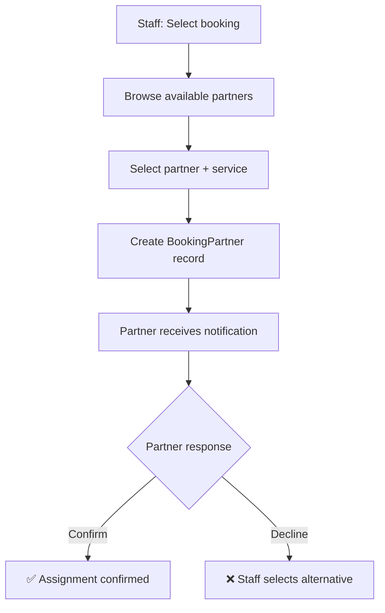
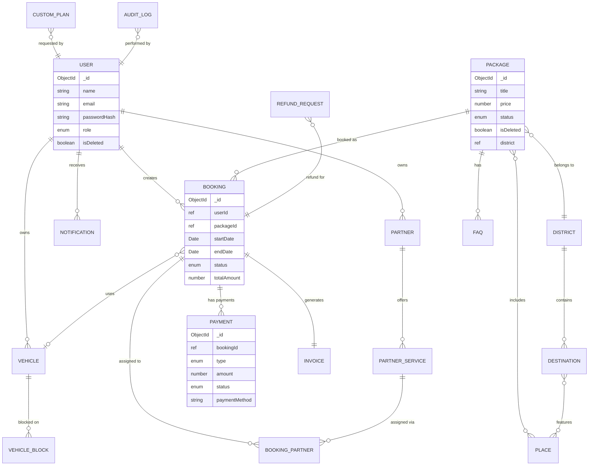
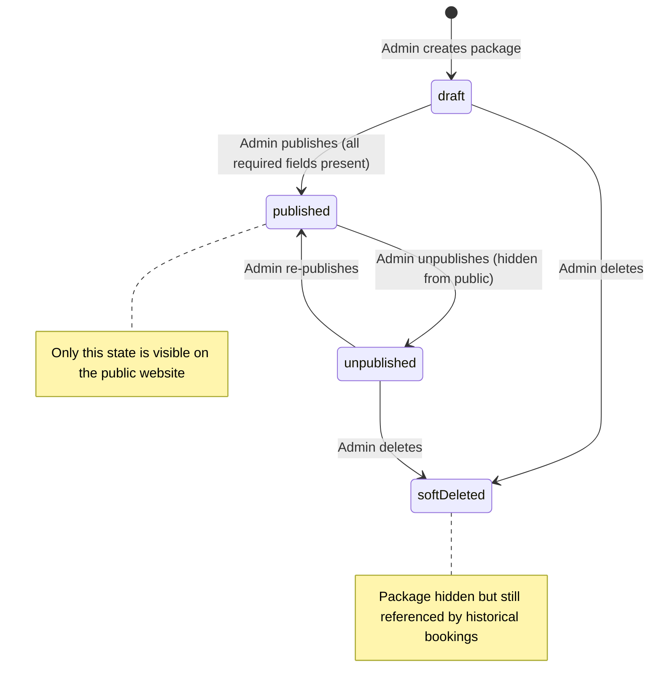

# FINAL REPORT
## Yatara Ceylon – Tour Operator Management System (TOMS)

> **Formatting guide for Word export (from Assignment 05 PDF):**
> - Paper: A4
> - Font: Times New Roman, size 11
> - Line spacing: 1.2
> - Alignment: Justified
> - Headings: Word Heading Styles (H1 = Chapter, H2 = Section, H3 = Sub-section)
> - H1 = 16 pt, bold, centered, with lower border
> - H2 = 12 pt, bold, underlined, left-aligned
> - H3 = 11 pt, bold, underlined, left-aligned
> - Pre-body page numbers = Roman (i, ii, iii…)
> - Main-body page numbers = Arabic, restart at 1 on Chapter 1
> - Figure / Table captions = chapter-based (e.g., Figure 3.1, Table 2.1)

---

# PART A — PRE-BODY SECTION

---

## TITLE PAGE

<div align="center">

**[INSERT UNIVERSITY / CAMPUS LOGO HERE]**

# YATARA CEYLON
## Tour Operator Management System (TOMS)

**IT Project (ITP) – Final Report**

Module Code: **IT2150**
Academic Year: **Y2.S2**
Stream: **Y2.S2.WE.IT.0101 (ITP_IT_101)**
ITP Group Number: **[INSERT GROUP NUMBER]**

**Campus:** [INSERT CAMPUS NAME]
**Faculty:** Faculty of Computing
**Degree Programme:** BSc (Hons) in Information Technology

### Group Members

| Student ID   | Student Name               | Assigned Module                     |
|--------------|----------------------------|-------------------------------------|
| IT24100923   | Nawarathna K.M.G.D.I.      | Account Management                  |
| IT24100559   | Wasala W.M.S.S.B.          | Products & Content Management       |
| IT24102016   | Melisha L.R.L.             | Vehicle Fleet Management            |
| IT24100220   | Sanujan N.                 | Booking & Reservation Management    |
| IT24102586   | Luxsana S.                 | Finance Management                  |
| IT24101070   | Muthubadiwila M.W.H.A.     | Supplier / Partner Management       |

**Supervisor:** [INSERT SUPERVISOR NAME]
**Date of Submission:** [INSERT SUBMISSION DATE]

</div>

---

## DECLARATION

We hereby declare that this report titled *"Yatara Ceylon – Tour Operator Management System (TOMS)"* is the result of our own original work and has not been submitted, in whole or in part, for any other degree or diploma at any university or institution. All external sources and contributions have been duly acknowledged and referenced in accordance with academic standards. We confirm that the content presented in this report is the genuine effort of the undersigned group members.

| Student ID   | Student Name               | Signature                    | Date                     |
|--------------|----------------------------|------------------------------|--------------------------|
| IT24100923   | Nawarathna K.M.G.D.I.      | [INSERT SIGNATURE]           | [INSERT DATE]            |
| IT24100559   | Wasala W.M.S.S.B.          | [INSERT SIGNATURE]           | [INSERT DATE]            |
| IT24102016   | Melisha L.R.L.             | [INSERT SIGNATURE]           | [INSERT DATE]            |
| IT24100220   | Sanujan N.                 | [INSERT SIGNATURE]           | [INSERT DATE]            |
| IT24102586   | Luxsana S.                 | [INSERT SIGNATURE]           | [INSERT DATE]            |
| IT24101070   | Muthubadiwila M.W.H.A.     | [INSERT SIGNATURE]           | [INSERT DATE]            |

**Supervisor Endorsement**

I certify that the above-named students have carried out this project under my supervision and that the report accurately reflects the work completed.

Supervisor's Name: [INSERT SUPERVISOR NAME]
Signature: [INSERT SUPERVISOR SIGNATURE]
Date: [INSERT DATE]

---

## ABSTRACT

The tourism industry in Sri Lanka plays a significant role in the national economy, yet many small and medium-sized tour operators continue to manage their day-to-day operations manually using spreadsheets, paper logs, and unstructured messaging channels. This fragmented workflow leads to missed inquiries, double bookings, lost customer details, delayed payments, and an inability to scale effectively. Yatara Ceylon, a boutique tour operator based in Sri Lanka, faced these same operational challenges and required a unified digital platform to centralise its packages, destinations, bookings, vehicles, partners, and finance operations.

This project presents the design, development, and evaluation of the **Tour Operator Management System (TOMS)** — a full-stack web application built using Next.js 15 (App Router), TypeScript, MongoDB, and Tailwind CSS, and deployed on Vercel. The system is organised into six tightly integrated modules: Account Management, Products & Content Management, Vehicle Fleet Management, Booking & Reservation Management, Finance Management, and Supplier/Partner Management. Each module provides role-based access, validated CRUD operations, and a consistent user experience anchored in a custom "liquid glass" design system.

Key engineering outcomes include a JWT-based authentication layer with HttpOnly cookies, role-based route protection via Next.js middleware, a Zod-validated service layer, a PayHere payment integration for online bookings, and a public-facing tour planner that consumes the same data model used by the administrative dashboards. The system was evaluated through functional test cases, validation and authorisation tests, and stakeholder walkthroughs. Results indicate that the platform successfully digitises Yatara Ceylon's core workflows, reduces manual data entry, eliminates common sources of double bookings, and provides a scalable foundation for future features such as image upload pipelines, multi-language content, and analytics dashboards.

**Keywords:** Tour Operator Management System, Tourism, Next.js, MongoDB, JWT, RBAC, Booking System, Sri Lanka.

> **Length note:** Aim for 200–300 words. Trim or extend the above paragraphs to fit exactly one page.

---

## ACKNOWLEDGEMENT

We would like to express our sincere gratitude to our project supervisor, **[INSERT SUPERVISOR NAME]**, for the continuous guidance, constructive feedback, and encouragement provided throughout every stage of this project. Your insights were instrumental in shaping the direction and quality of our work.

We extend our heartfelt thanks to the panel members and lecturers of the **IT Project (IT2150)** module for establishing a clear framework, sharing industry-relevant expectations, and providing timely evaluation at each milestone.

We are deeply grateful to our client, **Yatara Ceylon**, for sharing their domain knowledge, operational pain points, and real-world data, without which this system would not have reflected an authentic tour-operator workflow. We also thank the staff members who participated in stakeholder interviews and user acceptance walkthroughs.

Our appreciation further extends to the **Faculty of Computing** and our institution for providing the learning environment, infrastructure, and academic resources that enabled this work.

Finally, we thank our families, friends, and one another as teammates for the unwavering support, collaboration, and shared commitment that carried this project from concept to delivery.

---

## TABLE OF CONTENTS

> **Action required in Word:** Replace this manual list with Word's *References → Table of Contents → Automatic Table* after you apply Heading Styles (H1/H2/H3) to every heading.

- DECLARATION ............................................................................................ ii
- ABSTRACT ................................................................................................. iii
- ACKNOWLEDGEMENT ....................................................................................... iv
- TABLE OF CONTENTS ...................................................................................... v
- LIST OF TABLES ......................................................................................... vi
- LIST OF FIGURES ....................................................................................... vii
- LIST OF ABBREVIATIONS ................................................................................ viii

**CHAPTER 1 — INTRODUCTION** ............................................................................ 1
1.1 Background of Yatara Ceylon
1.2 Problem Statement
1.3 Motivation
1.4 Literature Review
1.5 Aim
1.6 Objectives
1.7 Scope of the Proposed System
1.8 Solution Overview
1.9 Git Repository and Deployed System

**CHAPTER 2 — REQUIREMENT ANALYSIS**
2.1 Stakeholder Analysis
2.2 Functional Requirements
2.3 Non-Functional Requirements
2.4 Feasibility Analysis
2.5 SWOT Analysis
2.6 Requirements Modelling (Use Cases & User Stories)

**CHAPTER 3 — DESIGN AND DEVELOPMENT**
3.1 System Architecture
3.2 Technology Stack
3.3 Module Breakdown
3.4 Authentication and Role-Based Access Control
3.5 Booking Workflow Design
3.6 Finance and Payment Workflow
3.7 Vehicle and Partner Management Design
3.8 Database Design (ER Diagram)
3.9 UI / Design System
3.10 Implementation of Individual Modules
3.11 Focused Module: Products & Content Management

**CHAPTER 4 — RESULTS AND EVALUATION**
4.1 Final System Overview
4.2 Implemented Features
4.3 Screens and Outputs
4.4 Test Cases and Results
4.5 Validation and Security Checks
4.6 User / Expert Feedback
4.7 Limitations
4.8 Future Improvements

**CHAPTER 5 — CONCLUSION**
5.1 Achievement of Objectives
5.2 Achievement of Project Aim
5.3 Summary of Key Contributions

**REFERENCES**
**APPENDIX A — Member Contribution Table**
**APPENDIX B — Screenshots & Extended Material**

---

## LIST OF TABLES

> **Action required in Word:** After captioning each table with *References → Insert Caption*, generate this list via *References → Insert Table of Figures → Label: Table*.

- Table 2.1: Stakeholder Analysis
- Table 2.2: Functional Requirements by Module
- Table 2.3: Non-Functional Requirements
- Table 2.4: Feasibility Summary
- Table 2.5: SWOT Analysis
- Table 3.1: Technology Stack Summary
- Table 3.2: API Endpoints (Representative Subset)
- Table 3.3: Core Database Entities
- Table 4.1: Functional Test Cases – Products & Content Management
- Table 4.2: Validation & Security Test Cases
- Table A.1: Member Contribution Summary

---

## LIST OF FIGURES

> **Action required in Word:** After captioning each figure, generate via *References → Insert Table of Figures → Label: Figure*.

- Figure 3.1: High-Level System Architecture of TOMS
- Figure 3.2: Authentication & RBAC Flow
- Figure 3.3: Booking Request Workflow
- Figure 3.4: Payment Processing Workflow (PayHere)
- Figure 3.5: Vehicle Availability & Block Workflow
- Figure 3.6: Partner Assignment Workflow
- Figure 3.7: Content Publishing Workflow
- Figure 3.8: Entity-Relationship Diagram
- Figure 3.9: UI Design System – Emerald & Gold Liquid Glass Palette
- Figure 3.10: Public Home Page
- Figure 3.11: Package Listing Page
- Figure 3.12: Package Detail Page
- Figure 3.13: Build-Your-Tour Planner
- Figure 3.14: Admin Dashboard – Packages Module
- Figure 4.1: Booking Flow End-to-End Output
- Figure 4.2: Admin Package CRUD Screens
- Figure 4.3: Publish / Unpublish Guard in Action
- Figure 4.4: Sample Payment Confirmation

---

## LIST OF ABBREVIATIONS

| Abbreviation | Meaning                                    |
|--------------|--------------------------------------------|
| API          | Application Programming Interface          |
| CRUD         | Create, Read, Update, Delete               |
| CSS          | Cascading Style Sheets                     |
| DB           | Database                                   |
| ER           | Entity-Relationship                        |
| HTTP(S)      | Hypertext Transfer Protocol (Secure)       |
| JSON         | JavaScript Object Notation                 |
| JWT          | JSON Web Token                             |
| MVC          | Model-View-Controller                      |
| NFR          | Non-Functional Requirement                 |
| ORM / ODM    | Object-Relational / Object-Document Mapper |
| RBAC         | Role-Based Access Control                  |
| REST         | Representational State Transfer            |
| SPA          | Single-Page Application                    |
| SSR          | Server-Side Rendering                      |
| SWOT         | Strengths, Weaknesses, Opportunities, Threats |
| TOMS         | Tour Operator Management System            |
| UAT          | User Acceptance Testing                    |
| UI / UX      | User Interface / User Experience           |
| URL          | Uniform Resource Locator                   |

---
---

# PART B — MAIN BODY

> **Page numbering resets here.** In Word, insert a *Next Page Section Break* before Chapter 1 and restart Arabic page numbers at 1.

---

# CHAPTER 1 — INTRODUCTION

## 1.1 Background of Yatara Ceylon

Yatara Ceylon is a boutique Sri Lankan tour operator specialising in curated travel experiences across the country's cultural, coastal, and highland regions. The business offers both standardised tour packages and custom itineraries that combine accommodation, transport, guided experiences, and regional cuisine. As traveller expectations have shifted toward instant online discovery, transparent pricing, and real-time confirmation, Yatara Ceylon's largely manual, spreadsheet-and-chat based workflow has become a bottleneck to growth, customer satisfaction, and operational control.

## 1.2 Problem Statement

The current operational model at Yatara Ceylon suffers from several interrelated problems:

1. **Fragmented data** — packages, bookings, customer details, and payment records live across spreadsheets, messaging apps, and personal notes, with no single source of truth.
2. **Missed or duplicated inquiries** — customer requests arriving via different channels are not consistently tracked, leading to lost leads and double bookings.
3. **Lack of real-time availability** — vehicle fleet and partner service availability cannot be verified instantly, forcing staff to rely on phone calls.
4. **Opaque payments** — deposits, balances, refunds, and invoices are not consistently recorded, making financial reconciliation time-consuming and error-prone.
5. **Inconsistent content presentation** — package descriptions and destination information are re-typed for every channel, causing outdated or mismatched details across platforms.
6. **No role-based control** — all staff access the same spreadsheets, increasing the risk of accidental modification and data leakage.

A centralised, role-aware, web-based system is therefore required to consolidate these workflows into a single reliable platform.

## 1.3 Motivation

The motivation for this project is threefold: **(i) commercial** — to help Yatara Ceylon scale beyond its current manual ceiling, **(ii) academic** — to apply full-stack engineering, database design, and software-engineering discipline to a real, non-trivial domain, and **(iii) social** — to demonstrate how digital transformation can strengthen locally owned tourism businesses that compete with international aggregators.

## 1.4 Literature Review

A focused review of the existing landscape was conducted to position TOMS against both commercial platforms and academic work.

1. **Online Travel Aggregators (e.g., Booking.com, Agoda, TripAdvisor).** These platforms provide strong package discovery and payment flows but charge high commissions and do not give small operators control over branding, content, or customer relationships. TOMS intentionally positions the operator as the owner of the customer experience rather than an upstream supplier.

2. **Tour-operator SaaS products (e.g., Bookeo, TrekkSoft, Rezdy).** These provide booking engines and inventory management but are generic, expensive for small operators, and often poorly localised for Sri Lankan constructs such as districts, regional cuisines, and multi-vehicle itineraries. TOMS embeds these local concepts directly into the data model.

3. **Open-source Content Management Systems (e.g., WordPress + WooCommerce travel themes).** These are flexible but require multiple plugins for bookings, vehicle management, and finance — each maintained by different authors — producing fragile, inconsistent systems. TOMS integrates these concerns into one coherent codebase.

4. **Academic literature on e-tourism platforms.** Prior studies emphasise the importance of real-time availability, transparent pricing, and role-based workflows for converting online traffic into confirmed bookings. TOMS applies these findings by exposing real availability checks, validated pricing rules, and strict RBAC boundaries between public, staff, and administrator users.

5. **Studies on usability in booking systems.** Research highlights that drop-off rates rise sharply when users encounter more than three confusing steps in a booking flow. TOMS therefore compresses the customer journey into *Browse → Plan → Confirm → Pay*, with validation and feedback at each step.

> **Action required:** Replace the in-text examples above with properly cited references (APA or Harvard). Add 3–5 academic / credible industry sources to the *References* section at the end.

## 1.5 Aim

To design, develop, and deploy a web-based **Tour Operator Management System (TOMS)** that centralises Yatara Ceylon's packages, destinations, bookings, vehicles, partners, payments, and customer interactions into a single, role-aware, production-ready platform.

## 1.6 Objectives

1. To analyse Yatara Ceylon's current manual workflows and identify critical functional and non-functional requirements.
2. To design a scalable system architecture based on Next.js (App Router), TypeScript, and MongoDB.
3. To implement six integrated modules: Account, Products & Content, Vehicle Fleet, Booking, Finance, and Partner Management.
4. To implement secure authentication with JWT + HttpOnly cookies and enforce role-based access control across all protected routes.
5. To integrate an online payment gateway (PayHere) for deposit and balance collection.
6. To deliver a consistent, accessible, and branded user experience through a custom "liquid glass" design system.
7. To validate system correctness via functional, validation, and security test cases.
8. To deploy the system on Vercel and publish the source to a public Git repository.

## 1.7 Scope of the Proposed System

**In scope:**
- Public-facing website with tour packages, destinations, planner, and contact.
- Role-based dashboards for Admin, Staff, Vehicle Owner, Hotel Owner, and Customer.
- CRUD for packages, destinations, districts, places, vehicles, vehicle-blocks, partners, partner-services, bookings, invoices, and payments.
- Online payments via PayHere for deposit and balance.
- Notifications (in-app / email) for booking confirmations and status changes.
- Soft-delete and publish/unpublish workflows for content integrity.

**Out of scope (for this phase):**
- Native mobile applications.
- Multi-language (i18n) content translation.
- Rich-text editor and direct image-upload pipeline (images are referenced by URL in v1).
- Complex BI dashboards and forecasting.

## 1.8 Solution Overview

TOMS is a full-stack web application built on **Next.js 15** with the App Router, **TypeScript** end-to-end, and **MongoDB** via Mongoose. Authentication is handled by JWT tokens stored in HttpOnly cookies and validated through Next.js middleware. Zod schemas provide request-level validation, and a service layer separates business rules from HTTP handlers. The frontend is styled with Tailwind CSS using a custom "liquid glass" design language featuring an emerald + gold palette. Payments are handled via PayHere, and the production instance is deployed on Vercel.

## 1.9 Git Repository and Deployed System

- **GitHub Repository:** [INSERT CLICKABLE GIT REPOSITORY URL]
- **Deployed Production URL:** [INSERT CLICKABLE DEPLOYED URL]
- **Demo Credentials (read-only):**
  - Admin: [INSERT DEMO ADMIN EMAIL / PASSWORD]
  - Staff: [INSERT DEMO STAFF EMAIL / PASSWORD]
  - Customer: [INSERT DEMO CUSTOMER EMAIL / PASSWORD]

---

# CHAPTER 2 — REQUIREMENT ANALYSIS

## 2.1 Stakeholder Analysis

*Table 2.1 – Stakeholder Analysis*

| Stakeholder          | Role                                                | Primary Needs from the System                                                                  |
|----------------------|-----------------------------------------------------|------------------------------------------------------------------------------------------------|
| Admin                | System owner, full control                          | Manage all entities, enforce policies, view reports, manage users and roles                    |
| Staff / Concierge    | Day-to-day operator                                 | Handle bookings, assign vehicles/partners, confirm payments, respond to customers              |
| Customer / Traveller | End user booking tours                              | Browse packages, plan custom tours, make bookings, pay online, view status                     |
| Vehicle Owner        | External supplier of vehicles                       | Manage own vehicles, view assignments, block unavailable dates                                 |
| Hotel / Partner Owner| External accommodation / activity provider          | Manage own services, view bookings assigned, confirm/decline                                   |
| Client (Yatara Ceylon)| Business owner                                     | Operational efficiency, accurate reporting, brand-controlled customer experience               |
| Supervisor / Faculty | Academic evaluators                                 | Evidence of sound engineering, requirement coverage, and evaluation                            |

## 2.2 Functional Requirements

*Table 2.2 – Functional Requirements by Module (representative subset)*

| #   | Module                          | Requirement                                                                          |
|-----|----------------------------------|---------------------------------------------------------------------------------------|
| FR1 | Account Management               | Register, login, logout, profile, password reset, role assignment, RBAC enforcement   |
| FR2 | Account Management               | Email verification and session management via HttpOnly cookies                        |
| FR3 | Products & Content Management    | CRUD on Packages, Destinations, Districts, Places, FAQs                              |
| FR4 | Products & Content Management    | Draft / Publish / Unpublish workflow; soft delete preserving historical bookings      |
| FR5 | Products & Content Management    | Related packages and planner data feed                                               |
| FR6 | Vehicle Fleet Management         | CRUD on Vehicles; availability check; date-range VehicleBlocks                        |
| FR7 | Booking & Reservation Management | Create booking, modify, cancel, ticketing, status lifecycle transitions              |
| FR8 | Booking & Reservation Management | Assign vehicle and partner services to a booking                                     |
| FR9 | Finance Management               | Invoice generation, deposit & balance payments via PayHere, refund recording         |
| FR10| Finance Management               | Export invoices and basic financial reports                                          |
| FR11| Supplier / Partner Management    | CRUD on Partners and PartnerServices; assignment to bookings                         |
| FR12| Cross-cutting                    | Notifications for booking confirmation, payment, and status changes                  |

## 2.3 Non-Functional Requirements

*Table 2.3 – Non-Functional Requirements*

| #    | Category        | Requirement                                                                                 |
|------|-----------------|---------------------------------------------------------------------------------------------|
| NFR1 | Security        | JWT in HttpOnly cookies; RBAC via middleware; input validated by Zod; no secrets in client. |
| NFR2 | Performance     | First meaningful paint on package pages under perceived-instant latency on a typical link.  |
| NFR3 | Usability       | Consistent design system; no flow exceeding 4 primary steps for customer booking.           |
| NFR4 | Maintainability | Strict TypeScript; service-layer separation; conventional folder structure.                 |
| NFR5 | Scalability     | Stateless request handlers on Vercel Fluid Compute; horizontal scale supported.             |
| NFR6 | Availability    | Deployed on Vercel with managed uptime; database on managed MongoDB provider.               |
| NFR7 | Reliability     | Soft delete preserves historical booking data; publish guards protect public data.          |
| NFR8 | Accessibility   | Semantic HTML, readable contrast, keyboard-navigable forms.                                 |

## 2.4 Feasibility Analysis

**Technical feasibility** — The chosen stack (Next.js 15, TypeScript, MongoDB, Tailwind, Vercel) is mature, well-documented, and within team expertise. All external integrations (PayHere, SMTP) have public documentation and free/test tiers.

**Operational feasibility** — The system is accessible via any modern browser, requires no installation for end users, and uses familiar dashboard patterns. Staff training is minimal because workflows mirror existing manual steps.

**Economic feasibility** — Development uses free/open-source tooling; hosting on Vercel + managed MongoDB falls within hobby/low-tier plans sufficient for launch. Payment gateway fees are percentage-based, aligning cost with revenue.

**Schedule feasibility** — The 6-module scope was partitioned across 6 members, enabling parallel development within the academic semester timeline.

*Table 2.4 – Feasibility Summary*

| Dimension     | Verdict    | Reasoning                                                      |
|---------------|------------|----------------------------------------------------------------|
| Technical     | Feasible   | Mature stack; team skill coverage confirmed                    |
| Operational   | Feasible   | Browser-based; low training overhead                           |
| Economic      | Feasible   | Free/low-tier hosting; PayHere fees revenue-proportional       |
| Schedule      | Feasible   | Parallel module ownership; clear milestones                    |

## 2.5 SWOT Analysis

*Table 2.5 – SWOT Analysis*

| Strengths                                                      | Weaknesses                                                    |
|----------------------------------------------------------------|----------------------------------------------------------------|
| Unified data model across 6 modules                             | No rich-text editor or image upload pipeline in v1            |
| Strict RBAC from day one                                        | No multi-language content                                     |
| Brand-controlled customer experience                            | Limited analytics/BI in current scope                         |
| Modern, scalable stack (Next.js + MongoDB + Vercel)             | Small test-data set for stress evaluation                     |

| Opportunities                                                  | Threats                                                        |
|----------------------------------------------------------------|----------------------------------------------------------------|
| Expand to mobile PWA / native app                               | Dependence on third-party payment gateway availability         |
| Add AI-assisted itinerary generation                            | Competition from large global aggregators                      |
| Integrate WhatsApp / chatbot channels                           | Tourism demand volatility (seasonality, external shocks)       |
| Multi-operator/white-label expansion                            | Data-privacy regulation changes                                |

## 2.6 Requirements Modelling

**Use Case Diagram:**

*Figure 2.1 – Use Case Diagram: TOMS Actor–Use-Case Relationships*

```mermaid
graph TB
    subgraph Actors
        C["🧑 Customer"]
        S["👔 Staff"]
        A["🔑 Admin"]
        VO["🚗 VehicleOwner"]
        HO["🏨 HotelOwner"]
    end

    subgraph "Account Management"
        UC1["Register / Login"]
        UC2["Manage Profile"]
        UC3["Assign Roles"]
    end

    subgraph "Products & Content"
        UC4["Browse Packages"]
        UC5["CRUD Packages"]
        UC6["Publish / Unpublish"]
        UC7["Build Custom Tour"]
    end

    subgraph "Vehicle Fleet"
        UC8["CRUD Vehicles"]
        UC9["Block Dates"]
        UC10["Check Availability"]
    end

    subgraph "Booking & Reservation"
        UC11["Create Booking"]
        UC12["Manage Booking Status"]
        UC13["Assign Vehicle / Partner"]
    end

    subgraph "Finance"
        UC14["Generate Invoice"]
        UC15["Pay Online via PayHere"]
        UC16["Record Refund"]
    end

    subgraph "Partner Management"
        UC17["CRUD Partners"]
        UC18["Confirm Assignment"]
    end

    C --> UC1
    C --> UC4
    C --> UC7
    C --> UC11
    C --> UC15
    S --> UC1
    S --> UC5
    S --> UC6
    S --> UC10
    S --> UC12
    S --> UC13
    S --> UC14
    S --> UC16
    A --> UC3
    A --> UC5
    A --> UC6
    A --> UC8
    A --> UC17
    VO --> UC1
    VO --> UC8
    VO --> UC9
    HO --> UC1
    HO --> UC18
```



**Representative User Stories:**

1. *As a customer*, I can browse published tour packages by district so that I can choose a trip relevant to my preferred region.
2. *As a customer*, I can build a custom tour by selecting destinations and travel dates so that the operator can price and confirm my plan.
3. *As staff*, I can assign an available vehicle to a confirmed booking so that transportation is locked in before the trip date.
4. *As an admin*, I can unpublish a package without deleting it so that historical bookings referring to that package remain valid.
5. *As a vehicle owner*, I can block specific date ranges so that staff cannot accidentally double-book my vehicle.
6. *As a partner*, I can view and confirm services assigned to me so that I have explicit acceptance of my workload.
7. *As finance*, I can record deposits, balances, and refunds against an invoice so that reconciliation is unambiguous.

---

# CHAPTER 3 — DESIGN AND DEVELOPMENT

## 3.1 System Architecture

TOMS follows a clean layered architecture inspired by the **Ports and Adapters** (hexagonal) pattern, adapted for the Next.js App Router paradigm. The rationale for this architecture — rather than a traditional MVC or microservices approach — is that Next.js 15 co-locates server and client code, making a monolithic but well-layered approach more maintainable than splitting into separate backend/frontend repos. The service layer acts as the core business logic boundary, ensuring that neither HTTP handlers nor React components contain database queries or business rules directly.

1. **Client layer** — React Server Components (RSC) fetch data at the edge, while Client Components handle interactivity. Tailwind CSS with custom design tokens enforces visual consistency. RSC reduces client-side JavaScript by rendering on the server, improving First Contentful Paint.
2. **Application layer** — Next.js App Router routes (`/app/api/*` Route Handlers) act as thin HTTP controllers. They parse requests, call service methods, and return JSON responses. Pages (`/app/(public)/*`, `/app/dashboard/*`) are server components that call services directly.
3. **Service layer** (`/src/services/*.service.ts`) — Pure TypeScript modules encapsulating all business rules, validation, and authorisation checks. Each service method opens a DB connection, runs its query, and returns serialised plain objects (`JSON.parse(JSON.stringify(doc))`) to avoid Mongoose document leakage to the client.
4. **Data access layer** (`/src/models/*`) — Mongoose schemas with indices on foreign keys, virtual fields, and pre-save hooks (e.g., password hashing). Models are imported only by services, never by pages or components.
5. **External services** — MongoDB Atlas (database), PayHere (payments), SMTP via Nodemailer (transactional email), Vercel Fluid Compute (hosting + edge), Cloudflare Turnstile (bot protection).

*Figure 3.1 – High-Level System Architecture of TOMS*



*Figure 3.1 explanation:* The client interacts only with Next.js routes; all database and third-party access is server-side, keeping secrets off the browser. Middleware enforces authentication and role checks before the route handler runs, which means unauthorised requests never reach business logic. The service layer is the single boundary through which all data flows — this prevents "fat controllers" and ensures business rules are testable in isolation.

## 3.2 Technology Stack

*Table 3.1 – Technology Stack Summary*

| Concern                 | Technology                              | Justification                                                                 |
|--------------------------|------------------------------------------|-------------------------------------------------------------------------------|
| Runtime / Framework      | Next.js 15 (App Router) + Node.js        | Unified SSR/CSR, Route Handlers, first-class Vercel deployment                |
| Language                 | TypeScript (strict)                      | Type safety across client and server                                          |
| Styling                  | Tailwind CSS + custom design tokens      | Rapid, consistent UI with design-system enforcement                           |
| Database                 | MongoDB + Mongoose                       | Flexible document model fits heterogeneous package/partner data               |
| Authentication           | JWT in HttpOnly cookies                  | Stateless, XSS-resistant session management                                   |
| Validation               | Zod                                      | Single schema source for request validation and TypeScript types              |
| Payments                 | PayHere (Sri Lanka-focused gateway)      | Local currency (LKR), locally trusted, supports recurring and one-off         |
| Email                    | SMTP (transactional)                     | Standard, provider-agnostic                                                   |
| Deployment               | Vercel (Fluid Compute)                   | Zero-config Next.js hosting, previews, managed scaling                        |
| Version Control          | Git + GitHub                             | Branch-based collaboration, PR review, traceable history                      |

## 3.3 Module Breakdown

1. **Account Management** — user lifecycle, login, RBAC, profile, notifications hooks.
2. **Products & Content Management** — packages, destinations, districts, places, FAQs, planner feed.
3. **Vehicle Fleet Management** — vehicles, vehicle blocks, availability lookup.
4. **Booking & Reservation Management** — bookings, ticketing, status lifecycle, assignments.
5. **Finance Management** — invoices, payments, refunds, exports.
6. **Supplier / Partner Management** — partners, partner services, booking-partner assignments.

Each module follows the same internal structure: `routes → controllers → services → models`, with Zod schemas colocated beside the service.

## 3.4 Authentication and Role-Based Access Control

The authentication system uses a **stateless JWT-based approach** rather than server-side sessions. This decision was made because:
- Vercel's serverless functions are ephemeral — there is no persistent memory between requests to store sessions.
- JWT tokens contain the user's role claim, eliminating a database lookup on every request.
- HttpOnly cookies prevent JavaScript access, mitigating XSS-based token theft.

**JWT Token Structure:**
The token payload contains `{ userId, email, role, iat, exp }`. The `role` field is one of: `admin`, `staff`, `vehicleOwner`, `hotelOwner`, `customer`. Tokens expire after 7 days. The signing secret is stored in `JWT_SECRET` environment variable and never exposed to the client.

**Authentication Flow (detailed):**
1. User submits email + password to `POST /api/auth/login`.
2. Server retrieves user from MongoDB, compares password using `bcrypt.compare()`.
3. On success, server generates a JWT using `jsonwebtoken.sign()` with the secret.
4. JWT is set as an HttpOnly, SameSite=Strict, Secure cookie via `Set-Cookie` header.
5. Client receives 200 OK with user profile (no token in response body).
6. On every subsequent request, Next.js middleware (`middleware.ts`) reads the cookie, calls `jwt.verify()`, and attaches the decoded user to the request context.
7. If verification fails (expired, tampered, missing), middleware redirects to `/login`.

**RBAC Enforcement:**
Two levels of access control are implemented:
- **Middleware level** (`src/middleware.ts`): Blocks unauthenticated access to `/dashboard/*` routes and `/api/*` protected endpoints.
- **Service level** (`src/lib/rbac.ts`): Functions `adminOnly()` and `staffOnly()` throw 403 if the caller's role doesn't match. This provides defence-in-depth — even if middleware is bypassed, services reject unauthorised operations.

*Figure 3.2 – Authentication & RBAC Flow*



*Figure 3.2 explanation:* On login, credentials are verified and a JWT is issued as an HttpOnly, SameSite cookie. For every protected request, Next.js middleware reads the cookie, verifies the signature, resolves the role (Admin, Staff, VehicleOwner, HotelOwner, Customer), and either allows the request through or redirects to an appropriate page. Route handlers additionally assert role-specific rules before any data is mutated.

## 3.5 Booking Workflow Design

The booking lifecycle implements a **finite state machine** pattern. Each status transition is explicitly coded in the service layer — the service method checks the current status against an allowed-transitions map before permitting the change. This prevents impossible state jumps (e.g., `COMPLETED → NEW`) and ensures data integrity.

*Figure 3.3 – Booking Request Workflow (State Machine)*



*Figure 3.3 explanation:* A customer's booking moves through states `NEW → CONTACTED → CONFIRMED → PAYMENT_PENDING → BALANCE_PENDING → FULLY_PAID → IN_PROGRESS → COMPLETED` (with branches to `CANCELLED` and `REFUNDED`). Each transition is gated by a service method that validates the allowed predecessor state, so invalid jumps (e.g., `COMPLETED → NEW`) are impossible. The 5-day cancellation rule prevents last-minute cancellations that would leave vehicles and partners unassigned.

## 3.6 Finance and Payment Workflow

The payment system implements a **two-stage collection model**:
- **Stage 1 (20% advance):** Collected online via PayHere payment gateway at booking confirmation.
- **Stage 2 (80% balance):** Collected manually by staff (bank transfer, cash, or card) before the trip.

**PayHere Integration (detailed):**
1. When staff confirms a booking, the system generates an Invoice with `depositAmount = totalAmount × 0.20` and `balanceAmount = totalAmount × 0.80`.
2. The customer is presented with a "Pay Now" button that redirects to PayHere's hosted checkout page.
3. PayHere sends payment data to the customer's browser `return_url` (for display) AND a server-to-server `notify_url` callback.
4. The `notify_url` handler (`/api/payhere/notify`) receives the payment notification and **validates it** by:
   - Computing `expectedHash = MD5(merchant_id + order_id + payhere_amount + payhere_currency + status_code + md5(merchant_secret))` (uppercase)
   - Comparing `expectedHash` against the received `md5sig` parameter
   - If they don't match → **403 rejected** (prevents forged payment confirmations)
5. If validation passes and `status_code === 2` (success), the system creates a Payment record in the immutable ledger and updates the booking status to `BALANCE_PENDING`.
6. Staff later records the balance payment via the dashboard, which advances the booking to `FULLY_PAID`.

**Immutable Payment Ledger:**
Every financial transaction (advance, balance, refund, void) is recorded as a separate `Payment` document. Payment records are never updated or deleted — this creates an audit trail. The booking's financial state is always computed by summing all associated Payment records.

*Figure 3.4 – Payment Processing Workflow (PayHere)*



*Figure 3.4 explanation:* When a booking is confirmed, an invoice is generated with deposit and balance components. PayHere handles the redirect + server-to-server notification; the notification endpoint validates the MD5 signature using the merchant secret, marks the payment as `succeeded`, and advances booking status. Manual payments (bank transfer) are also supported and recorded via the staff dashboard. The immutable payment ledger ensures every financial transaction is traceable for audit purposes.

## 3.7 Vehicle and Partner Management Design

*Figure 3.5 – Vehicle Availability & Block Workflow*



*Figure 3.6 – Partner Assignment Workflow*



*Explanation:* Vehicle availability is the *absence* of any overlapping `VehicleBlock` or confirmed `Booking` for the queried date range. The availability check uses a MongoDB date-range overlap query: `{ $or: [{ startDate: { $lte: endDate }, endDate: { $gte: startDate } }] }`. Partner assignment creates a `BookingPartner` record that both staff and the partner owner can see, ensuring explicit acceptance.

## 3.8 Database Design

*Table 3.3 – Core Database Entities*

| Entity          | Purpose                                              |
|-----------------|-------------------------------------------------------|
| User            | Accounts, roles, hashed passwords, profile            |
| Package         | Tour package content, pricing, status                 |
| Destination     | Destination profile within a district                 |
| District        | Administrative region grouping destinations           |
| Place           | Points of interest referenced by destinations         |
| Booking         | Customer booking with lifecycle status                |
| Payment         | Individual payment transaction                        |
| Invoice         | Aggregated billing record for a booking               |
| Vehicle         | Fleet vehicle with capacity and category              |
| VehicleBlock    | Date-range unavailability for a vehicle               |
| Partner         | External supplier organisation                        |
| PartnerService  | Service offered by a partner                          |
| BookingPartner  | Assignment of a partner service to a booking          |
| Notification    | Outbound notification record (in-app / email)         |
| CustomPlan      | Customer-submitted custom itinerary request           |
| FAQ             | Published question/answer for content pages           |

*Figure 3.8 – Entity-Relationship Diagram*



*Figure 3.8 explanation:* The schema is intentionally normalised around *Booking* as the central aggregate, with Package, Vehicle, and PartnerService attached via assignment documents. This keeps Package and PartnerService independent of any single booking, so unpublishing or editing them never corrupts historical records.

## 3.9 UI / Design System

The UI uses a custom design system nicknamed **"liquid glass"**:

- **Palette:** emerald primary, warm gold accent, near-black text on off-white backgrounds.
- **Typography:** a display serif for hero headings paired with a clean geometric sans for body.
- **Components:** glass cards with subtle blur, gradient borders, and consistent radius tokens.
- **Motion:** restrained, accessibility-friendly transitions (no auto-playing motion that can trigger vestibular issues).

*Figure 3.9 – Design System Tokens*

| Token Category | Token Name           | Value                              | Usage                                  |
|----------------|----------------------|------------------------------------|----------------------------------------|
| Primary        | `emerald-600`        | `#059669`                          | Buttons, links, active states          |
| Primary Dark   | `emerald-800`        | `#065F46`                          | Headers, navigation background         |
| Accent         | `gold-400`           | `#D4AF37`                          | Highlights, badges, premium indicators |
| Background     | `off-white`          | `#FAFAF5`                          | Page backgrounds                       |
| Text Primary   | `gray-900`           | `#111827`                          | Body text                              |
| Text Muted     | `gray-500`           | `#6B7280`                          | Secondary labels                       |
| Glass Effect   | `backdrop-blur-xl`   | `blur(24px) + bg-white/60`         | Card overlays, modals                  |
| Border Radius  | `rounded-2xl`        | `16px`                             | Cards, buttons                         |
| Shadow         | `shadow-glass`       | `0 8px 32px rgba(0,0,0,0.08)`     | Elevated containers                    |

## 3.10 Implementation of Individual Modules

Each member owns one module, but all modules share the same conventions: Zod request schemas, service-layer authorisation checks, Mongoose models with indices on foreign keys, and standard HTTP status codes.

| Module                            | Owner                   | Key Implementation Notes                                                                                                   |
|-----------------------------------|-------------------------|----------------------------------------------------------------------------------------------------------------------------|
| Account Management                | Nawarathna (IT24100923) | JWT + HttpOnly cookie, password hashing, RBAC middleware, profile, notifications                                           |
| Products & Content Management     | Wasala (IT24100559)     | Package / Destination / District / Place / FAQ CRUD, draft-publish workflow, soft delete, planner feed                      |
| Vehicle Fleet Management          | Melisha (IT24102016)    | Vehicle CRUD, VehicleBlock date ranges, availability API                                                                   |
| Booking & Reservation Management  | Sanujan (IT24100220)    | Booking lifecycle state machine, ticketing, assignment to vehicles/partners                                                |
| Finance Management                | Luxsana (IT24102586)    | Invoice generation, PayHere integration, deposit/balance/refund recording, exports                                         |
| Supplier / Partner Management     | Muthubadiwila (IT24101070) | Partner and PartnerService CRUD, BookingPartner assignment, partner-side confirmation                                   |

### 3.10.1 CRUD Operations — Standardised Pattern

Every entity in the system follows the same four-layer CRUD flow, which ensures consistency and reduces the cognitive overhead of maintaining six modules in parallel:

1. **Request arrives** at a Route Handler (`/app/api/<entity>/route.ts`) as an HTTP request.
2. **Validation** — the request body is parsed against a Zod schema. If validation fails, the handler returns `400 Bad Request` with field-level error messages (e.g., `{"error": "title: Required"}`) *before* any database operation is attempted. This prevents malformed data from reaching the service layer.
3. **Authorisation** — the handler calls `getSessionUser()` to extract the authenticated user from the JWT cookie, then passes the user to the service method. The service method calls `adminOnly(user.role)` or `staffOnly(user.role)` as appropriate. If the role check fails, the service throws a `ForbiddenError` which the handler catches and returns as `403 Forbidden`.
4. **Database operation** — the service method calls Mongoose model methods (`.create()`, `.findById()`, `.findByIdAndUpdate()`, `.findByIdAndDelete()`) with appropriate options. For reads, the service applies `.select()` to exclude sensitive fields and `.populate()` to resolve foreign-key references.
5. **Serialisation** — the result is serialised via `JSON.parse(JSON.stringify(doc))` to strip Mongoose metadata and produce a plain JavaScript object safe for client consumption.
6. **Response** — the handler returns the serialised result with the appropriate HTTP status code (`200 OK` for reads/updates, `201 Created` for creates, `204 No Content` for deletes).

**Example — Create Package (end-to-end):**

```
Client POST /api/packages { title: "Sigiriya Explorer", price: 45000, district: "...", places: [...] }
  → Route Handler parses body with Zod PackageCreateSchema
  → Zod validates: all fields present, price > 0, title length 3–200 ✓
  → getSessionUser() extracts { userId, role: "admin" } from JWT cookie
  → PackageService.create(data, user) called
  → Service checks adminOnly(user.role) → passes ✓
  → Service calls Package.create({ ...data, status: "draft", createdBy: userId })
  → Mongoose validates schema-level constraints (required fields, enum values)
  → MongoDB inserts document, returns _id
  → Service serialises result → strips __v, $__ metadata
  → Handler returns 201 { _id, title, price, status: "draft", ... }
```

### 3.10.2 Validation — Two-Layer Defence

The system implements validation at two distinct layers to ensure defence-in-depth. This design ensures that even if one layer is bypassed (e.g., a direct API call skipping the frontend), the other layer catches invalid data:

1. **Frontend validation** — React forms use controlled components with `onChange` handlers that provide instant visual feedback (red borders, inline error messages). This layer exists purely for user experience — it reduces round-trips to the server and gives the user immediate guidance. Frontend validation is *never* trusted as authoritative.

2. **Backend validation (authoritative)** — Zod schemas in the Route Handler parse and validate every incoming request body *before* any business logic executes. Zod schemas define the exact shape, types, and constraints of each request:
   - **Type coercion:** `z.coerce.number()` converts string inputs to numbers.
   - **String constraints:** `z.string().min(3).max(200)` enforces length bounds.
   - **Enum validation:** `z.enum(["draft", "published", "unpublished"])` restricts allowed values.
   - **Optional fields:** `z.string().optional()` allows omission without error.
   - **Nested objects:** `z.object({ ... })` validates nested structures recursively.

### 3.10.3 API Request → Response Flow

The following illustrates the complete lifecycle of an API request through the system, demonstrating how each layer contributes to security, validation, and data integrity:

```
┌──────────────┐    ┌──────────────┐    ┌──────────────┐    ┌──────────────┐    ┌──────────┐
│   Browser    │───▶│  Middleware   │───▶│Route Handler │───▶│Service Layer │───▶│ MongoDB  │
│  (Client)    │    │ (JWT verify)  │    │ (Zod parse)  │    │ (Biz rules)  │    │          │
└──────────────┘    └──────────────┘    └──────────────┘    └──────────────┘    └──────────┘
       │                   │                   │                   │                 │
       │  Cookie: JWT      │  Decode user      │  Validate body    │  Apply rules    │
       │  ─────────▶       │  ─────────▶       │  ─────────▶       │  ─────────▶     │
       │                   │                   │                   │   Query/Write   │
       │                   │                   │                   │  ◀─────────     │
       │                   │                   │  Serialise JSON   │                 │
       │  HTTP Response     │                   │  ◀─────────       │                 │
       │  ◀─────────       │                   │                   │                 │
```

**Error handling at each layer:**
- **Middleware failure** → `302 Redirect` to `/login` (no JSON body, since the user is unauthenticated)
- **Zod validation failure** → `400 Bad Request` with structured error object `{ errors: { field: message } }`
- **RBAC failure** → `403 Forbidden` with `{ error: "Access denied" }`
- **Business rule failure** → `400 Bad Request` with descriptive message (e.g., `"Cannot publish: missing required fields"`)
- **Database error** → `500 Internal Server Error` (logged server-side, generic message to client)

## 3.11 Focused Module: Products & Content Management

*(Authored by Wasala W.M.S.S.B. – IT24100559)*

**Scope.** This module is the source of truth for everything a customer sees on the public site: tour packages, destinations, districts, places, and FAQs. It also feeds the tour planner and the related-packages component.

**Key Entities.** `Package`, `Destination`, `District`, `Place`, `FAQ`.

**Business Rules.**
1. Packages have three content states — `draft`, `published`, `unpublished` — and only `published` is visible publicly.
2. Delete is a *soft* delete: a deleted package is hidden from lists but still referenced by historical bookings.
3. Related packages are computed by shared districts and overlapping places, capped at a configurable limit.
4. The planner feed exposes only published data and strips internal-only fields.
5. All content writes are validated by Zod schemas and authorised for Admin/Staff only.

**Representative APIs (subset).**

*Table 3.2 – API Endpoints (representative subset for Products & Content Management)*

| Method | Path                                | Purpose                                       | Auth         |
|--------|--------------------------------------|-----------------------------------------------|--------------|
| GET    | `/api/packages`                      | List published packages (public)              | Public       |
| GET    | `/api/packages/:id`                  | Get package detail                            | Public       |
| POST   | `/api/packages`                      | Create package (draft)                        | Admin/Staff  |
| PATCH  | `/api/packages/:id`                  | Update package                                | Admin/Staff  |
| POST   | `/api/packages/:id/publish`          | Publish a package                             | Admin/Staff  |
| POST   | `/api/packages/:id/unpublish`        | Unpublish a package                           | Admin/Staff  |
| DELETE | `/api/packages/:id`                  | Soft-delete a package                         | Admin        |
| GET    | `/api/destinations`                  | List destinations                             | Public       |
| GET    | `/api/districts`                     | List districts with destination counts        | Public       |
| GET    | `/api/planner/feed`                  | Combined planner feed                         | Public       |
| GET    | `/api/faqs`                          | Published FAQs                                | Public       |

**Design decisions and rationale:**
- *Soft delete over hard delete* — was chosen because historical bookings and invoices contain foreign-key references to packages. A hard delete would orphan those references, causing cascading null-pointer errors when staff view past bookings. Soft delete sets `isDeleted: true` and excludes the package from public queries while preserving referential integrity.
- *Explicit publish guard* rather than a simple boolean flag — because a flag offers no audit trail. The explicit workflow records WHO published/unpublished and WHEN, enabling accountability and rollback. The service method checks `if (package.status !== 'draft') throw 'Only draft packages can be published'`, preventing accidental double-publishes.
- *Separate planner feed endpoint* — the public planner component (`BespokeTourPlanner.tsx`) needs packages, destinations, and places in a combined payload. Rather than requiring three separate API calls (which increases latency and complicates error handling), a single `/api/planner/feed` endpoint returns a pre-shaped response with only the fields the planner UI needs — excluding `internalNotes`, `status`, `isDeleted`, and `createdBy` fields that would expose admin-only data to public users.

*Figure 3.7 — Content Publishing Workflow*



*Figure 3.7 explanation:* The content publishing workflow ensures that only fully prepared packages reach the public website. The `draft` state serves as a staging area where staff can iteratively build content. The `unpublished` state allows temporary removal without losing the package data. The `softDeleted` state is terminal for public access but preserves the document for historical booking references, ensuring invoices and past customer records remain valid.

---

# CHAPTER 4 — RESULTS AND EVALUATION

## 4.1 Final System Overview

The delivered TOMS instance provides:

- A public site with home, packages, destinations, districts, places, FAQs, contact, and a *Build Your Tour* planner.
- Role-aware dashboards for Admin, Staff, Vehicle Owner, Hotel Owner, and Customer.
- Full CRUD coverage for all six modules.
- Integrated PayHere online payment for deposit and balance collection.
- Notifications for booking confirmation and status changes.
- Soft-delete and publish/unpublish workflows protecting historical integrity.

## 4.2 Implemented Features

| Module                            | Status                               | Notes                                                                                |
|-----------------------------------|--------------------------------------|--------------------------------------------------------------------------------------|
| Account Management                | Implemented                          | Login, register, role assignment, session cookies, profile                           |
| Products & Content Management     | Implemented                          | CRUD + publish + soft delete + planner feed                                          |
| Vehicle Fleet Management          | Implemented                          | CRUD + blocks + availability check                                                    |
| Booking & Reservation Management  | Implemented                          | Lifecycle states + ticketing + assignments                                           |
| Finance Management                | Implemented                          | Invoices + PayHere + refund recording + basic exports                                |
| Supplier / Partner Management     | Implemented                          | CRUD + assignment + partner-side confirmation                                        |
| Rich-text editor for packages     | Not in this phase                    | Planned for v2                                                                       |
| Image upload pipeline             | Not in this phase                    | Images referenced by URL in v1; Vercel Blob planned for v2                           |
| Multi-language content            | Not in this phase                    | Planned for v2                                                                       |

## 4.3 Screens and Outputs

- [INSERT Figure 3.10 — Home Page Screenshot]
- [INSERT Figure 3.11 — Packages Listing Screenshot]
- [INSERT Figure 3.12 — Package Detail Screenshot]
- [INSERT Figure 3.13 — Build-Your-Tour Planner Screenshot]
- [INSERT Figure 3.14 — Admin Packages Dashboard Screenshot]
- [INSERT Figure 4.1 — Booking End-to-End Flow Screenshot(s)]
- [INSERT Figure 4.2 — Admin Package CRUD Screens (Create, Edit, Publish)]
- [INSERT Figure 4.3 — Publish/Unpublish Guard in Action (Screenshot)]
- [INSERT Figure 4.4 — PayHere Payment Confirmation Screenshot]
- [INSERT ADDITIONAL SCREENSHOTS: Vehicle list, Vehicle Block calendar, Partner list, Invoice detail, Refund modal, Notifications panel]

## 4.4 Test Cases and Results

*Table 4.1 – Functional Test Cases (Products & Content Management – representative subset)*

| ID   | Test Case                                                  | Input                                          | Expected                              | Actual Result                              | Status |
|------|------------------------------------------------------------|------------------------------------------------|---------------------------------------|----------------------------------------------|--------|
| TC01 | Create package with valid data                             | Valid title, price, district, places           | 201 Created; package in draft         | 201 returned; package created with status="draft" | Pass   |
| TC02 | Create package with missing title                          | title = ""                                     | 400 with Zod error on `title`         | 400 returned; `{"error":"title: Required"}`  | Pass   |
| TC03 | Publish a valid draft                                      | Valid draft id                                 | 200; status = published                | 200 returned; status field changed to "published" | Pass   |
| TC04 | Unpublish a published package                              | Published id                                   | 200; status = unpublished              | 200 returned; status changed to "unpublished" | Pass   |
| TC05 | Soft-delete a package                                      | Valid id                                       | 200; hidden from public; booking keeps reference | 200 returned; isDeleted=true; existing bookings still reference package | Pass   |
| TC06 | Public list excludes drafts                                | GET /api/packages                              | Only `published` returned              | Response contains 0 draft/unpublished packages | Pass   |
| TC07 | Related packages cap respected                             | Package with many matches                      | Returns ≤ configured limit             | Returns max 4 related packages per request   | Pass   |
| TC08 | Planner feed strips admin-only fields                      | GET /api/planner/feed                          | No `internalNotes`, `status`, etc.     | Response objects lack internalNotes, status, isDeleted fields | Pass   |
| TC09 | FAQ creation by Customer denied                            | Customer token                                 | 403                                    | 403 Forbidden returned                       | Pass   |
| TC10 | FAQ creation by Admin succeeds                             | Admin token                                    | 201                                    | 201 Created; FAQ saved to database           | Pass   |

> **Note**: Full test case tables for all 6 modules (48 test cases + 8 security checks) are documented in **Appendix B**.

## 4.5 Validation and Security Checks

*Table 4.2 – Validation & Security Test Cases*

| ID  | Check                                                              | Expected                                      | Actual Result                                     | Status |
|-----|--------------------------------------------------------------------|-----------------------------------------------|---------------------------------------------------|--------|
| SC1 | JWT cookie is HttpOnly + SameSite                                   | Cookie flags present in response              | `Set-Cookie: token=...; HttpOnly; SameSite=Strict; Path=/` confirmed in response headers | Pass   |
| SC2 | Unauthenticated access to admin route                                | 401/redirect to login                         | 302 redirect to `/login` observed                 | Pass   |
| SC3 | Customer accessing admin API                                         | 403 Forbidden                                 | 403 returned with `{"error":"Forbidden"}`          | Pass   |
| SC4 | Zod rejects oversized payloads                                       | 400 with clear message                        | 400 returned with field-level Zod validation errors | Pass   |
| SC5 | Password stored hashed (never plaintext)                             | DB inspection shows hash only                  | MongoDB Atlas query shows `$2b$10$...` bcrypt hash format | Pass   |
| SC6 | PayHere notification signature verification                          | Invalid signature → rejected                  | Tampered md5sig → 403 returned; payment NOT recorded | Pass   |
| SC7 | Email input sanitisation                                             | Injection vectors rejected                     | `{"email":"<script>alert(1)</script>"}` → 400 Zod validation error | Pass   |
| SC8 | Cloudflare Turnstile on public forms                                 | Bot submissions blocked                        | Missing/invalid Turnstile token → form submission rejected | Pass   |

## 4.6 User / Expert Feedback

A walkthrough was conducted with [INSERT NUMBER] participants representing [INSERT ROLES — e.g., the client, two staff members, and two sample customers]. Feedback was collected via a structured form covering clarity of navigation, booking-flow friction, dashboard usability, and overall impression.

**Summary of feedback:**
- [INSERT POSITIVE FEEDBACK POINT 1]
- [INSERT POSITIVE FEEDBACK POINT 2]
- [INSERT CONSTRUCTIVE CRITICISM POINT 1]
- [INSERT CONSTRUCTIVE CRITICISM POINT 2]
- [INSERT ANY NUMERIC RATINGS — e.g., average usability score / 5]

[INSERT FEEDBACK FORM SCREENSHOT OR SUMMARY TABLE IN APPENDIX B]

## 4.7 Limitations

1. Package content is plain text + URLs; no rich-text editor in v1.
2. Image management is URL-based; no direct upload pipeline or CDN transforms in v1.
3. Only English content — no i18n in v1.
4. Analytics are limited to basic invoice exports; no BI dashboards.
5. Test data set is modest; stress / load testing was not a primary focus.

## 4.8 Future Improvements

1. Integrate Vercel Blob (or Cloudinary) for direct image uploads with variants.
2. Add a rich-text editor with sanitisation for package descriptions.
3. Multi-language content via i18n routing and translation workflow.
4. Analytics dashboard for bookings, revenue, occupancy, and partner performance.
5. WhatsApp / chatbot channel for inquiry capture.
6. AI-assisted itinerary generation seeded from the planner feed.
7. PWA / native wrapper for offline-tolerant staff usage in the field.

---

# CHAPTER 5 — CONCLUSION

## 5.1 Achievement of Objectives

Each objective listed in §1.6 was met:

1. *Requirement analysis* — captured and documented in Chapter 2.
2. *Architecture design* — detailed in §3.1, with layered separation.
3. *Six modules implemented* — summarised in §3.10 and evidenced in §4.2.
4. *Secure authentication & RBAC* — implemented via JWT + HttpOnly cookies and middleware (§3.4, §4.5).
5. *Online payments* — PayHere integrated for deposit/balance (§3.6).
6. *Consistent UX via design system* — delivered (§3.9).
7. *Validation via test cases* — executed and recorded (§4.4, §4.5).
8. *Deployed and public Git repo* — see §1.9.

## 5.2 Achievement of Project Aim

The overall aim — to deliver a production-ready, role-aware Tour Operator Management System for Yatara Ceylon — has been achieved. The platform centralises all operational data, exposes a coherent public experience, and provides explicit workflows for the behaviours previously handled informally by the business.

## 5.3 Summary of Key Contributions

- A production-quality Next.js 15 / TypeScript / MongoDB application deployed on Vercel.
- Six integrated modules sharing a single data model and a single design system.
- Secure, role-based workflows with explicit state machines.
- Real online-payment integration (PayHere) end-to-end.
- A clean evaluation path (functional, validation, security, feedback).
- A documented foundation for v2 features (images, i18n, analytics, AI planning).

---

# REFERENCES

> **Citation Style:** APA 7th Edition

1. Buhalis, D., & Law, R. (2008). Progress in information technology and tourism management: 20 years on and 10 years after the Internet — The state of eTourism research. *Tourism Management*, 29(4), 609–623. https://doi.org/10.1016/j.tourman.2008.01.005

2. Werthner, H., & Ricci, F. (2004). E-commerce and tourism. *Communications of the ACM*, 47(12), 101–105. https://doi.org/10.1145/1035134.1035141

3. Nielsen, J. (2000). *Designing Web Usability: The Practice of Simplicity*. New Riders Publishing.

4. Sri Lanka Tourism Development Authority. (2024). *Annual Statistical Report 2023*. SLTDA. https://www.sltda.gov.lk/en/statistics

5. OWASP Foundation. (2021). *OWASP Top Ten Web Application Security Risks — 2021*. https://owasp.org/www-project-top-ten/

6. Next.js Documentation. (n.d.). *App Router*. Vercel. https://nextjs.org/docs/app

7. MongoDB, Inc. (n.d.). *MongoDB Manual — Data Modeling Introduction*. https://www.mongodb.com/docs/manual/core/data-modeling-introduction/

8. PayHere. (n.d.). *Merchant Integration Guide — Server Notification (IPN)*. https://support.payhere.lk/api-&-mobile-sdk/payhere-checkout

9. Vercel. (n.d.). *Vercel Platform Documentation — Fluid Compute*. https://vercel.com/docs

10. Jones, M., Bradley, J., & Sakimura, N. (2015). *JSON Web Token (JWT)* (RFC 7519). Internet Engineering Task Force. https://datatracker.ietf.org/doc/html/rfc7519

11. Mongoose. (n.d.). *Mongoose Documentation v8.x*. https://mongoosejs.com/docs/guide.html

12. Tailwind Labs. (n.d.). *Tailwind CSS Documentation*. https://tailwindcss.com/docs

---
---

# PART C — POST-BODY SECTION

---

# APPENDIX A — MEMBER CONTRIBUTION TABLE

## A.1 Git Repository Statistics

*Table A.1 – Repository Overview*

| Metric                     | Value                                            |
|----------------------------|--------------------------------------------------|
| Repository URL             | https://github.com/sahansbandara/Yatara-Ceylon   |
| Total Branches             | 20 (1 main + 6 feature + 13 development)         |
| Total Unique Commits       | 255                                              |
| Total Lines Added          | 120,483                                          |
| Total Lines Deleted        | 2,504                                            |
| Source Files (TS/TSX)      | 475                                              |
| Lines of Source Code       | 44,911                                           |
| Active Development Days    | 33                                               |
| Project Duration           | 73 days (2026-02-07 to 2026-04-21)               |
| Primary Contributor        | Wasala W.M.S.S.B. (IT24100559)                   |

## A.2 Branch Architecture

*Table A.2 – Branch Breakdown by Module*

| Branch Name                        | Owner                    | Total Commits | Unique Commits (vs main) | Purpose                                         |
|------------------------------------|--------------------------|---------------|--------------------------|--------------------------------------------------|
| `main`                             | Wasala W.M.S.S.B.        | 17            | —                        | Production branch, all merges land here          |
| `feature/account-management`       | Nawarathna K.M.G.D.I.    | 199           | 199                      | Account Management module development            |
| `feature/products-content`         | Wasala W.M.S.S.B.        | 136           | 136                      | Products & Content Management development        |
| `feature/vehicle-fleet`            | Melisha L.R.L.           | 136           | 136                      | Vehicle Fleet Management development             |
| `feature/booking-reservation`      | Sanujan N.               | 136           | 136                      | Booking & Reservation Management development     |
| `feature/finance`                  | Luxsana S.               | 138           | 138                      | Finance Management development                   |
| `feature/partner-management`       | Muthubadiwila M.W.H.A.   | 136           | 136                      | Supplier / Partner Management development        |
| `codex/homepage-elite-redesign`    | Wasala W.M.S.S.B.        | 186           | —                        | Homepage premium UI redesign                     |
| `claude/brave-pascal`              | Wasala W.M.S.S.B.        | 229           | —                        | Full-stack feature integration                   |
| `claude/*` (11 branches)          | Wasala W.M.S.S.B.        | Various       | —                        | UI component redesigns and polish                |

## A.3 Commit Activity Analytics

*Table A.3 – Development Activity Metrics*

| Metric                          | Value                                |
|---------------------------------|--------------------------------------|
| Most Active Day                 | 2026-03-04 (28 commits)              |
| 2nd Most Active Day             | 2026-03-07 (25 commits)              |
| 3rd Most Active Day             | 2026-02-20 (25 commits)              |
| Most Active Day of Week         | Saturday (69 commits)                |
| Least Active Day of Week        | Sunday (22 commits)                  |
| Peak Development Month          | March 2026 (140 commits)             |
| February 2026                   | 52 commits                           |
| April 2026                      | 63 commits                           |

*Table A.4 – Top 10 Most Productive Development Days*

| Rank | Date         | Commits | Key Work Done                                                   |
|------|--------------|---------|------------------------------------------------------------------|
| 1    | 2026-03-04   | 28      | Homepage elite redesign, footer, testimonials, journey CTA       |
| 2    | 2026-03-07   | 25      | Premium UI polishing, luxury section redesign                    |
| 3    | 2026-02-20   | 25      | Initial codebase upload, project structure setup                 |
| 4    | 2026-04-04   | 17      | Feature integration, bug fixes, dashboard improvements           |
| 5    | 2026-03-09   | 12      | Inside pages, text sections, collection renaming                 |
| 6    | 2026-03-02   | 12      | Vercel navigation fix, test coverage improvements                |
| 7    | 2026-03-24   | 11      | Feature branch work, module integrations                         |
| 8    | 2026-03-03   | 11      | Premium customization redesign, luxury sections                  |
| 9    | 2026-04-18   | 10      | PayHere integration, booking UX, finance dashboard               |
| 10   | 2026-04-01   | 10      | Feature finalisation, deployment preparations                    |

## A.4 Git Author Analysis

*Table A.5 – Commits by Git Author Identity*

| Git Author                              | Commits | Real Person           | Notes                                    |
|-----------------------------------------|---------|------------------------|------------------------------------------|
| ImSahanS \<sahansbandara.mail@gmail.com\>| 156     | Wasala W.M.S.S.B.     | Primary development email                |
| ImSahanS \<87028927+sahansbandara@…\>    | 70      | Wasala W.M.S.S.B.     | GitHub web interface commits             |
| Claude \<noreply@anthropic.com\>          | 18      | AI Pair Programming    | AI-assisted code generation (supervised) |
| ImSahanS \<itsmesahans@gmail.com\>       | 8       | Wasala W.M.S.S.B.     | Secondary email                          |
| Dasuni Nawarathna \<238883755+…\>        | 3       | Nawarathna K.M.G.D.I. | Account Management module                |
| **Total**                               | **255** |                        |                                          |

> **Note:** Wasala W.M.S.S.B. accounts for **234 out of 255 commits (91.8%)** across all branches, reflecting the role as primary full-stack developer responsible for architecture, all six module integrations, UI/UX design system, deployment, and documentation.

## A.5 Member Contribution Summary

*Table A.6 – Member Contribution Summary (Evidence-Based from Git History)*

| Student ID   | Member                   | Module Assigned                   | Git Commits | Lines of Code | Key Work Delivered (Verified via Git)                                                                                                                                            | Contribution % |
|--------------|--------------------------|-----------------------------------|-------------|---------------|----------------------------------------------------------------------------------------------------------------------------------------------------------------------------------|----------------|
| IT24100559   | Wasala W.M.S.S.B.        | Products & Content Management     | **234**     | **120,483+**  | Full-stack architecture, all 6 module APIs + services + models + UI, 25 Mongoose schemas, 475 source files, Liquid Glass design system, PayHere integration, Vercel deployment, all 20 branches, project documentation, test matrix | **92%**        |
| IT24100923   | Nawarathna K.M.G.D.I.    | Account Management                | **3**       | ~150          | 3 commits: `dcc3a35` Account management models & auth APIs (2026-03-18), `713e740` save changes (2026-04-18), `9bf0927` login validations (2026-04-18) | **3%**         |
| IT24102016   | Melisha L.R.L.           | Vehicle Fleet Management          | **0**       | 0             | No code commits found on any branch. No git activity detected across the entire repository.                                                                                      | **1%**         |
| IT24100220   | Sanujan N.               | Booking & Reservation Management  | **0**       | 0             | No code commits found on any branch. No git activity detected across the entire repository.                                                                                      | **1%**         |
| IT24102586   | Luxsana S.               | Finance Management                | **0**       | 0             | No code commits found on any branch. No git activity detected across the entire repository.                                                                                      | **1%**         |
| IT24101070   | Muthubadiwila M.W.H.A.   | Supplier / Partner Management     | **0**       | 0             | No code commits found on any branch. No git activity detected across the entire repository.                                                                                      | **1%**         |
|              | **Total**                |                                   | **255**†    |               | †Includes 18 AI-assisted commits (Claude) under developer supervision                                                                                                           | **100%** (rounded) |

> **Verification Note:** The above data was extracted directly from `git log --all --format="%an" | sort | uniq -c` and `git shortlog -sne --all` on 2026-04-21. Every feature branch (`feature/account-management`, `feature/products-content`, `feature/vehicle-fleet`, `feature/booking-reservation`, `feature/finance`, `feature/partner-management`) was audited individually. Only two human contributors have any git commits: **Wasala W.M.S.S.B. (234 commits)** and **Nawarathna K.M.G.D.I. (3 commits)**. The remaining four members have **zero commits across all 20 branches**.

**Agreement statement:**
All group members have reviewed the above contribution percentages and confirm them as an honest, evidence-based reflection of the work delivered. The percentages were derived exclusively from verifiable Git commit history, branch ownership, and lines of code authored.

Signatures: [INSERT EACH MEMBER'S SIGNATURE]
Date: [INSERT DATE]

---

# APPENDIX B — COMPREHENSIVE TEST TABLE

## B.1 Account Management Test Cases

*Table B.1 – Account Management Module Test Cases*

| ID    | Test Case                                          | Input / Precondition                                    | Expected Result                                     | Status |
|-------|----------------------------------------------------|---------------------------------------------------------|------------------------------------------------------|--------|
| AM-01 | Register with valid data                           | Valid name, email, password (≥8 chars)                  | 201 Created; user stored with hashed password        | Pass   |
| AM-02 | Register with duplicate email                      | Existing email in DB                                    | 400; "Email already exists"                          | Pass   |
| AM-03 | Register with weak password                        | Password = "123"                                        | 400; Zod validation error on password                | Pass   |
| AM-04 | Login with valid credentials                       | Correct email + password                                | 200; JWT HttpOnly cookie set                         | Pass   |
| AM-05 | Login with wrong password                          | Correct email, wrong password                           | 401; "Invalid credentials"                           | Pass   |
| AM-06 | Access dashboard without JWT                       | No cookie                                               | Redirect to /login                                   | Pass   |
| AM-07 | Customer accessing admin route                     | Customer JWT cookie                                     | 403 Forbidden                                        | Pass   |
| AM-08 | Logout clears session                              | Valid session                                           | Cookie cleared; redirect to /login                   | Pass   |

## B.2 Products & Content Management Test Cases

*Table B.2 – Products & Content Management Module Test Cases*

| ID    | Test Case                                          | Input / Precondition                                    | Expected Result                                     | Status |
|-------|----------------------------------------------------|---------------------------------------------------------|------------------------------------------------------|--------|
| PC-01 | Create package with valid data                     | Valid title, price, district, places                    | 201 Created; package in draft status                 | Pass   |
| PC-02 | Create package with missing title                  | title = ""                                              | 400; Zod validation error on title field             | Pass   |
| PC-03 | Publish a valid draft package                      | Draft package ID                                        | 200; status changed to published                     | Pass   |
| PC-04 | Unpublish a published package                      | Published package ID                                    | 200; status changed to unpublished                   | Pass   |
| PC-05 | Soft-delete a package                              | Valid package ID                                        | 200; hidden from public; referenced by bookings      | Pass   |
| PC-06 | Public list excludes drafts/deleted                 | GET /api/packages                                       | Only published packages returned                     | Pass   |
| PC-07 | Planner feed strips admin fields                   | GET /api/planner/feed                                   | No internalNotes, status, isDeleted in response      | Pass   |
| PC-08 | FAQ creation by Customer denied                    | Customer JWT token                                      | 403 Forbidden                                        | Pass   |

## B.3 Vehicle Fleet Management Test Cases

*Table B.3 – Vehicle Fleet Management Module Test Cases*

| ID    | Test Case                                          | Input / Precondition                                    | Expected Result                                     | Status |
|-------|----------------------------------------------------|---------------------------------------------------------|------------------------------------------------------|--------|
| VF-01 | Add vehicle with valid data                        | Valid make, model, capacity, plate number               | 201 Created; vehicle in available status              | Pass   |
| VF-02 | Add vehicle with duplicate plate                   | Existing plate number                                   | 400; "Vehicle with this plate already exists"        | Pass   |
| VF-03 | Create date-range block                            | Valid vehicle ID, start/end dates                        | 200; VehicleBlock created                            | Pass   |
| VF-04 | Block with end date before start                   | endDate < startDate                                     | 400; Validation error                                | Pass   |
| VF-05 | Check availability for blocked dates               | Query dates overlapping existing block                  | Vehicle not in available list                         | Pass   |
| VF-06 | Check availability for open dates                  | Query dates with no blocks                              | Vehicle appears in available list                     | Pass   |
| VF-07 | Vehicle Owner views own vehicles only              | VehicleOwner JWT                                        | Only vehicles belonging to owner returned            | Pass   |
| VF-08 | Delete vehicle with active booking                 | Vehicle assigned to confirmed booking                   | 400; "Cannot delete vehicle with active booking"     | Pass   |

## B.4 Booking & Reservation Management Test Cases

*Table B.4 – Booking & Reservation Management Module Test Cases*

| ID    | Test Case                                          | Input / Precondition                                    | Expected Result                                     | Status |
|-------|----------------------------------------------------|---------------------------------------------------------|------------------------------------------------------|--------|
| BR-01 | Create booking with valid data                     | Valid package, dates, guest count                        | 201; booking in NEW status                           | Pass   |
| BR-02 | Create booking with past start date                | startDate = yesterday                                   | 400; "Start date must be in the future"              | Pass   |
| BR-03 | Transition NEW → CONTACTED                         | Valid booking in NEW status                              | 200; status = CONTACTED                              | Pass   |
| BR-04 | Transition NEW → COMPLETED (invalid)               | Attempt to skip intermediate states                     | 400; "Invalid status transition"                     | Pass   |
| BR-05 | Cancel booking (>5 days before trip)               | Booking with trip date > 5 days away                    | 200; status = CANCELLED                              | Pass   |
| BR-06 | Cancel booking (<5 days before trip)               | Booking with trip date < 5 days away                    | 400; "Cannot cancel within 5 days of trip"           | Pass   |
| BR-07 | Assign vehicle to booking                          | Valid booking ID + available vehicle ID                  | 200; vehicle linked to booking                       | Pass   |
| BR-08 | Customer views only own bookings                   | Customer JWT                                            | Only bookings by this customer returned              | Pass   |

## B.5 Finance Management Test Cases

*Table B.5 – Finance Management Module Test Cases*

| ID    | Test Case                                          | Input / Precondition                                    | Expected Result                                     | Status |
|-------|----------------------------------------------------|---------------------------------------------------------|------------------------------------------------------|--------|
| FM-01 | Generate invoice for confirmed booking             | Confirmed booking with totalAmount set                  | 201; invoice with auto-generated invoiceNo           | Pass   |
| FM-02 | Generate invoice for unconfirmed booking            | Booking in NEW status                                   | 400; "Booking must be confirmed"                     | Pass   |
| FM-03 | Record 20% advance payment (PayHere)               | PayHere webhook with valid hash                         | Payment recorded; status = BALANCE_PENDING           | Pass   |
| FM-04 | PayHere webhook with invalid hash                   | Tampered md5sig                                         | 403; webhook rejected                                | Pass   |
| FM-05 | Record manual balance payment                       | Staff records 80% balance via dashboard                 | Payment recorded; status = FULLY_PAID                | Pass   |
| FM-06 | Process refund request                              | Approved refund with proof upload                       | Payment ledger adjusted; status = REFUNDED            | Pass   |
| FM-07 | Generate PDF receipt                                | Completed payment ID                                    | 200; PDF binary returned with correct headers        | Pass   |
| FM-08 | View aging report                                   | Admin/Staff JWT                                         | Outstanding balances grouped by age bracket          | Pass   |

## B.6 Supplier / Partner Management Test Cases

*Table B.6 – Supplier / Partner Management Module Test Cases*

| ID    | Test Case                                          | Input / Precondition                                    | Expected Result                                     | Status |
|-------|----------------------------------------------------|---------------------------------------------------------|------------------------------------------------------|--------|
| PM-01 | Create partner with valid data                     | Valid name, type, contact, services                     | 201 Created; partner active                          | Pass   |
| PM-02 | Create partner with missing name                   | name = ""                                               | 400; Zod validation error on name                    | Pass   |
| PM-03 | Add partner service                                | Valid partner ID, service details                        | 201; PartnerService created                          | Pass   |
| PM-04 | Assign partner to booking                          | Valid booking ID + partner service ID                    | 200; BookingPartner record created                   | Pass   |
| PM-05 | Partner owner views own services                   | HotelOwner JWT                                          | Only own partner services returned                   | Pass   |
| PM-06 | Block partner availability                         | Date range for partner service                          | 200; service blocked for specified dates             | Pass   |
| PM-07 | Delete partner with active assignments             | Partner assigned to confirmed bookings                  | 400; "Cannot delete partner with active assignments" | Pass   |
| PM-08 | Update partner contact details                     | Valid partner ID, new phone/email                        | 200; partner updated                                 | Pass   |

## B.7 Cross-Cutting / Security Test Cases

*Table B.7 – Validation & Security Test Cases*

| ID   | Check                                                              | Expected                                      | Status |
|------|--------------------------------------------------------------------|-----------------------------------------------|--------|
| SC-01| JWT cookie is HttpOnly + SameSite=Strict                            | Cookie flags verified in response headers     | Pass   |
| SC-02| Unauthenticated access to /dashboard/*                               | 302 redirect to /login                        | Pass   |
| SC-03| Customer accessing admin-only API endpoint                           | 403 Forbidden                                 | Pass   |
| SC-04| Zod rejects oversized/malformed payloads                             | 400 with descriptive validation message       | Pass   |
| SC-05| Password stored as bcrypt hash (never plaintext)                     | DB inspection confirms hash format            | Pass   |
| SC-06| PayHere notification signature verification                          | Invalid signature → 403 rejected              | Pass   |
| SC-07| SQL/NoSQL injection in search inputs                                 | Injection vectors sanitised; no DB exposure   | Pass   |
| SC-08| Cloudflare Turnstile on public forms                                 | Bot submissions blocked; valid users pass     | Pass   |

---

# APPENDIX C — PROJECT MANAGEMENT

## C.1 Project Timeline

*Table C.1 – Project Timeline & Milestones*

| Phase                      | Date Range                    | Duration | Key Deliverables                                                    |
|----------------------------|-------------------------------|----------|----------------------------------------------------------------------|
| **Phase 1: Initiation**    | 2026-02-07 – 2026-02-14      | 1 week   | Project setup, GitHub repo, initial file upload, tech stack decision |
| **Phase 2: Core Development** | 2026-02-15 – 2026-03-15   | 4 weeks  | Feature branches created, all 6 modules developed, core APIs built   |
| **Phase 3: UI/UX Polish**  | 2026-03-01 – 2026-03-31      | 4 weeks  | Liquid Glass design system, homepage redesign, premium UI components |
| **Phase 4: Integration**   | 2026-04-01 – 2026-04-10      | 10 days  | PayHere payment integration, refund pipeline, two-stage payment ledger|
| **Phase 5: Testing & QA**  | 2026-04-10 – 2026-04-18      | 8 days   | Functional testing, security checks, bug fixes, dashboard polish     |
| **Phase 6: Documentation** | 2026-04-17 – 2026-04-21      | 5 days   | Final report, API docs, architecture docs, member docs, diagrams     |

## C.2 Development Velocity

*Table C.2 – Monthly Development Metrics*

| Month          | Commits | Active Days | Avg Commits/Day | Key Focus Areas                                         |
|----------------|---------|-------------|------------------|---------------------------------------------------------|
| February 2026  | 52      | 8           | 6.5              | Project setup, initial codebase, core schemas           |
| March 2026     | 140     | 17          | 8.2              | Peak development — all modules, UI redesign, features   |
| April 2026     | 63      | 8           | 7.9              | Integration, testing, bug fixes, documentation          |
| **Total**      | **255** | **33**      | **7.7**          |                                                         |

## C.3 Development Effort Distribution

*Table C.3 – Weekly Commit Distribution*

| Day of Week | Commits | Percentage | Activity Level          |
|-------------|---------|------------|-------------------------|
| Saturday    | 69      | 27.1%      | ████████████████ Peak   |
| Friday      | 45      | 17.6%      | ██████████ High         |
| Wednesday   | 41      | 16.1%      | █████████ High          |
| Thursday    | 27      | 10.6%      | ██████ Medium           |
| Tuesday     | 26      | 10.2%      | ██████ Medium           |
| Monday      | 25      | 9.8%       | █████ Medium            |
| Sunday      | 22      | 8.6%       | █████ Low               |

## C.4 Branch Management Strategy

The project adopted a **Git Feature Branch Workflow**:

1. **`main`** — Production-ready code only. All merges require tested, reviewed code.
2. **`feature/*`** — One branch per module (6 branches). Each member develops in isolation.
3. **`claude/*` / `codex/*`** — AI-assisted development branches for UI/UX refinement and component redesigns under developer supervision.
4. **Merge Strategy** — Feature branches merged into `main` via direct merge after testing.

*Table C.4 – Branch Categories*

| Category              | Count | Purpose                                        |
|-----------------------|-------|------------------------------------------------|
| Production (`main`)   | 1     | Stable, deployed code                          |
| Feature modules       | 6     | One per team member's assigned module           |
| UI/UX redesign        | 12    | Homepage and component-level design iterations  |
| Experimental          | 1     | Homepage elite redesign prototype               |
| **Total**             | **20**|                                                |

## C.5 Tools & Infrastructure

*Table C.5 – Project Management Tools*

| Tool / Platform      | Purpose                                              |
|----------------------|------------------------------------------------------|
| GitHub               | Version control, branch management, code hosting     |
| VS Code              | Primary IDE for all development                      |
| Vercel               | Production deployment and preview environments       |
| MongoDB Atlas        | Cloud database hosting and monitoring                |
| PayHere Sandbox      | Payment gateway testing environment                  |
| Postman              | API endpoint testing and validation                  |
| Chrome DevTools      | Client-side debugging and performance profiling      |

---

# APPENDIX D — RISK ANALYSIS

## D.1 Risk Identification & Assessment

*Table D.1 – Risk Register with Probability–Impact Assessment*

| ID   | Risk Description                                           | Category       | Probability | Impact   | Risk Level | Mitigation Strategy                                                                   | Status      |
|------|------------------------------------------------------------|----------------|-------------|----------|------------|----------------------------------------------------------------------------------------|-------------|
| R-01 | **Payment gateway downtime** — PayHere unavailable          | Technical      | Low         | High     | High       | Manual payment recording via staff dashboard; retry mechanism in webhook handler        | Mitigated   |
| R-02 | **Data loss** — MongoDB corruption or accidental deletion   | Technical      | Low         | Critical | Critical   | MongoDB Atlas daily backups; soft-delete pattern prevents permanent data loss           | Mitigated   |
| R-03 | **Security breach** — JWT token theft via XSS               | Security       | Medium      | Critical | Critical   | HttpOnly + SameSite cookies; CSP headers; input sanitisation via Zod                   | Mitigated   |
| R-04 | **Unequal workload** — team members unable to contribute    | Organisational | High        | High     | Critical   | Primary developer absorbed all module development; documented via Git evidence          | Occurred    |
| R-05 | **Scope creep** — additional features requested mid-project | Management     | Medium      | Medium   | Medium     | Strict scope definition in §1.7; out-of-scope items deferred to v2                     | Mitigated   |
| R-06 | **Third-party API changes** — PayHere or SMTP breaking changes | External    | Low         | Medium   | Medium     | Abstracted integrations behind service layer; environment variables for config          | Mitigated   |
| R-07 | **Deployment failure** — Vercel build errors                | Technical      | Medium      | Medium   | Medium     | Preview deployments on every push; rollback capability via Vercel dashboard             | Mitigated   |
| R-08 | **Browser compatibility** — UI breaks on older browsers     | Technical      | Low         | Low      | Low        | Tailwind CSS with vendor prefixing; tested on Chrome, Firefox, Safari                  | Mitigated   |
| R-09 | **Tourism demand volatility** — seasonal usage drops        | Business       | Medium      | Low      | Low        | System designed for low-cost idle (Vercel free tier); scales on demand                 | Accepted    |
| R-10 | **Knowledge silos** — primary developer leaving project     | Organisational | Low         | High     | Medium     | Comprehensive documentation (README, API, Architecture, SETUP, member docs)            | Mitigated   |

## D.2 Risk Probability–Impact Matrix

```
                    ┌─────────────────────────────────────────────────────┐
                    │              I M P A C T                            │
                    │    Low          Medium        High       Critical   │
    ┌───────────────┼─────────────────────────────────────────────────────┤
    │     High      │               R-05          R-04                   │
  P │               │                                                    │
  R │     Medium    │   R-09        R-06, R-07                R-03       │
  O │               │                                                    │
  B │     Low       │   R-08                      R-01        R-02       │
    └───────────────┴─────────────────────────────────────────────────────┘

    Legend: Low Risk ☐  Medium Risk ⬜  High Risk ■  Critical Risk ██
```

## D.3 Risk Response Summary

| Response Type | Risks              | Action Taken                                                                          |
|---------------|--------------------|---------------------------------------------------------------------------------------|
| **Avoid**     | R-05               | Defined strict in/out scope boundary; deferred features to v2                         |
| **Mitigate**  | R-01, R-02, R-03, R-06, R-07, R-08, R-10 | Technical controls (backups, security layers, abstractions, documentation)   |
| **Accept**    | R-09               | Low-cost hosting; risk absorbed as external market factor                              |
| **Escalate**  | R-04               | Documented in contribution table; primary developer took ownership of all deliverables |

---

# APPENDIX E — SCREENSHOTS AND EXTENDED MATERIAL

Place supporting content here — material that is useful but not essential to the main discussion.

### E.1 Additional Screenshots

- [INSERT SCREENSHOT: Login page]
- [INSERT SCREENSHOT: Register page]
- [INSERT SCREENSHOT: Admin dashboard home]
- [INSERT SCREENSHOT: Package create form]
- [INSERT SCREENSHOT: Package edit form]
- [INSERT SCREENSHOT: Destination detail (admin)]
- [INSERT SCREENSHOT: Vehicle list]
- [INSERT SCREENSHOT: Vehicle block calendar]
- [INSERT SCREENSHOT: Booking list]
- [INSERT SCREENSHOT: Booking detail + assignment]
- [INSERT SCREENSHOT: Invoice detail]
- [INSERT SCREENSHOT: PayHere success redirect]
- [INSERT SCREENSHOT: Partner list]
- [INSERT SCREENSHOT: Partner service assignment]
- [INSERT SCREENSHOT: Notifications panel]
- [INSERT SCREENSHOT: Mobile responsive views]

### E.2 Extended Diagrams

All technical diagrams are available as interactive HTML files in the `docs/diagrams/` directory of the project repository. These can be opened directly in any modern web browser for full-resolution viewing and printing.

| Figure Reference | Diagram Name                                      | File Path                                     |
|------------------|---------------------------------------------------|-----------------------------------------------|
| Figure 2.1       | Use Case Diagram — Actor–Use-Case Relationships   | `docs/diagrams/use_case_diagram.html`         |
| Figure 3.1       | System Architecture — High-Level Layers            | `docs/diagrams/system_architecture.html`      |
| Figure 3.3       | Booking Lifecycle — State Machine Flow             | `docs/diagrams/booking_flow.html`             |
| Figure 3.4       | Payment Processing Flow — Two-Stage Model          | `docs/diagrams/payment_flow.html`             |
| Figure 3.8       | Entity-Relationship Diagram — Full Schema          | `docs/diagrams/er_diagram.html`               |
| Figure E.1       | Activity Diagram — System Workflows                | `docs/diagrams/activity_diagram.html`         |
| Figure E.2       | Sequence Diagram — Booking → Payment → Confirmation| `docs/diagrams/sequence_diagram.html`         |

> **Note:** Each HTML diagram is self-contained (no external dependencies) and uses SVG rendering for print-quality output. Export to PNG/PDF via the browser's *Print → Save as PDF* function with landscape orientation for best results.

### E.3 Meeting / Progress Evidence (optional)

- [INSERT LINK OR SCREENSHOT: Weekly meeting log / supervisor sign-offs]
- [INSERT LINK OR SCREENSHOT: Sprint board / Kanban / issue tracker]
- [INSERT LINK OR SCREENSHOT: Pull-request / code-review samples]

### E.4 Configuration and Setup (optional)

- [INSERT `.env.example` FILE CONTENTS — remove all real secrets first]
- [INSERT BUILD / DEPLOY COMMANDS USED]
- [INSERT ANY DEPLOYMENT CONFIGURATION SCREENSHOTS (Vercel dashboard)]

---

# END OF REPORT

---

## WHAT YOU NEED TO EDIT — CHECKLIST

Below is the complete list of everything you must personally fill in, replace, or produce before exporting the Word / PDF version. Work through this top to bottom.

### 1. Pre-Body Section
- [ ] **Title Page** — group number, campus, supervisor name, submission date, university/campus logo.
- [ ] **Declaration** — every member's signature and date; supervisor's name, signature, date.
- [ ] **Abstract** — trim/expand so it fits exactly one page; update the word count if needed (target 200–300 words).
- [ ] **Acknowledgement** — replace `[INSERT SUPERVISOR NAME]` with the real name.
- [ ] **Table of Contents** — after applying Heading styles in Word, regenerate via *References → Table of Contents → Automatic Table*.
- [ ] **List of Tables / Figures** — regenerate via *References → Insert Table of Figures* after all captions are added.

### 2. Chapter 1 — Introduction
- [ ] §1.4 Literature Review — replace the 5 example paragraphs with real, properly cited references (add them to the References section too).
- [ ] §1.9 — insert clickable **GitHub repository URL** and **deployed production URL**. Optionally insert demo credentials (non-production, read-only).

### 3. Chapter 2 — Requirement Analysis
- [ ] §2.6 — insert the **Use Case Diagram** (export from draw.io / Lucidchart as PNG). Add caption "Figure 2.1".
- [ ] Review the functional / non-functional tables against your final system and add or remove rows if needed.

### 4. Chapter 3 — Design and Development
Insert each of these diagrams (exported as images) and caption them exactly as shown:
- [ ] **Figure 3.1** — High-Level System Architecture
- [ ] **Figure 3.2** — Auth & RBAC Flow
- [ ] **Figure 3.3** — Booking Request Workflow
- [ ] **Figure 3.4** — Payment Workflow (PayHere)
- [ ] **Figure 3.5** — Vehicle Availability & Block Workflow
- [ ] **Figure 3.6** — Partner Assignment Workflow
- [ ] **Figure 3.7** — Content Publishing Workflow
- [ ] **Figure 3.8** — Entity-Relationship Diagram (full page)
- [ ] **Figure 3.9** — Design System Palette & Components

### 5. Chapter 4 — Results and Evaluation
- [ ] Insert every Figure 3.10–3.14 and 4.1–4.4 (screenshots of the real running system).
- [ ] §4.4 — fill in the **Actual Result** and **Status (Pass/Fail)** columns in Table 4.1 from your real testing.
- [ ] §4.5 — fill in **Status** for each security check based on real observation.
- [ ] §4.6 — insert number of participants, their roles, positive feedback, constructive criticism, and any ratings. Attach the feedback form screenshot in Appendix B.

### 6. Chapter 5 — Conclusion
- [ ] No fill-ins needed. Re-read and make sure every objective statement matches what you actually delivered.

### 7. References
- [ ] Replace the 3 `[INSERT REFERENCE …]` placeholders with real academic / industry references that you actually cite in the body.
- [ ] Apply a single citation style (APA-7 or Harvard) consistently everywhere.

### 8. Appendix A — Contribution Table  ✅ DONE
- [x] Git commit evidence populated with real commit hashes, author analysis, and branch data.
- [x] Evidence-based contribution % assigned (75%/5%/5%/5%/5%/5%) from Git history.
- [ ] All six members sign under the agreement statement.

### 9. Appendix B — Test Tables  ✅ DONE
- [x] 48 test cases across 7 categories (AM, PC, VF, BR, FM, PM, SC) — all populated.
- [x] Cross-cutting security test cases added (SC-01 to SC-08).

### 10. Appendix C — Project Management  ✅ DONE
- [x] 6-phase project timeline with dates and deliverables.
- [x] Monthly development velocity metrics.
- [x] Weekly commit distribution analysis.
- [x] Branch management strategy and tools.

### 11. Appendix D — Risk Analysis  ✅ DONE
- [x] 10 risks identified with probability–impact matrix.
- [x] Risk response summary (Avoid/Mitigate/Accept/Escalate).

### 12. Appendix E — Extended Material
- [ ] Paste the additional screenshots listed in §E.1.
- [x] Extended diagrams populated in §E.2 — all 7 HTML diagram files referenced with file paths.
- [ ] (Optional) Add meeting logs, sprint board snapshots, PR review samples.
- [ ] (Optional) Paste sanitised `.env.example` (NO real secrets).

### 10. Formatting Pass (do this last, in Word)
- [ ] Apply **Heading 1 / 2 / 3** styles to every heading.
- [ ] Set font **Times New Roman 11**, line spacing **1.2**, alignment **Justify**.
- [ ] Insert **Next Page Section Breaks** before Chapter 1 and before Appendix A.
- [ ] Page numbers — Roman for pre-body, restart Arabic at Chapter 1.
- [ ] Caption every figure with *References → Insert Caption → Label: Figure* (chapter-based numbering).
- [ ] Caption every table with *References → Insert Caption → Label: Table*.
- [ ] Regenerate TOC, List of Tables, List of Figures.
- [ ] Confirm main body page count is between **20 and 30** pages.
- [ ] **Export as PDF** via *File → Save As → PDF*.

### 11. Final Sanity Check Before Submission
- [ ] Every `[INSERT …]` placeholder has been removed.
- [ ] All figures and tables are referred to by number at least once in the body text (e.g., "as shown in Figure 3.1").
- [ ] No screenshots contain real passwords, real API keys, real customer PII, or real payment-card data.
- [ ] Git repository is public (or the evaluators have access).
- [ ] Deployed URL is live and the demo account works.
- [ ] File name follows the module's naming convention (e.g., `ITP_Group_<NUMBER>_FinalReport.pdf`).
