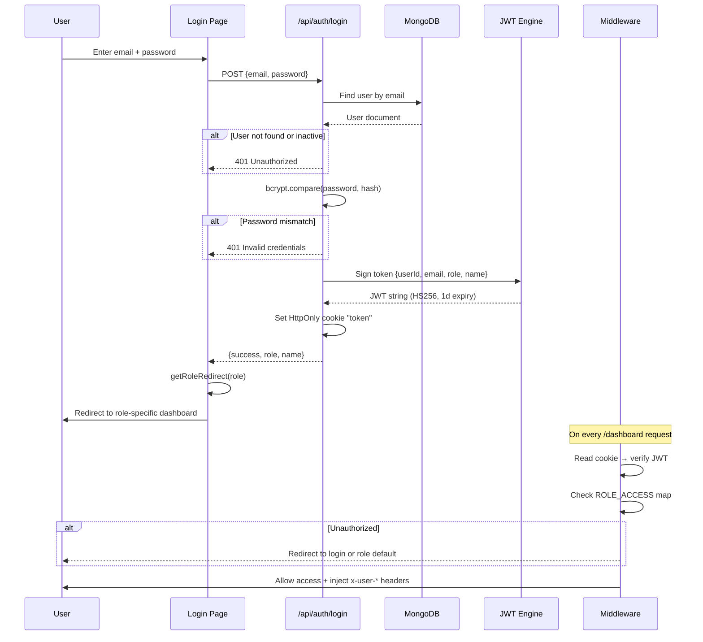
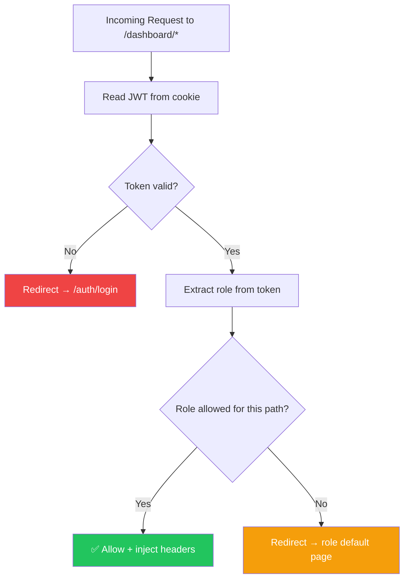
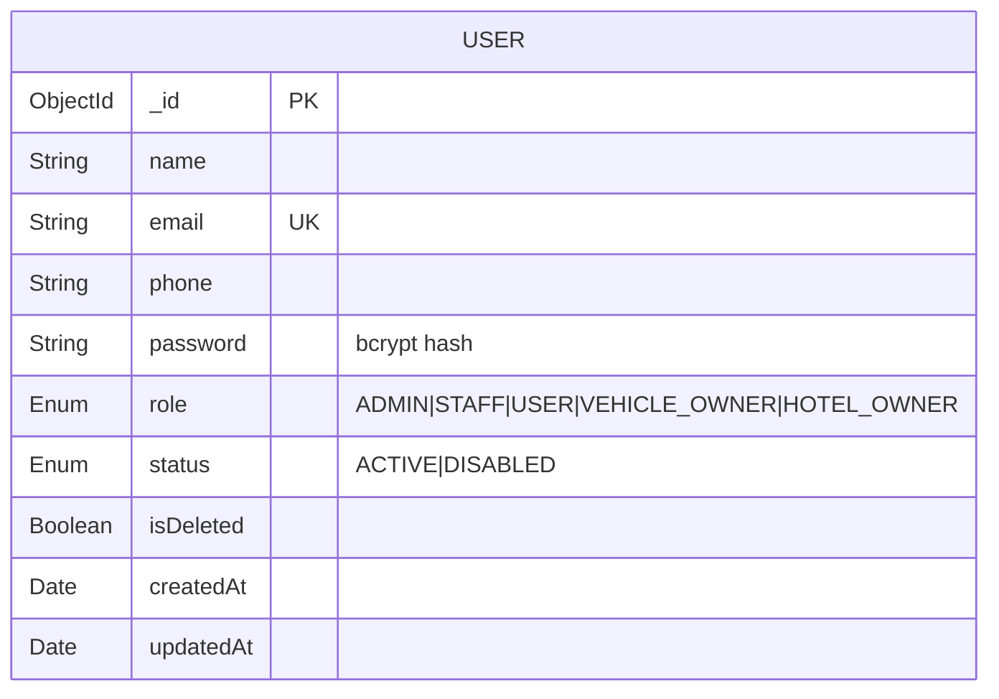

# 🔐 Account Management Module

> User registration, authentication, role-based access control, and profile management.

---

## Overview

The Account Management module handles the complete identity lifecycle for all 5 user roles in the system. It provides a **single unified login**, JWT-based session management, middleware-level route protection, and per-role dashboard access.

---

## User Roles

| Role | Code | Description | Default Dashboard |
|------|------|-------------|-------------------|
| Administrator | `ADMIN` | Full system access — manage all modules | `/dashboard` |
| Concierge Staff | `STAFF` | Booking operations, no finance/user mgmt | `/dashboard` |
| Customer | `USER` | View own bookings and custom plans | `/dashboard/my-bookings` |
| Fleet Partner | `VEHICLE_OWNER` | Manage own vehicles and assignments | `/dashboard/fleet` |
| Hotel Partner | `HOTEL_OWNER` | Manage hotel profile and services | `/dashboard/hotel` |

---

## Authentication Flow



---

## Role-Based Access Control (RBAC)

The RBAC system operates at **three levels**:

### Level 1: Middleware (Route Protection)



**Access Map:**

| Path Pattern | ADMIN | STAFF | USER | VEHICLE_OWNER | HOTEL_OWNER |
|-------------|:-----:|:-----:|:----:|:-------------:|:-----------:|
| `/dashboard` (overview) | ✅ | ✅ | ❌ | ❌ | ❌ |
| `/dashboard/bookings` | ✅ | ✅ | ❌ | ❌ | ❌ |
| `/dashboard/packages` | ✅ | ✅ | ❌ | ❌ | ❌ |
| `/dashboard/vehicles` | ✅ | ✅ | ❌ | ❌ | ❌ |
| `/dashboard/finance` | ✅ | ❌ | ❌ | ❌ | ❌ |
| `/dashboard/users` | ✅ | ❌ | ❌ | ❌ | ❌ |
| `/dashboard/my-bookings` | ❌ | ❌ | ✅ | ❌ | ❌ |
| `/dashboard/my-plans` | ❌ | ❌ | ✅ | ❌ | ❌ |
| `/dashboard/fleet` | ❌ | ❌ | ❌ | ✅ | ❌ |
| `/dashboard/hotel` | ❌ | ❌ | ❌ | ❌ | ✅ |
| `/dashboard/profile` | ✅ | ✅ | ✅ | ✅ | ✅ |

### Level 2: API Route Guards

```typescript
// Staff or Admin only
export const POST = staffOrAdmin(async (request, { user }) => { ... });

// Admin only
export const DELETE = adminOnly(async (request, { user }) => { ... });

// Customer only
export const GET = customerOnly(async (request, { user }) => { ... });
```

### Level 3: UI Conditional Rendering

The `DashboardSidebar` component fetches the user's role from `/api/auth/me` and renders only the navigation items permitted for that role.

---

## Key Files

| File | Purpose |
|------|---------|
| `src/lib/auth.ts` | JWT sign, verify, cookie helpers |
| `src/lib/rbac.ts` | `withRole()`, `staffOrAdmin()`, `adminOnly()`, `customerOnly()` |
| `src/middleware.ts` | Route-level RBAC with `ROLE_ACCESS` map |
| `src/lib/seed.ts` | Demo account seeder (6 accounts) |
| `src/app/auth/login/page.tsx` | Unified login page |
| `src/app/api/auth/login/route.ts` | Login API |
| `src/app/api/auth/me/route.ts` | Current user profile API |
| `src/components/layout/DashboardSidebar.tsx` | Role-aware sidebar |

---

## Entity Schema — User



---

## Security Features

- **Password hashing**: bcryptjs with 12 salt rounds
- **JWT expiry**: Configurable via `JWT_EXPIRES_IN` (default: 1 day)
- **HttpOnly cookies**: Token never exposed to client-side JavaScript
- **SameSite=Strict**: CSRF protection
- **Secure flag**: Enabled automatically in production
- **Rate limiting**: Login endpoint rate-limited per IP
- **Security headers**: `X-Frame-Options`, `X-Content-Type-Options`, `X-XSS-Protection`
