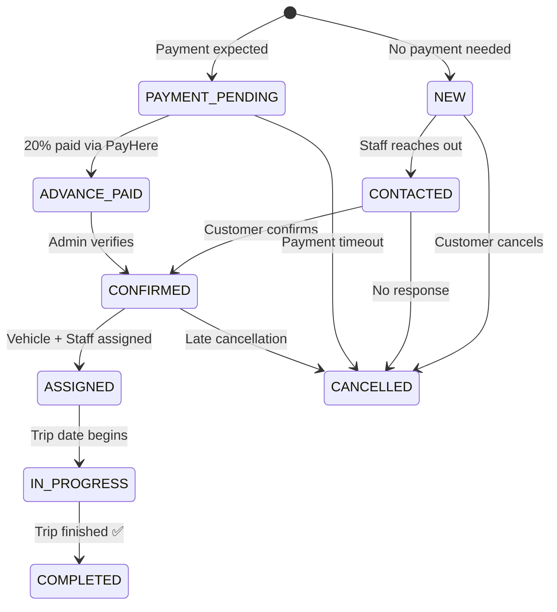
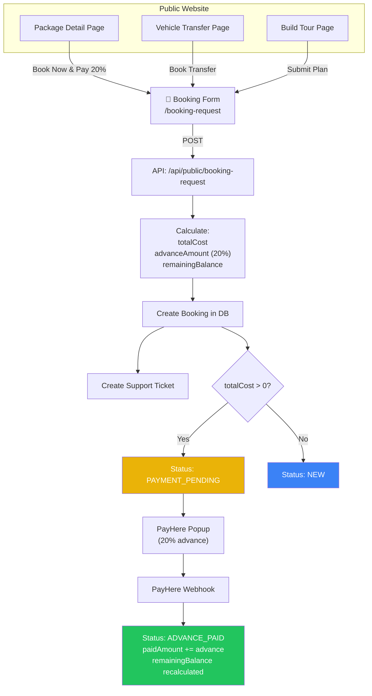
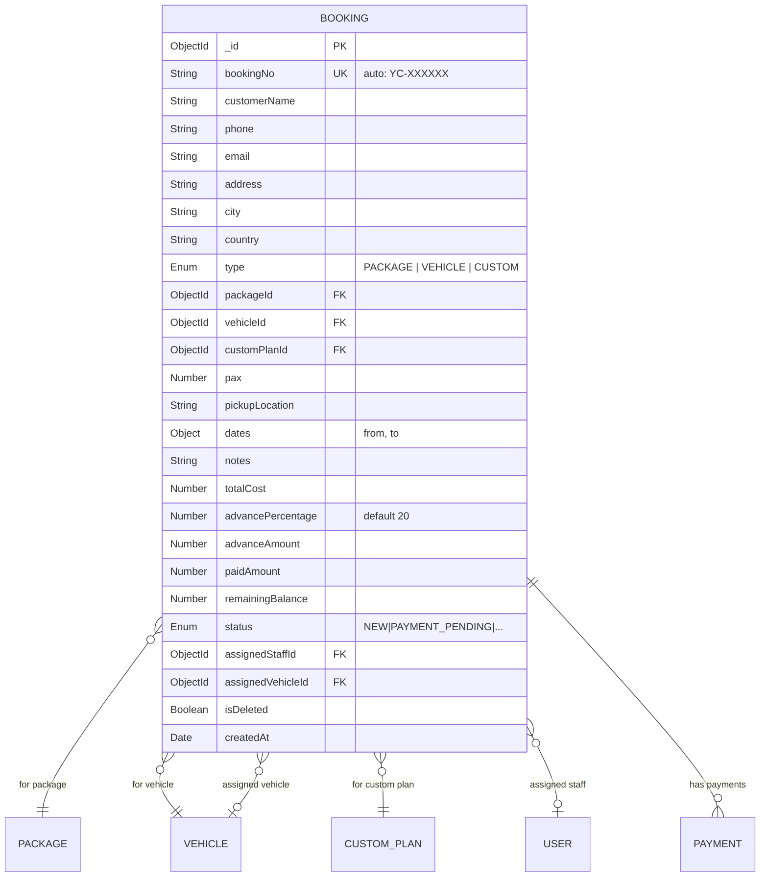
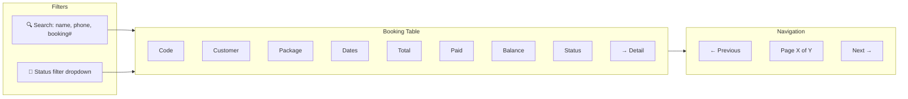
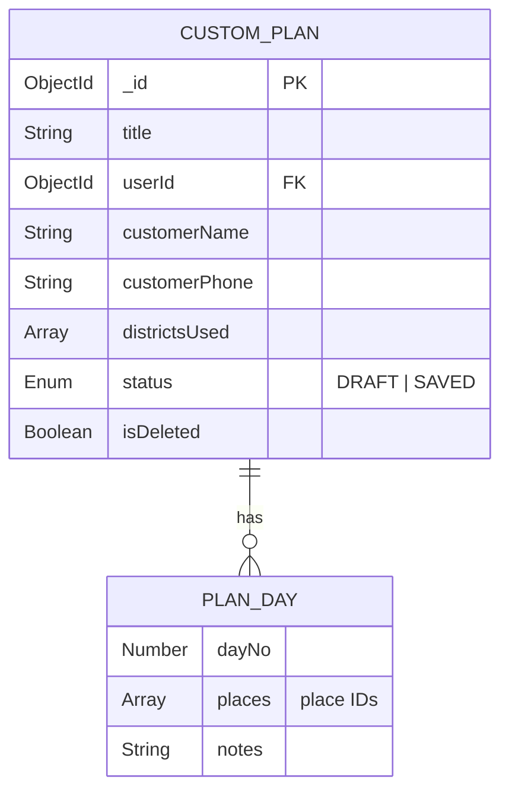

# 📅 Booking & Reservation Management Module

> Full booking lifecycle, custom tour plans, status pipeline, vehicle/staff assignment, and customer booking history.

---

## Overview

The Booking module is the **operational core** of the system. It handles the complete lifecycle from a customer's initial booking request through payment, assignment, execution, and completion. It supports three booking types: **package bookings**, **vehicle transfers**, and **custom plan bookings**.

---

## Booking Status Pipeline

### Status Definitions

| Status | Color | Meaning |
|--------|-------|---------|
| `NEW` | 🔵 Blue | Booking created, no payment expected |
| `PAYMENT_PENDING` | 🟡 Yellow | Awaiting 20% advance payment |
| `CONTACTED` | 🔵 Sky | Staff has contacted the customer |
| `ADVANCE_PAID` | 🟢 Emerald | 20% advance received and verified |
| `CONFIRMED` | 🟢 Green | Booking fully confirmed |
| `ASSIGNED` | 🟣 Purple | Vehicle and/or staff assigned |
| `IN_PROGRESS` | 🔵 Indigo | Trip currently active |
| `COMPLETED` | ⚪ Gray | Trip finished |
| `CANCELLED` | 🔴 Red | Booking cancelled |

---

## Booking Creation Flow

---

## Booking Entity

---

## Admin Booking Management

### Booking List Page (`/dashboard/bookings`)

### Booking Detail Page (`/dashboard/bookings/:id`)

| Section | Contents |
|---------|----------|
| **Header** | Booking #, status badge, status updater dropdown |
| **Customer Info** | Name, phone, email, pax |
| **Trip Details** | Package name, pickup location, date range, notes |
| **Payment History** | List of all payment records (orderId, amount, status, provider) |
| **Vehicle Assignment** | Assigned vehicle or "Not assigned" |
| **Financial Summary** | Total cost, 20% advance, paid amount, remaining balance |
| **Staff Assignment** | Assigned staff member or "Not assigned" |

---

## Custom Tour Plans

The Build Your Tour feature allows customers to:
1. **Browse districts** on a Leaflet map
2. **Select places** within each district
3. **Arrange into days** with drag-and-drop
4. **Save the plan** and optionally convert to a booking

---

## Key Files

| File | Purpose |
|------|---------|
| `src/models/Booking.ts` | Booking Mongoose schema |
| `src/models/CustomPlan.ts` | Custom plan schema |
| `src/app/dashboard/bookings/page.tsx` | Admin booking list |
| `src/app/dashboard/bookings/[id]/page.tsx` | Booking detail page |
| `src/app/dashboard/bookings/[id]/BookingStatusUpdater.tsx` | Status dropdown |
| `src/app/dashboard/my-bookings/page.tsx` | Customer booking history |
| `src/app/dashboard/my-plans/page.tsx` | Customer saved plans |
| `src/app/(public)/booking-request/page.tsx` | Public booking form |
| `src/components/public/BookingRequestClient.tsx` | Booking form + PayHere |
| `src/app/api/bookings/route.ts` | Booking CRUD API |
| `src/app/api/public/booking-request/route.ts` | Public booking API |
| `src/lib/validations.ts` | `createBookingSchema`, `updateBookingStatusSchema` |

---

## API Endpoints

| Method | Endpoint | Auth | Description |
|--------|----------|------|-------------|
| `GET` | `/api/bookings` | Staff+ | List bookings (filter, search, paginate) |
| `POST` | `/api/bookings` | Staff+ | Create booking (staff-initiated) |
| `GET` | `/api/bookings/:id` | Staff+ | Get booking detail |
| `PATCH` | `/api/bookings/:id` | Staff+ | Update status or assignment |
| `POST` | `/api/public/booking-request` | — | Public booking + 20% advance calc |
