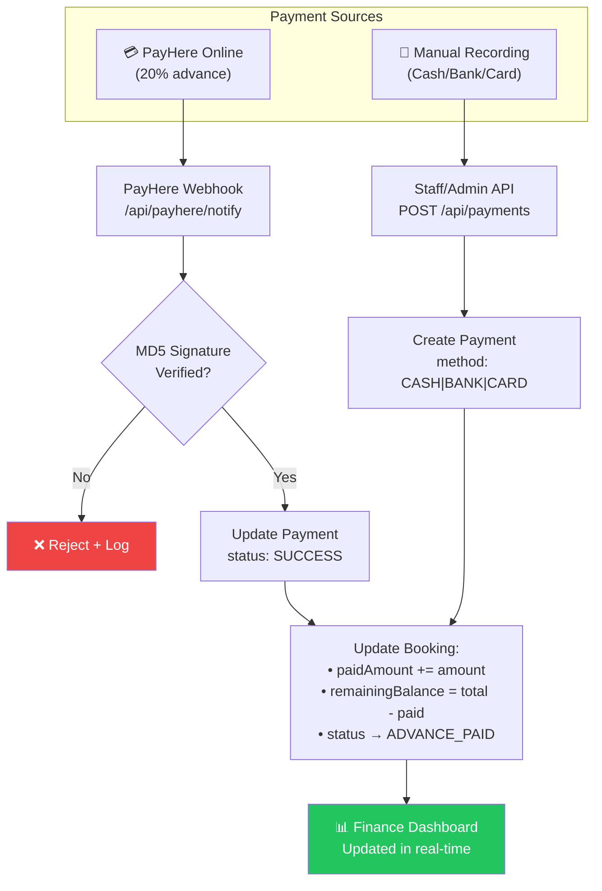
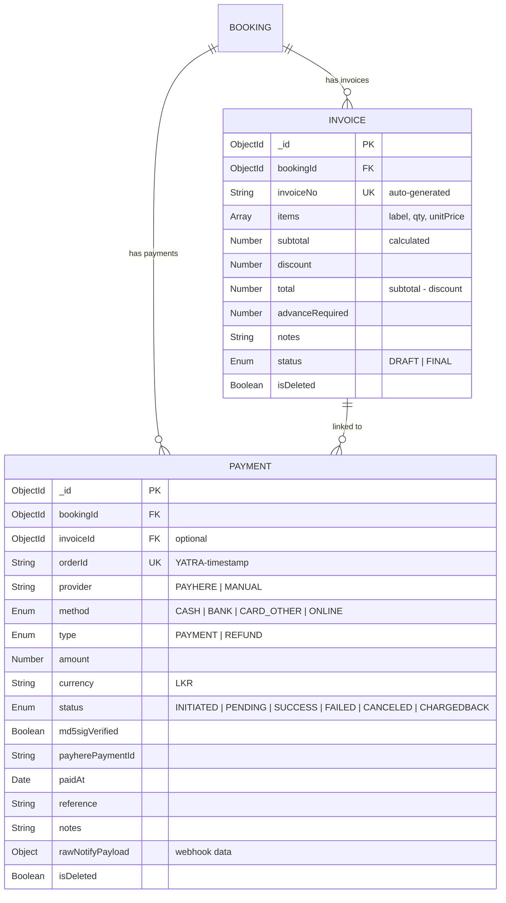
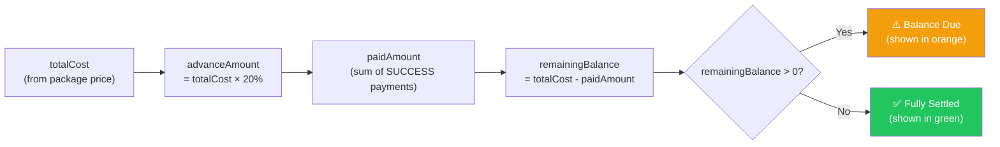
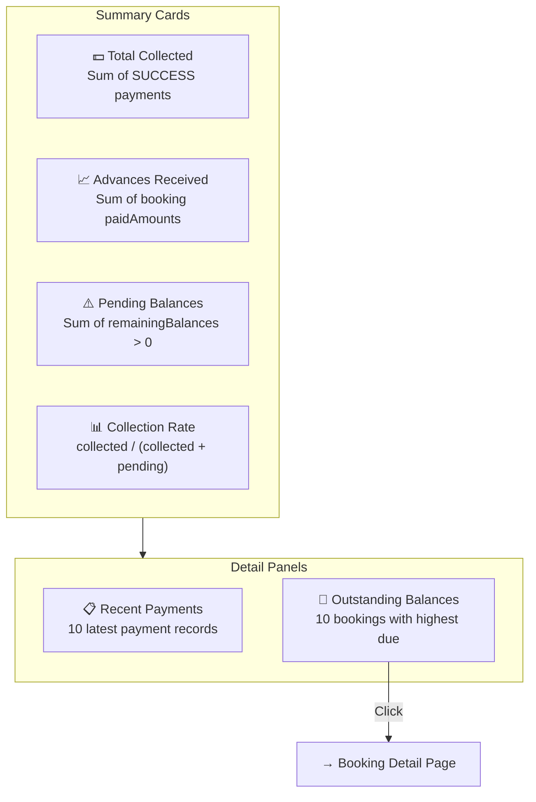
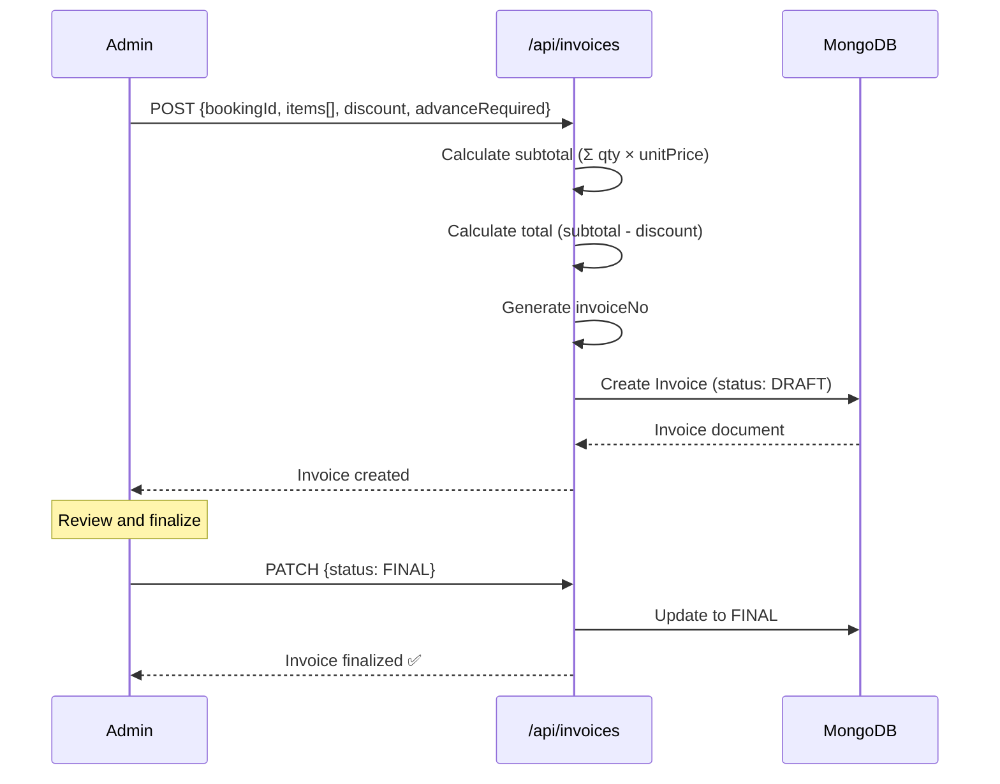

# 💰 Finance Management Module

> Payment processing, advance tracking, invoice management, manual recording, and financial dashboards.

---

## Overview

The Finance module tracks **all monetary flows** in the system. It manages the 20% advance payment model via PayHere, manual payment recording by staff, invoice generation, and provides a real-time financial dashboard with collection metrics.

> **Scope Note**: Per the approved project document (ITP_IT_101), the initial scope focuses on **manual payment recording** — invoice, advance payment, receipt, remaining balance, and refund tracking. Online payment via PayHere is available as an enhancement.

---

## Payment Processing Flow

---

## Payment Entity

---

## Financial Calculations

---

## Finance Dashboard (`/dashboard/finance`)

### Dashboard Data Queries

| Metric | Query |
|--------|-------|
| Total Collected | `Payment.aggregate($sum amount where status=SUCCESS)` |
| Advances Received | `Booking.aggregate($sum paidAmount where paidAmount > 0)` |
| Pending Balances | `Booking.aggregate($sum remainingBalance where remainingBalance > 0)` |
| Collection Rate | `collected / (collected + pending) × 100%` |
| Recent Payments | `Payment.find().sort(createdAt: -1).limit(10)` |
| Outstanding | `Booking.find(remainingBalance > 0).sort(remainingBalance: -1).limit(10)` |

---

## Invoice System

---

## Manual Payment Recording

| Field | Type | Required | Description |
|-------|------|----------|-------------|
| `bookingId` | String | ✅ | Which booking this payment is for |
| `amount` | Number | ✅ | Payment amount (min 0.01) |
| `method` | Enum | ✅ | `CASH`, `BANK`, `CARD_OTHER`, `ONLINE` |
| `invoiceId` | String | ❌ | Link to invoice if applicable |
| `paidAt` | String | ❌ | Payment date (defaults to now) |
| `reference` | String | ❌ | Bank reference / receipt number |
| `type` | Enum | ❌ | `PAYMENT` (default) or `REFUND` |
| `notes` | String | ❌ | Internal notes |

---

## Key Files

| File | Purpose |
|------|---------|
| `src/models/Payment.ts` | Payment Mongoose schema |
| `src/models/Invoice.ts` | Invoice Mongoose schema |
| `src/app/dashboard/finance/page.tsx` | Finance dashboard |
| `src/app/api/payments/route.ts` | Payment CRUD API |
| `src/app/api/invoices/route.ts` | Invoice CRUD API |
| `src/app/api/payhere/create/route.ts` | PayHere session creation |
| `src/app/api/payhere/notify/route.ts` | PayHere webhook handler |
| `src/lib/payhere/hash.ts` | MD5 signature verification |
| `src/lib/validations.ts` | `createPaymentSchema`, `createInvoiceSchema` |

---

## API Endpoints

| Method | Endpoint | Auth | Description |
|--------|----------|------|-------------|
| `GET` | `/api/payments` | Admin | List payment records |
| `POST` | `/api/payments` | Staff+ | Record manual payment |
| `GET` | `/api/invoices` | Staff+ | List invoices |
| `POST` | `/api/invoices` | Staff+ | Create invoice |
| `PATCH` | `/api/invoices/:id` | Staff+ | Update invoice status |
| `POST` | `/api/payhere/create` | — | Create PayHere session |
| `POST` | `/api/payhere/notify` | — | PayHere webhook (MD5 verified) |
