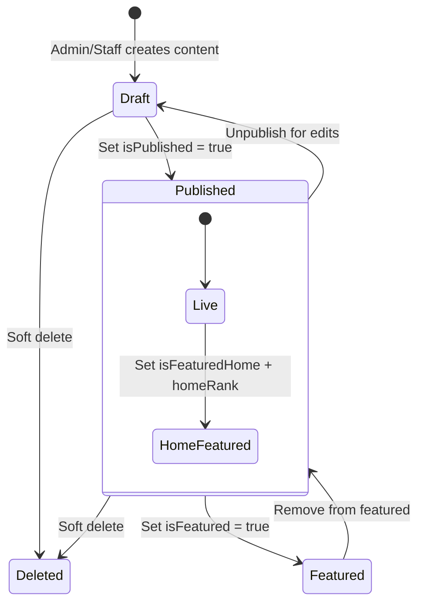
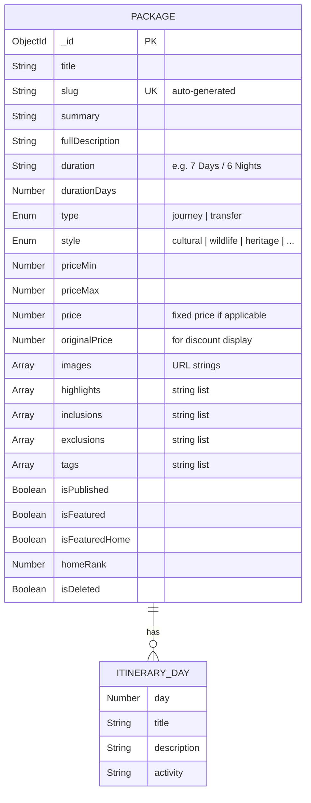
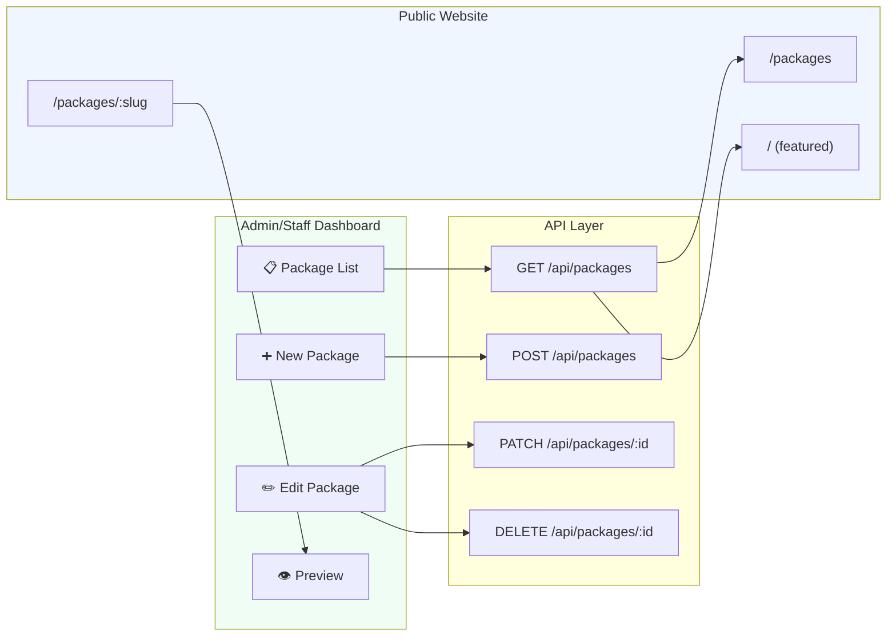
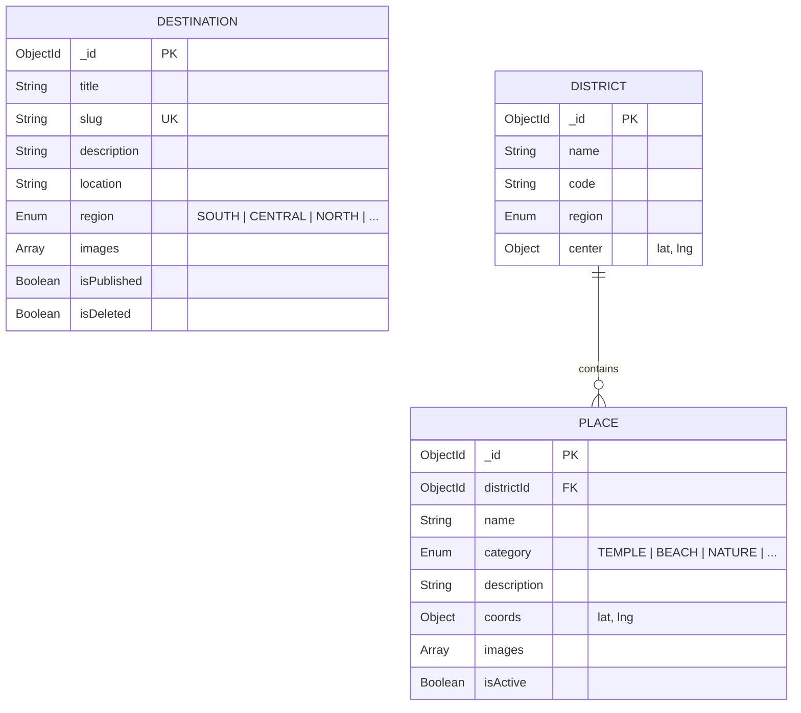
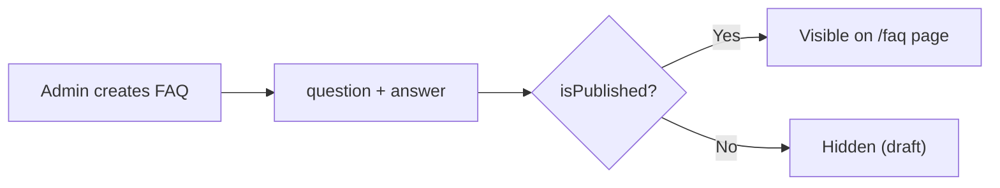

# 📦 Products & Content Management Module

> Packages, destinations, FAQs, testimonials, gallery, and SEO-optimized content publishing.

---

## Overview

This module manages all **public-facing content** for the Yatara Ceylon tourism website. It provides full CRUD for tour packages with itineraries, destination pages with regional grouping, customer testimonials, FAQ management, and a gallery/blog system.

---

## Content Lifecycle

---

## Package Management

### Package Entity

### Package CRUD Flow

### Package Detail Page Sections

| Section | Data Source | Description |
|---------|-----------|-------------|
| Hero Banner | `images[0]` | Full-width hero with gradient overlay |
| Gallery Strip | `images[1..3]` | 3-image grid below hero |
| Signature Moments | `highlights[]` | Key experience highlights grid |
| Journey Overview | `fullDescription` | Long-form description prose |
| Day-by-Day Itinerary | `itinerary[]` | Timeline with day numbers and activities |
| What's Included | `inclusions[]` | Green checkmark list |
| What's Excluded | `exclusions[]` | Red X list |
| Booking Sidebar | `priceMin`, `priceMax` | Price display + Book Now button |
| Related Journeys | Related packages query | 3 related packages by tags |

---

## Destination Management

---

## Other Content Types

### FAQs

### Testimonials

| Field | Type | Description |
|-------|------|-------------|
| `name` | String | Customer name |
| `rating` | Number (1-5) | Star rating |
| `comment` | String | Review text |
| `isPublished` | Boolean | Visibility toggle |

### Gallery / Blog

| Field | Type | Description |
|-------|------|-------------|
| `type` | `IMAGE` or `BLOG` | Content type |
| `title` | String | Title |
| `content` | String | Blog body (markdown-capable) |
| `images` | String[] | Image URLs |
| `isPublished` | Boolean | Visibility toggle |

---

## Key Files

| File | Purpose |
|------|---------|
| `src/app/dashboard/packages/page.tsx` | Package list (admin) |
| `src/app/dashboard/packages/[id]/page.tsx` | Package edit form |
| `src/app/dashboard/packages/new/page.tsx` | New package form |
| `src/app/dashboard/destinations/page.tsx` | Destination list (admin) |
| `src/app/(public)/packages/page.tsx` | Public package listing |
| `src/app/(public)/packages/[slug]/page.tsx` | Public package detail |
| `src/app/(public)/destinations/page.tsx` | Public destination listing |
| `src/app/api/packages/route.ts` | Package CRUD API |
| `src/app/api/destinations/route.ts` | Destination CRUD API |
| `src/lib/validations.ts` | Zod schemas for all content types |

---

## API Endpoints

| Method | Endpoint | Auth | Description |
|--------|----------|------|-------------|
| `GET` | `/api/packages` | Staff+ | List all packages |
| `POST` | `/api/packages` | Staff+ | Create package |
| `GET` | `/api/packages/:id` | Staff+ | Get package detail |
| `PATCH` | `/api/packages/:id` | Staff+ | Update package |
| `DELETE` | `/api/packages/:id` | Admin | Soft delete package |
| `GET` | `/api/destinations` | Staff+ | List destinations |
| `POST` | `/api/destinations` | Staff+ | Create destination |
| `GET` | `/api/public/packages` | — | Public package listing |
