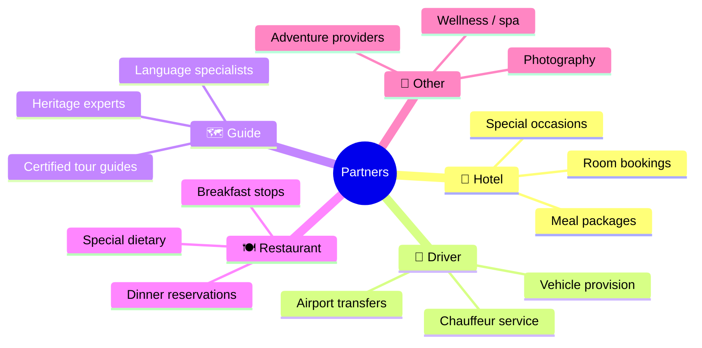
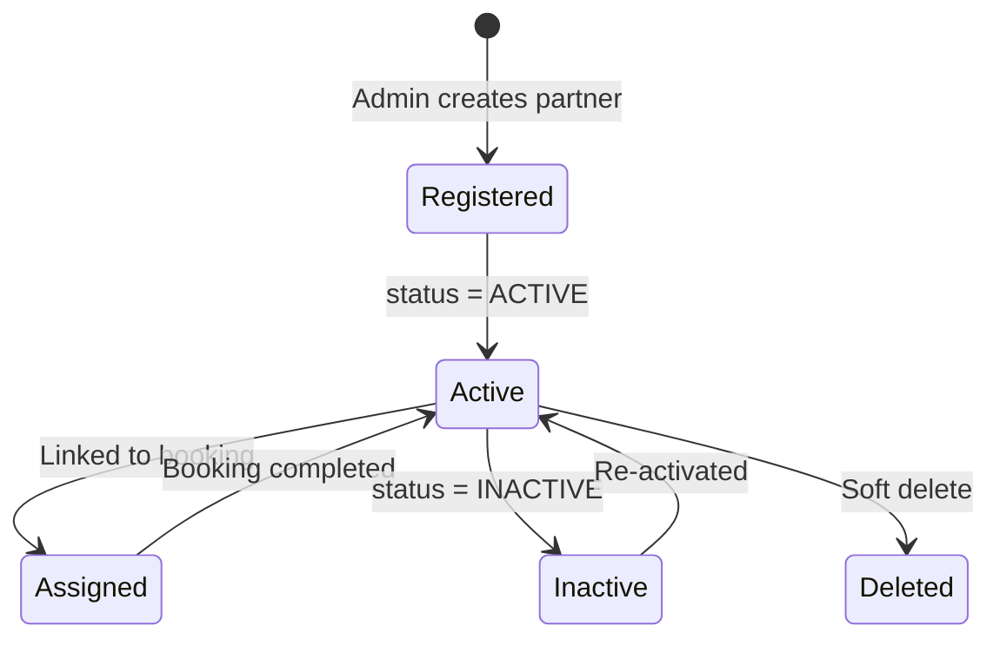
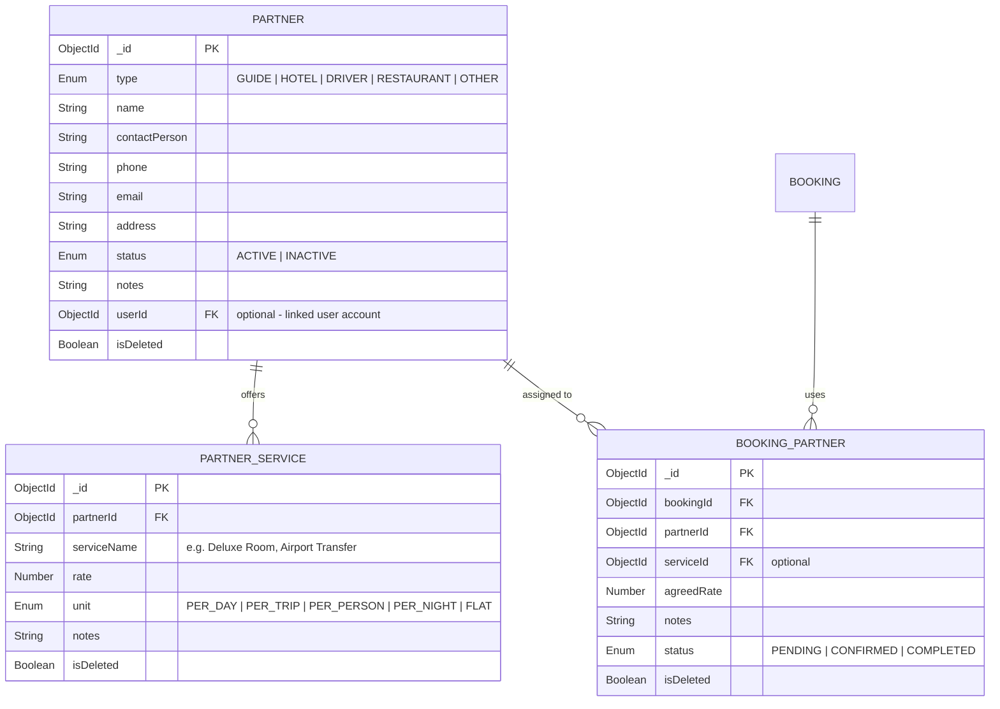
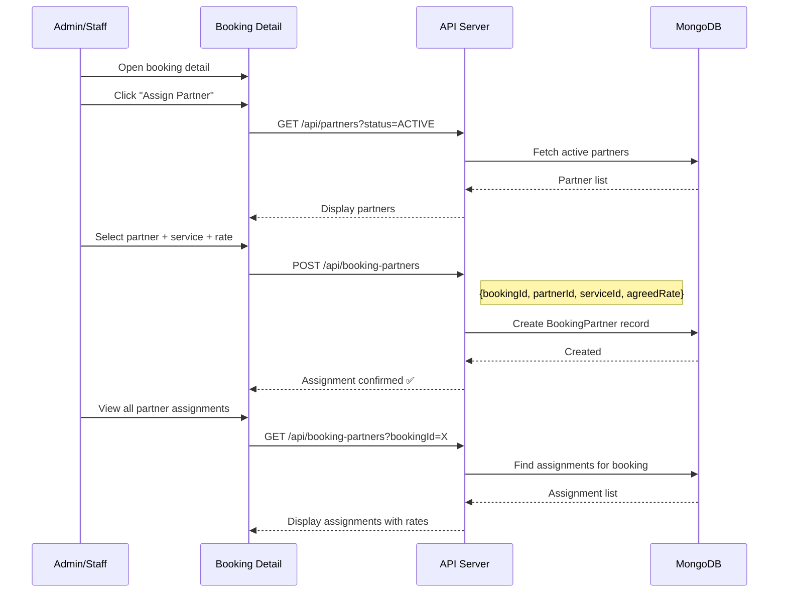
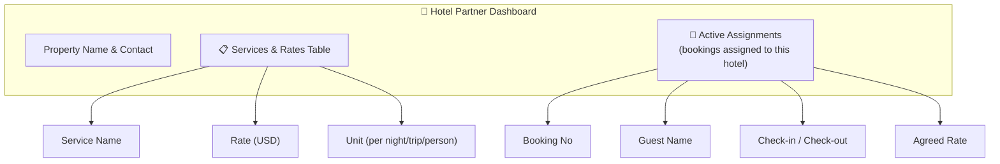
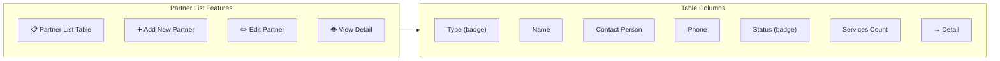

# 🤝 Supplier/Partner Management Module

> Partner registry, service rate cards, booking-partner assignments, and hotel partner dashboard.

---

## Overview

The Supplier/Partner module manages the **external service providers** that Yatara Ceylon works with — hotels, restaurants, drivers/guides, and other tourism service providers. Each partner has a profile, service rate cards, and can be assigned to bookings. Hotel partners get their own dedicated dashboard.

---

## Partner Types

---

## Partner Lifecycle

---

## Partner Entity

---

## Partner Assignment to Bookings

---

## Hotel Partner Dashboard

The hotel partner (`HOTEL_OWNER`) accesses `/dashboard/hotel` to view their properties and services:

---

## Service Rate Card

Each partner can define multiple service offerings with different pricing units:

| Service Name | Rate | Unit | Example |
|-------------|------|------|---------|
| Deluxe Room | $120 | PER_NIGHT | Hotel partner |
| Airport Pickup | $45 | PER_TRIP | Driver partner |
| Cultural Walk | $30 | PER_PERSON | Guide partner |
| Dinner Package | $25 | PER_PERSON | Restaurant partner |
| Full Day Guide | $80 | PER_DAY | Guide partner |
| Photography Session | $200 | FLAT | Other partner |

---

## Admin Partner Management

### Partner List (`/dashboard/partners`)

### Partner Detail (`/dashboard/partners/:id`)

| Section | Contents |
|---------|----------|
| **Profile** | Name, type, contact person, phone, email, address |
| **Status** | Active/Inactive toggle |
| **Services** | Service rate cards with add/edit/delete |
| **Assignments** | All bookings this partner has been assigned to |
| **Notes** | Internal notes about the partner |

---

## Key Files

| File | Purpose |
|------|---------|
| `src/models/Partner.ts` | Partner Mongoose schema |
| `src/models/PartnerService.ts` | Service rate card schema |
| `src/models/BookingPartner.ts` | Booking-partner assignment schema |
| `src/app/dashboard/partners/page.tsx` | Partner list (admin) |
| `src/app/dashboard/partners/[id]/page.tsx` | Partner detail + services |
| `src/app/dashboard/partners/new/page.tsx` | New partner form |
| `src/app/dashboard/hotel/page.tsx` | Hotel partner dashboard |
| `src/app/api/partners/route.ts` | Partner CRUD API |
| `src/app/api/partners/[id]/services/route.ts` | Partner services API |
| `src/app/api/booking-partners/route.ts` | Booking assignment API |
| `src/lib/validations.ts` | `createPartnerSchema`, `createPartnerServiceSchema`, `createBookingPartnerSchema` |

---

## API Endpoints

| Method | Endpoint | Auth | Description |
|--------|----------|------|-------------|
| `GET` | `/api/partners` | Staff+ | List partners (filter by type/status) |
| `POST` | `/api/partners` | Staff+ | Create partner |
| `GET` | `/api/partners/:id` | Staff+ | Get partner detail |
| `PATCH` | `/api/partners/:id` | Staff+ | Update partner |
| `DELETE` | `/api/partners/:id` | Admin | Soft delete partner |
| `GET` | `/api/partners/:id/services` | Staff+ | List partner services |
| `POST` | `/api/partners/:id/services` | Staff+ | Add service rate card |
| `DELETE` | `/api/partners/:id/services/:sid` | Staff+ | Remove service |
| `GET` | `/api/booking-partners` | Staff+ | List booking assignments |
| `POST` | `/api/booking-partners` | Staff+ | Assign partner to booking |
