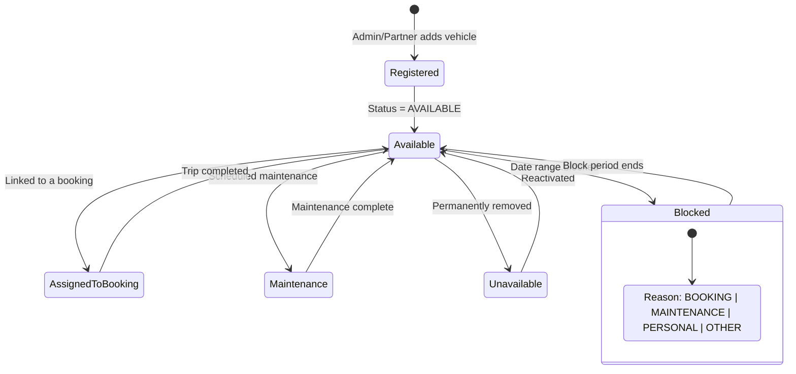
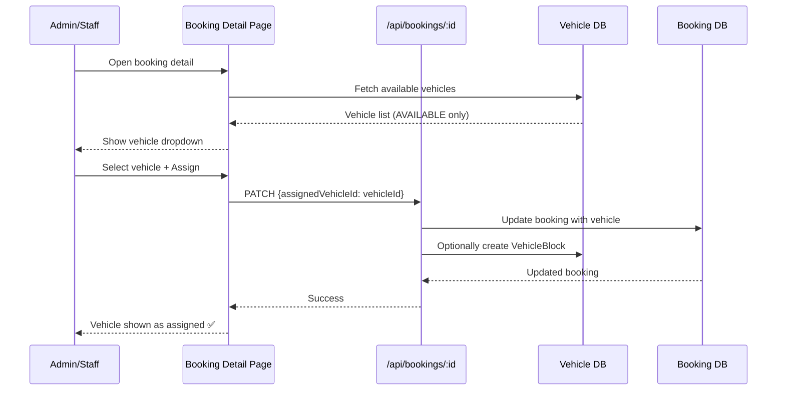
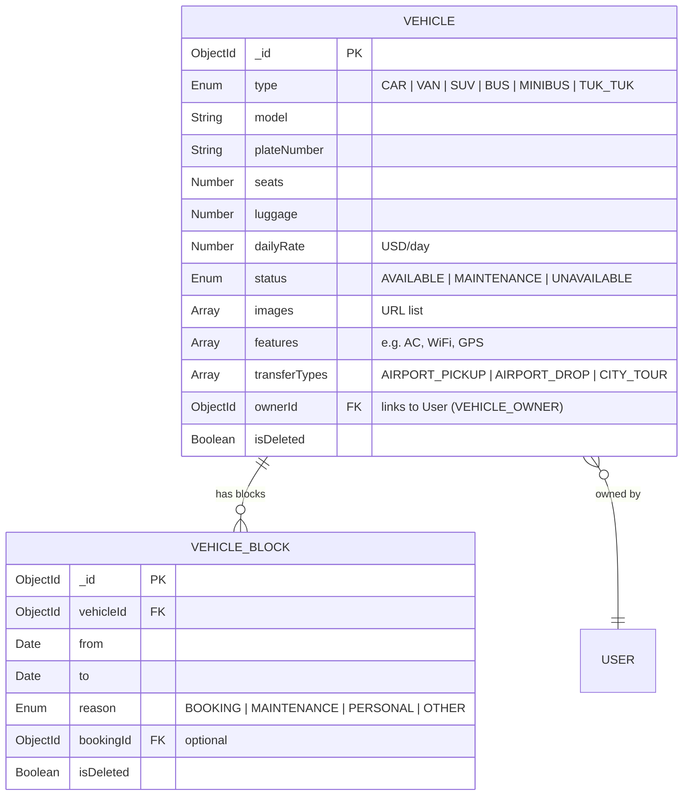
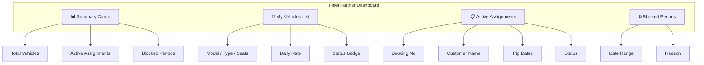
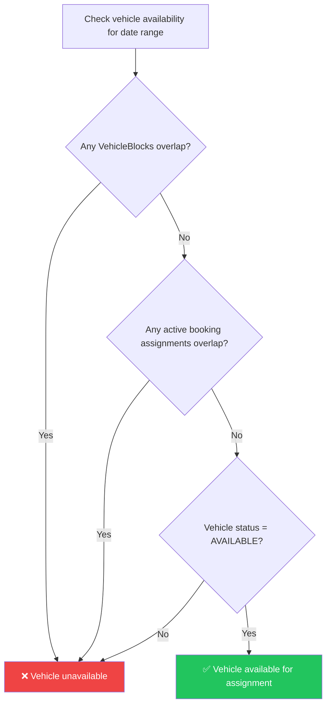

# 🚗 Vehicle Fleet Management Module

> Vehicle registry, availability blocking, booking assignments, and fleet partner dashboard.

---

## Overview

The Vehicle Fleet module manages Yatara Ceylon's **transport fleet** — private cars, vans, SUVs, buses, and tuk-tuks available for airport transfers, city tours, and multi-day journeys. Fleet partners (vehicle owners) can manage their own vehicles through a dedicated dashboard, while admin/staff handle assignments.

---

## Vehicle Lifecycle

---

## Vehicle Assignment Flow

---

## Vehicle Entity

---

## Fleet Partner Dashboard

The fleet partner (`VEHICLE_OWNER`) has a dedicated dashboard at `/dashboard/fleet` showing:

---

## Availability Calendar Logic

---

## Key Files

| File | Purpose |
|------|---------|
| `src/models/Vehicle.ts` | Vehicle Mongoose schema |
| `src/models/VehicleBlock.ts` | Vehicle block period schema |
| `src/app/dashboard/vehicles/page.tsx` | Admin vehicle list |
| `src/app/dashboard/vehicles/[id]/page.tsx` | Vehicle edit + blocks |
| `src/app/dashboard/vehicles/new/page.tsx` | New vehicle form |
| `src/app/dashboard/fleet/page.tsx` | Fleet partner dashboard |
| `src/app/api/vehicles/route.ts` | Vehicle CRUD API |
| `src/app/api/vehicles/[id]/blocks/route.ts` | Vehicle blocks API |
| `src/lib/validations.ts` | `createVehicleSchema`, `createVehicleBlockSchema` |

---

## API Endpoints

| Method | Endpoint | Auth | Description |
|--------|----------|------|-------------|
| `GET` | `/api/vehicles` | Staff+ | List all vehicles |
| `POST` | `/api/vehicles` | Staff+ | Register new vehicle |
| `GET` | `/api/vehicles/:id` | Staff+ | Get vehicle detail |
| `PATCH` | `/api/vehicles/:id` | Staff+ | Update vehicle |
| `DELETE` | `/api/vehicles/:id` | Admin | Soft delete vehicle |
| `GET` | `/api/vehicles/:id/blocks` | Staff+ | List vehicle blocks |
| `POST` | `/api/vehicles/:id/blocks` | Staff+ | Create date block |
| `DELETE` | `/api/vehicles/:id/blocks/:blockId` | Staff+ | Remove block |
