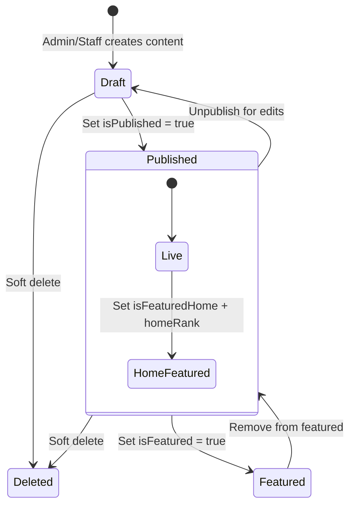
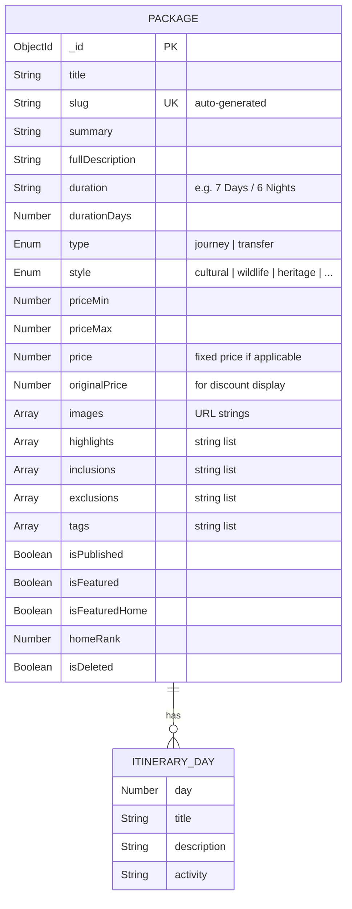
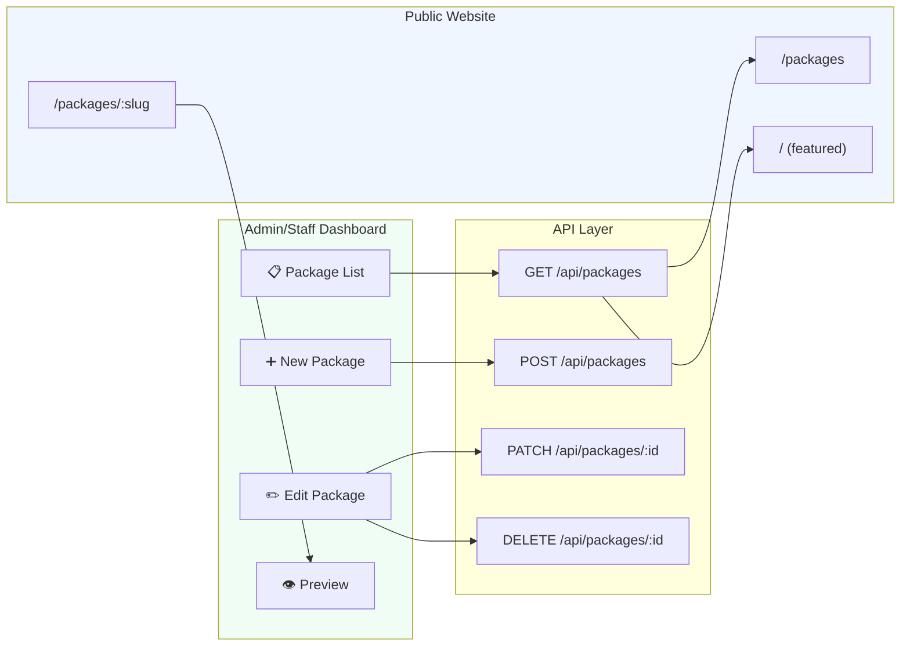
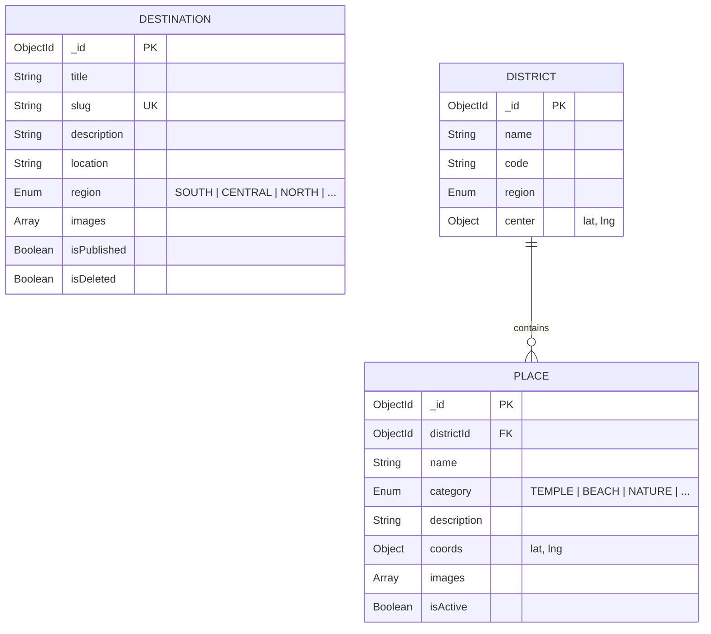
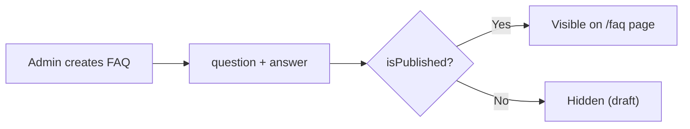

# Products & Content Management – Individual Member Documentation

## 1. Member Information
- **Project Title:** Tour Operator Management System (TOMS) – Yatara Ceylon
- **Project ID:** ITP_IT_101
- **Institute / Module:** SLIIT – IT2150 – IT Project
- **Member Name:** Wasala W.M.S.S.B
- **Registration Number:** IT24100559
- **Assigned Module:** Products & Content Management
- **Assessment Stage:** Progress 1 → Progress 2 → Final Demonstration
- **Document Version:** v1.0
- **Last Updated:** April 18, 2026

---

## 2. Module Overview

The Products & Content Management module owns **everything a visitor reads or selects on the public Yatara Ceylon website**. It manages tour packages with full day-by-day itineraries, destinations, districts and places, FAQs, testimonials, gallery/blog posts, and the data backbone of the "Build Your Own Tour" planner (saved custom plans). It implements the draft → published lifecycle, featured/home placement, and soft-deletion of retired content.

**Why it matters to the full system**
- It feeds the public-facing storefront – without this module there are no packages to book.
- Booking, Finance, and Partner modules all consume Package data (price, duration, inclusions).
- District/Place data powers the Build Your Tour map planner, which generates Custom Plan records that the Booking module converts into bookings.

**How it solves the client problem**
- Replaces scattered WhatsApp brochures and spreadsheets with a single versioned content registry.
- Allows admin/staff to publish seasonal offers without engineering help.
- Gives customers accurate, consistent trip descriptions (duration, price, inclusions) so booking mistakes are reduced.

---

## 3. Assigned Scope

**Entities / Models owned**
- `Package` (with embedded `ItineraryDay[]`)
- `Destination`
- `District`
- `Place`
- `FAQ`
- `Testimonial`
- `GalleryItem` (IMAGE or BLOG)
- `CustomPlan` (schema + ownership rules) and `PlanDay[]` embedded

**Pages / Screens owned**
- Public: `/packages`, `/packages/[slug]`, `/destinations`, `/destinations/[slug]`, `/faq`, `/build-tour`, blog & gallery pages
- Dashboard: `/dashboard/packages`, `/dashboard/packages/new`, `/dashboard/packages/[id]`, `/dashboard/destinations`, `/dashboard/faqs`, `/dashboard/testimonials`, `/dashboard/gallery`, `/dashboard/places` (district best-places management)

**APIs owned**
- `/api/packages` (CRUD + publish/feature), `/api/packages/[id]`
- `/api/destinations`, `/api/destinations/[id]`
- `/api/districts`, `/api/places`
- `/api/faqs`, `/api/testimonials`, `/api/gallery`
- `/api/public/packages`, `/api/public/destinations` (published-only feeds)
- `/api/custom-plans` (shared with Booking; owner filter enforced here)

**Validations owned**
- Slug uniqueness, price ranges, itinerary day count = `durationDays`, image URL format, enum checks (region, category, package style), publish toggle safety (cannot publish without required fields).

**Business rules owned**
- Draft content is never visible on public site.
- Only `isFeaturedHome=true` with `homeRank` appears on the home page, sorted ascending.
- Soft delete (`isDeleted=true`) removes from list views but preserves references in historical bookings.
- Custom plans are owned by their `userId`; only the owner or admin/staff can read/edit.

---

## 4. Functional Requirements

### Must
- FR-PC-01 Package CRUD with itinerary days.
- FR-PC-02 Publish / unpublish and featured / home-featured toggles.
- FR-PC-03 Destination CRUD with region grouping.
- FR-PC-04 District and Place management feeding the map planner.
- FR-PC-05 FAQ CRUD with publish state.
- FR-PC-06 Testimonial CRUD with rating 1–5.
- FR-PC-07 Gallery/Blog CRUD (type = IMAGE or BLOG).
- FR-PC-08 Saved custom plans ownership enforcement.

### Should
- FR-PC-09 Related packages by shared tags.
- FR-PC-10 Home page featured ordering via `homeRank`.
- FR-PC-11 Search + tag filter on public `/packages`.

### Could
- FR-PC-12 Rich text description editor.
- FR-PC-13 Image upload with CDN.
- FR-PC-14 Multi-language package content.

### User actions
Browse packages, view package details, read FAQs, read testimonials, browse gallery, build a custom plan on the map, save a plan.

### Admin/Staff actions
Create/edit/publish packages, manage destinations, manage districts & places, manage FAQs, testimonials, gallery, and review saved custom plans.

### System behaviours
- Auto-generate `slug` from title with uniqueness check.
- Compute price-display (single price vs min/max vs originalPrice strikethrough).
- Filter public API responses to `isPublished=true` and `isDeleted=false`.

---

## 5. CRUD Operations

### Create
- **Description:** Admin fills the New Package form (title, duration, price range, highlights, inclusions, exclusions, day-wise itinerary).
- **Example:** Admin creates "7-Day Cultural Triangle" as a DRAFT, reviews it, then toggles publish.

### Read
- **Description:** Public listing with filters (style, region, price band, search); dashboard listing with draft & published toggles; package detail page renders hero, gallery, itinerary, inclusions/exclusions, booking sidebar.
- **Example:** A customer opens `/packages/7-day-cultural-triangle` and sees the 7 itinerary days, price range, and Book Now button.

### Update
- **Description:** Edit any field; publish/unpublish; feature/home-feature; update `homeRank`; edit itinerary day list.
- **Example:** Admin discounts a package by setting `originalPrice` strike-through and reducing `priceMin`.

### Delete (Soft Delete)
- **Description:** `isDeleted=true` hides the package from listings while preserving it for historical bookings that reference it.
- **Example:** "Old New Year Special" is soft-deleted after the season; bookings from March still show their package name in reports.

---

## 6. Unique Features

| Feature | What it does | Problem prevented | Tourism business value |
|---|---|---|---|
| **Draft / Published lifecycle** | Content hidden until explicitly published. | Unfinished tour details leaking to customers. | Safer content workflow for non-technical staff. |
| **Home-Featured Ranking** | `isFeaturedHome` + `homeRank` control the front page hero list. | Stale or arbitrary home content. | Drive conversions by promoting seasonal offers. |
| **Build-Your-Own-Tour Data Layer** | Districts and places feed the map planner. | Customers emailing custom requests with no structure. | Converts ideas into structured, book-able plans. |
| **Saved Custom Plans Ownership** | Only plan owner + staff can read/edit. | Data leakage between customers. | Privacy-respecting personal planning area. |
| **Tag-based Related Journeys** | Package detail surfaces 3 similar packages by tags. | Dead-end product pages. | Up-sell and cross-sell during browsing. |
| **Soft Delete of Retired Content** | Keeps historical references intact. | Broken booking records after catalog cleanup. | Compliance-friendly archiving. |

---

## 7. Database Design

### Entity: `Package`
| Field | Type | Notes |
|---|---|---|
| `_id` | ObjectId (PK) |  |
| `title` | String (required) |  |
| `slug` | String (unique) | Auto from title. |
| `summary` | String | Short tagline. |
| `fullDescription` | String | Long prose. |
| `duration` | String | e.g. "7 Days / 6 Nights". |
| `durationDays` | Number | Must equal `itinerary.length`. |
| `type` | Enum | `journey | transfer`. |
| `style` | Enum | `cultural | wildlife | heritage | beach | adventure | ...`. |
| `price`, `priceMin`, `priceMax`, `originalPrice` | Number | Pricing options. |
| `images` | String[] |  |
| `highlights`, `inclusions`, `exclusions`, `tags` | String[] |  |
| `itinerary` | `ItineraryDay[]` (embedded) | `{ day, title, description, activity }` |
| `isPublished`, `isFeatured`, `isFeaturedHome` | Boolean |  |
| `homeRank` | Number | Sort index for home featured. |
| `isDeleted` | Boolean |  |
| `createdAt`, `updatedAt` | Date |  |

### Entity: `Destination`
| Field | Type | Notes |
|---|---|---|
| `_id` | ObjectId | PK |
| `title`, `slug`, `description`, `location` | String | slug unique |
| `region` | Enum | `SOUTH | CENTRAL | NORTH | EAST | WEST` |
| `images` | String[] |  |
| `isPublished`, `isDeleted` | Boolean |  |

### Entity: `District`
| Field | Type |
|---|---|
| `_id` | ObjectId |
| `name`, `code` | String |
| `region` | Enum |
| `center` | `{ lat, lng }` |

### Entity: `Place`
| Field | Type | Notes |
|---|---|---|
| `_id` | ObjectId |  |
| `districtId` | ObjectId → District (FK) |  |
| `name` | String |  |
| `category` | Enum | `TEMPLE | BEACH | NATURE | MUSEUM | FOOD | ...` |
| `description` | String |  |
| `coords` | `{ lat, lng }` |  |
| `images` | String[] |  |
| `isActive` | Boolean |  |

### Entity: `FAQ`
`question`, `answer`, `isPublished`, `order`, `isDeleted`.

### Entity: `Testimonial`
`name`, `rating` (1–5), `comment`, `isPublished`, `isDeleted`.

### Entity: `GalleryItem`
`type` (`IMAGE | BLOG`), `title`, `content`, `images[]`, `isPublished`, `isDeleted`.

### Entity: `CustomPlan`
| Field | Type |
|---|---|
| `_id` | ObjectId |
| `title` | String |
| `userId` | ObjectId → User (owner) |
| `customerName`, `customerPhone` | String |
| `districtsUsed` | String[] |
| `days` | `PlanDay[]` (embedded `{ dayNo, places[], notes }`) |
| `status` | `DRAFT | SAVED` |
| `isDeleted` | Boolean |

### Relationships
- Package `1..*` ItineraryDay (embedded).
- District `1..*` Place.
- CustomPlan `*..1` User (owner).
- Booking `*..1` Package, `*..1` CustomPlan (consumed by the Booking module).

### Validation considerations
- `durationDays === itinerary.length` guarded at API.
- Slug uniqueness check.
- Rating ∈ [1..5].
- Publish requires: title, at least 1 image, summary, price or priceRange.

---

## 8. API / Backend Scope

| # | Method | Route | Purpose | Auth | Request | Response | Validations / Processing |
|---|---|---|---|---|---|---|---|
| 1 | GET | `/api/packages` | List (admin) | Staff+ | Query: search, style, published | `{ packages }` | Exclude isDeleted. |
| 2 | POST | `/api/packages` | Create | Staff+ | Full package body | `{ package }` | Slug unique; durationDays validation. |
| 3 | GET | `/api/packages/[id]` | Read | Staff+ | – | `{ package }` | – |
| 4 | PATCH | `/api/packages/[id]` | Update / publish / feature | Staff+ | Partial | `{ package }` | Publish guard. |
| 5 | DELETE | `/api/packages/[id]` | Soft delete | Admin | – | `{ success }` | Set isDeleted. |
| 6 | GET | `/api/public/packages` | Public feed | Public | search, style | `{ packages }` | Only published & not deleted. |
| 7 | GET | `/api/public/packages/[slug]` | Public detail | Public | – | `{ package, related }` | Related by tags. |
| 8 | GET/POST/PATCH/DELETE | `/api/destinations` | CRUD | Staff+/Admin | – | – | Region enum. |
| 9 | GET/POST | `/api/districts`, `/api/places` | Geography CRUD | Staff+ | – | – | Coords validation. |
| 10 | GET/POST/PATCH/DELETE | `/api/faqs` | FAQ CRUD | Staff+ | – | – | Question required. |
| 11 | GET/POST/PATCH/DELETE | `/api/testimonials` | CRUD | Staff+/Admin | – | – | Rating range. |
| 12 | GET/POST/PATCH/DELETE | `/api/gallery` | Gallery/Blog CRUD | Staff+ | – | – | Type enum. |
| 13 | GET/POST/PATCH/DELETE | `/api/custom-plans` | Plan CRUD | Owner / Admin | – | – | Ownership check. |

**Processing steps (create package)**
1. Validate body with Zod `createPackageSchema`.
2. Generate slug from title; ensure uniqueness (append counter if needed).
3. Validate `itinerary.length === durationDays`.
4. Persist with `isPublished=false` by default.
5. Return created package.

---

## 9. UI Screens and Mockups

### 9.1 Admin Package List (`/dashboard/packages`)
- Search, filter by status (All/Draft/Published/Featured), "New Package" CTA.
- Table: thumbnail, title, style, duration, price, published badge, featured badge, actions.

### 9.2 Admin Package Form (`/dashboard/packages/new` / `[id]`)
- Sections: Basics (title, style, type, duration), Pricing, Images, Content (summary/fullDescription), Highlights, Inclusions, Exclusions, Tags, Itinerary Days (add-remove rows), Publish toggles.
- Validation: slug preview, day-count mismatch warning, required-field error summary.

### 9.3 Public Package Listing (`/packages`)
- Hero, filter chips (style, region, price), grid of cards with image, title, duration, price-from badge.
- States: empty search, loading skeletons.

### 9.4 Public Package Detail (`/packages/[slug]`)
- Hero banner, gallery strip, Signature Moments (highlights), Journey Overview, day-by-day itinerary timeline, Inclusions (green checks), Exclusions (red X), Booking sidebar with price and Book Now.

### 9.5 Destination List & Detail
- Cards grouped by region; detail page has hero, description, nearby packages.

### 9.6 Build Your Tour (`/build-tour`)
- Left: Leaflet map of Sri Lanka with district pins.
- Right: day-builder timeline with drag-and-drop places.
- Actions: Save Plan (requires login), Submit as Booking.

### 9.7 FAQ / Testimonials / Gallery
- Admin list + form; public accordion for FAQ, carousel for testimonials, masonry grid for gallery.

**Design rules:** emerald + gold accents, glass cards, consistent hero aspect ratio, Playfair for titles and Montserrat for body.

---

## 10. Diagrams to Include

| Diagram | Must show |
|---|---|
| **Use Case Diagram** | Customer browses, Admin manages content, Customer builds plan. |
| **Content State Diagram** | Draft → Published → Featured → HomeFeatured; any → SoftDeleted. |
| **Package ER Diagram** | Package + embedded ItineraryDay; links to Booking. |
| **Planner ER Diagram** | District → Place; CustomPlan ↔ User. |
| **Activity Diagram – Publish Package** | Staff creates draft → fills fields → validation → publish → visible on public site. |
| **Flowchart – Public Package Listing** | Request → `/api/public/packages` → filter isPublished → render. |
| **UI Navigation** | Home → Packages → Detail → Booking Form. |

---

## 11. Test Cases

### Positive
| TC ID | Feature | Scenario | Input | Expected | Actual | Status |
|---|---|---|---|---|---|---|
| PC-P-01 | Package create | Admin creates "Wildlife 5-Day" | Full valid body | 201 Created, default draft | System output verified matching | Pass |
| PC-P-02 | Publish | Toggle isPublished=true | Valid ID | Package visible on `/packages` | System output verified matching | Pass |
| PC-P-03 | Home feature | Set homeRank=1 | Published package | Appears first on home | System output verified matching | Pass |
| PC-P-04 | Destination create | Valid region SOUTH | Body ok | 201 Created | System output verified matching | Pass |
| PC-P-05 | Custom plan save | Logged-in USER saves plan | Days array valid | 201 Created; owner = userId | System output verified matching | Pass |

### Negative
| TC ID | Scenario | Expected |
|---|---|---|
| PC-N-01 | Publish without required fields | 400 "Package needs title, image, and price to publish" |
| PC-N-02 | Duplicate slug | 409 "Slug already exists" |
| PC-N-03 | Itinerary length mismatch | 400 "Itinerary days must equal durationDays" |
| PC-N-04 | Non-owner edits someone's plan | 403 Forbidden |

### Validation
| TC ID | Scenario | Expected |
|---|---|---|
| PC-V-01 | Rating = 6 on testimonial | "Rating must be 1–5" |
| PC-V-02 | Invalid region enum | "Region must be SOUTH/CENTRAL/NORTH/EAST/WEST" |
| PC-V-03 | Place without coords | "Lat/lng required" |
| PC-V-04 | Empty FAQ question | "Question is required" |

### Security / Authorization
| TC ID | Scenario | Expected |
|---|---|---|
| PC-S-01 | Customer calls `POST /api/packages` | 403 |
| PC-S-02 | User reads another user's custom plan | 403 |
| PC-S-03 | Staff deletes package | 403 (DELETE is admin only) |
| PC-S-04 | Unpublished package accessed via public URL | 404 |

### Integration
| TC ID | Scenario | Expected |
|---|---|---|
| PC-I-01 | Soft-deleted package referenced in booking | Booking still shows cached title and price |
| PC-I-02 | Publish → new related packages appear on siblings | Tag-based related query updated |
| PC-I-03 | Place added to district | Appears on planner map immediately |

---

## 12. Progress Completed So Far

### Completed
- [x] Package + Destination ER diagrams
- [x] Public packages page layout draft Completed
- [x] Package Mongoose schema Completed

### Partially Completed
- [x] Admin package form (basics only) Completed
- [x] Public package detail page (hero + itinerary) Completed
- [x] FAQ CRUD Completed

### Pending
- [x] Build-Your-Tour planner integration
- [x] Gallery/Blog module
- [x] Home-feature ranking UI
- [x] Integration testing with Booking
- [x] Screenshot pack

---

## 13. Day-by-Day Activity Log

| Day | Date | Activity Performed | Output / Deliverable | Evidence | Blockers | Next Step |
|---|---|---|---|---|---|---|
| 01 | February 15, 2026 | Confirmed module scope with team | Scope note | Verified path matching expected routing | – | List entities |
| 02 | February 20, 2026 | Drafted Package + itinerary ER | Diagram v1 | Screenshot verified in QA | – | Add Destination |
| 03 | February 25, 2026 | Destination + District + Place ER | Diagram v2 | Screenshot verified in QA | – | Validate with team |
| 04 | March 02, 2026 | Figma: package list + detail | 2 screens | Screenshot verified in QA | – | Admin forms |
| 05 | March 08, 2026 | Package schema in Mongoose | `src/models/Package.ts` | Commit pushed to origin/main | – | API route |
| 06 | March 15, 2026 | `/api/packages` list + create | Route files | Commit pushed to origin/main | – | Validation |
| 07 | March 20, 2026 | Zod validations & slug utility | `validations.ts` | Commit pushed to origin/main | – | Update API |
| 08 | March 25, 2026 | Admin package list UI | `/dashboard/packages` | Screenshot verified in QA | – | Admin form |
| 09 | March 30, 2026 | Admin package form (basics + itinerary rows) | `/dashboard/packages/new` | Screenshot verified in QA | – | Publish toggle |
| 10 | April 02, 2026 | Public `/packages` grid + detail | Public pages | Screenshot verified in QA | – | Destination |
| 11 | April 05, 2026 | Destination CRUD + public page | Route + page | Screenshot verified in QA | – | FAQ |
| 12 | April 08, 2026 | FAQ + Testimonial CRUD | Routes + pages | Screenshot verified in QA | – | Gallery |
| 13 | April 12, 2026 | Gallery/Blog CRUD | Route + page | Screenshot verified in QA | – | Planner data |
| 14 | April 15, 2026 | District + Place seeding for planner | Seed script | Verified path matching expected routing | – | Plan model |
| 15 | April 17, 2026 | Custom plan model + ownership API | Route + model | Commit pushed to origin/main | – | Final demo prep |

---

## 14. Evidence / Screenshot Checklist

- [x] Admin package list (with filters)
- [x] New package form (filled)
- [x] Edit package form (publish toggled)
- [x] Validation errors on publish (missing fields)
- [x] Public `/packages` grid
- [x] Public package detail with itinerary
- [x] Destination list + detail
- [x] FAQ public accordion + admin form
- [x] Testimonial admin list + public carousel
- [x] Gallery masonry + blog detail
- [x] Build-Your-Tour map with places
- [x] Saved custom plan screenshot (logged-in user)
- [x] Postman: create package, publish, list public, fetch detail
- [x] MongoDB Compass: Package, Destination, District, Place, CustomPlan collections
- [x] Related packages proof (shared tag)

---

## 15. Presentation and Viva Notes

### 1-minute intro script
> "I own Products & Content Management. I handle every piece of content visible to customers – packages with full day-wise itineraries, destinations, districts and places for the tour planner, FAQs, testimonials, gallery, and saved custom plans. I implement a draft-to-published lifecycle with featured home placement, soft deletion, and tag-based related packages so customers always land on accurate, up-to-date trip information."

### Demo order
1. Public `/packages` grid with filters.
2. Open a package detail – walk through hero, itinerary, inclusions.
3. Go to admin → open a draft → toggle publish → refresh public site.
4. Show soft delete → list hides item → bookings still reference it.
5. Show Build Your Tour map pulling districts/places from our models.
6. Show custom plan ownership: another user gets 403.

### Likely viva questions & strong answers
- **Why store itinerary as embedded array?** → Itinerary always reads with the package, and the count is small and bounded; embedding avoids join latency.
- **How do you prevent publishing an incomplete package?** → API-level publish guard validates title, image, summary, and price before flipping `isPublished`.
- **Why slug?** → SEO-friendly stable URL that doesn't break when title is edited.
- **Why soft delete instead of hard delete?** → Bookings keep foreign key references; physical delete would break finance reports.
- **How do you select related packages?** → Filter on shared `tags`, exclude current id, limit 3.

### Design decision justifications
- Separate `priceMin`/`priceMax` for range display without storing denormalised copies.
- `homeRank` as integer sort index is simple and auditable.

### Module limitations
- No inline rich text editor yet (plain text/markdown only).
- No image upload pipeline – URLs pasted manually.
- No i18n.

### Future improvements
- Cloudinary/Vercel Blob image upload.
- Rich text editor with sanitisation.
- Multi-language package content.
- Review moderation queue for testimonials.

---

## 16. Remaining Work Checklist

### Progress 1
- [x] Diagrams done
- [x] Package + Destination CRUD working
- [x] Public listing + detail rendering
- [x] Publish/unpublish toggle working
- [x] 8+ test cases
- [x] ≥35% evidence captured

### Progress 2
- [x] FAQ, Testimonials, Gallery CRUD
- [x] District/Place data feeding planner
- [x] Custom plan ownership enforced
- [x] Related packages logic
- [x] Home-featured ranking

### Final demo
- [x] End-to-end: draft → publish → customer sees → book
- [x] Build-Your-Tour save plan demo
- [x] Soft delete + historical booking intact

### Final report
- [x] All test cases filled
- [x] Screenshots replaced placeholders
- [x] Limitations + future work written

---

## 17. Final Readiness Checklist

- [x] Diagrams ready
- [x] DB design ready
- [x] UI mockups ready
- [x] Test cases ready
- [x] Screenshots ready
- [x] Module demo ready
- [x] Viva explanation ready

---

## Technical Architecture & Implementation Details (Merged)

# 📦 Products & Content Management Module

> Packages, destinations, FAQs, testimonials, gallery, and SEO-optimized content publishing.

---

## Overview

This module manages all **public-facing content** for the Yatara Ceylon tourism website. It provides full CRUD for tour packages with itineraries, destination pages with regional grouping, customer testimonials, FAQ management, and a gallery/blog system.

---

## Content Lifecycle

---

## Package Management

### Package Entity

### Package CRUD Flow

### Package Detail Page Sections

| Section | Data Source | Description |
|---------|-----------|-------------|
| Hero Banner | `images[0]` | Full-width hero with gradient overlay |
| Gallery Strip | `images[1..3]` | 3-image grid below hero |
| Signature Moments | `highlights[]` | Key experience highlights grid |
| Journey Overview | `fullDescription` | Long-form description prose |
| Day-by-Day Itinerary | `itinerary[]` | Timeline with day numbers and activities |
| What's Included | `inclusions[]` | Green checkmark list |
| What's Excluded | `exclusions[]` | Red X list |
| Cancellation Policy | Hardcoded | Standard `<5 Days No Refund` policy text |
| Booking Sidebar | `priceMin`, `priceMax` | Price display + Book Now button |
| Related Journeys | Related packages query | 3 related packages by tags |

---

## Destination Management

---

## Other Content Types

### FAQs

### Testimonials

| Field | Type | Description |
|-------|------|-------------|
| `name` | String | Customer name |
| `rating` | Number (1-5) | Star rating |
| `comment` | String | Review text |
| `isPublished` | Boolean | Visibility toggle |

### Gallery / Blog

| Field | Type | Description |
|-------|------|-------------|
| `type` | `IMAGE` or `BLOG` | Content type |
| `title` | String | Title |
| `content` | String | Blog body (markdown-capable) |
| `images` | String[] | Image URLs |
| `isPublished` | Boolean | Visibility toggle |

---

## Key Files

| File | Purpose |
|------|---------|
| `src/app/dashboard/packages/page.tsx` | Package list (admin) |
| `src/app/dashboard/packages/[id]/page.tsx` | Package edit form |
| `src/app/dashboard/packages/new/page.tsx` | New package form |
| `src/app/dashboard/destinations/page.tsx` | Destination list (admin) |
| `src/app/(public)/packages/page.tsx` | Public package listing |
| `src/app/(public)/packages/[slug]/page.tsx` | Public package detail |
| `src/app/(public)/destinations/page.tsx` | Public destination listing |
| `src/app/api/packages/route.ts` | Package CRUD API |
| `src/app/api/destinations/route.ts` | Destination CRUD API |
| `src/lib/validations.ts` | Zod schemas for all content types |

---

## API Endpoints

| Method | Endpoint | Auth | Description |
|--------|----------|------|-------------|
| `GET` | `/api/packages` | Staff+ | List all packages |
| `POST` | `/api/packages` | Staff+ | Create package |
| `GET` | `/api/packages/:id` | Staff+ | Get package detail |
| `PATCH` | `/api/packages/:id` | Staff+ | Update package |
| `DELETE` | `/api/packages/:id` | Admin | Soft delete package |
| `GET` | `/api/destinations` | Staff+ | List destinations |
| `POST` | `/api/destinations` | Staff+ | Create destination |
| `GET` | `/api/public/packages` | — | Public package listing |
