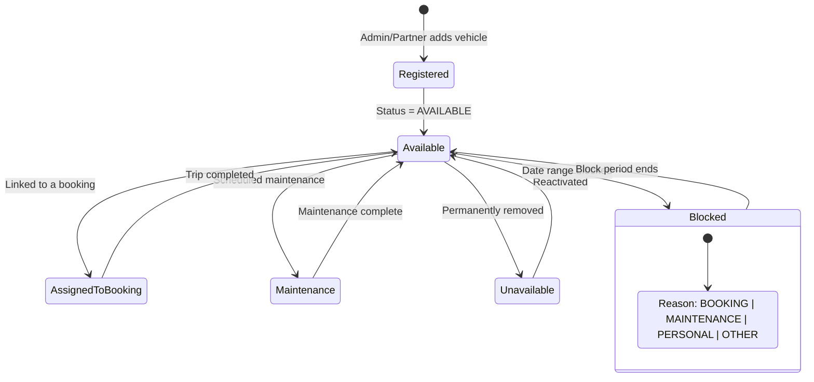
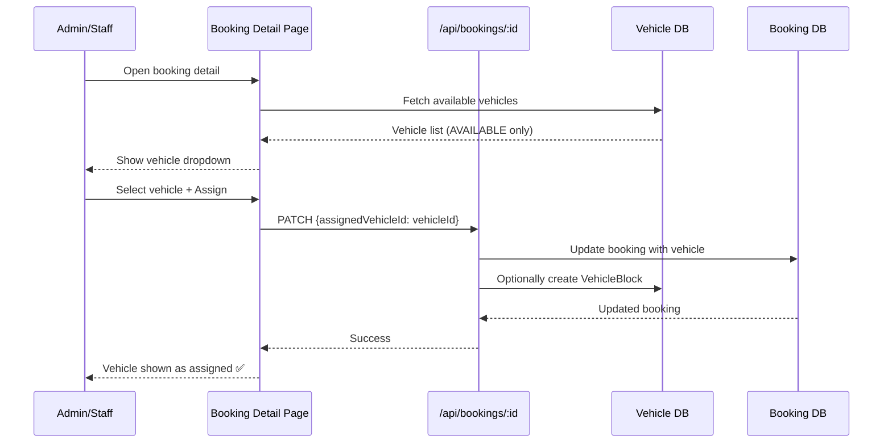
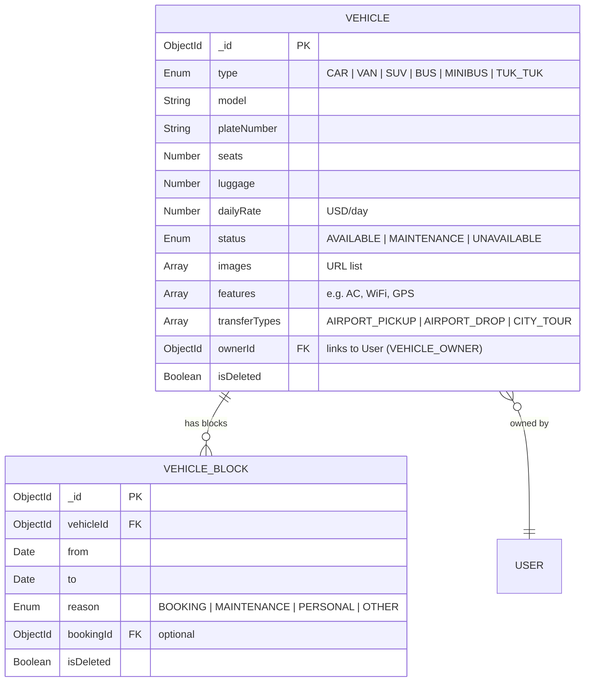
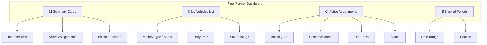
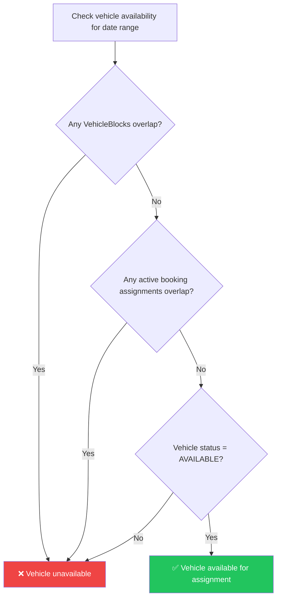

# Vehicle Fleet Management – Individual Member Documentation

## 1. Member Information
- **Project Title:** Tour Operator Management System (TOMS) – Yatara Ceylon
- **Project ID:** ITP_IT_101
- **Institute / Module:** SLIIT – IT2150 – IT Project
- **Member Name:** Melisha L.R.L
- **Registration Number:** IT24102016
- **Assigned Module:** Vehicle Fleet Management
- **Assessment Stage:** Progress 1 → Progress 2 → Final Demonstration
- **Document Version:** v1.0
- **Last Updated:** April 18, 2026

---

## 2. Module Overview

The Vehicle Fleet Management module runs the transport side of the tour operator business. It handles the vehicle registry (cars, vans, SUVs, buses, minibuses, tuk-tuks), rates, seat/luggage specs, vehicle status (AVAILABLE / MAINTENANCE / UNAVAILABLE), owner attribution, blocked date ranges (for bookings, maintenance, personal use), and the availability logic that prevents double-booking. It also exposes a dedicated **Fleet Partner Dashboard** for `VEHICLE_OWNER` accounts to self-manage their own vehicles.

**Why it matters to the full system**
- Every package and transfer booking eventually needs a vehicle; this module is the source of truth.
- Prevents double assignment through overlap checks and vehicle blocks.
- Finance depends on daily rates for pricing and invoicing.

**How it solves the client problem**
- Replaces calls-and-notes juggling with a live availability calendar.
- Prevents the classic "two trips booked on the same van" mistake.
- Fleet partners manage their own cars without admin back-and-forth.

---

## 3. Assigned Scope

**Entities / Models owned**
- `Vehicle`
- `VehicleBlock` (booking/maintenance/personal/other holds)

**Pages / Screens owned**
- `/dashboard/vehicles` – admin vehicle list
- `/dashboard/vehicles/new` – register vehicle
- `/dashboard/vehicles/[id]` – edit vehicle + manage blocks
- `/dashboard/fleet` – vehicle owner (partner) dashboard
- Public `/vehicles` listing (transfer/hire) and `/vehicles/[id]` detail
- Vehicle assignment widget inside booking detail (owned here, consumed by Booking module)

**APIs owned**
- `/api/vehicles` (list, create), `/api/vehicles/[id]` (read, patch, soft-delete)
- `/api/vehicles/[id]/blocks` (list, create, delete)
- `/api/vehicles/availability?from=&to=` (availability query)

**Validations owned**
- Plate uniqueness, seats/luggage ≥ 1, dailyRate ≥ 0, block date range (`from < to`), no overlapping blocks for the same vehicle, ownerId is a VEHICLE_OWNER or ADMIN.

**Business rules owned**
- Overlap prevention: a new block cannot intersect any existing non-deleted block on the same vehicle.
- When a booking is assigned a vehicle, a `VehicleBlock` with `reason=BOOKING` is auto-created.
- A vehicle with `status=MAINTENANCE` or `UNAVAILABLE` is never offered for new assignments.
- Soft delete vehicle preserves history; bookings keep cached vehicle label.

---

## 4. Functional Requirements

### Must
- FR-VF-01 Vehicle CRUD with model, plate, seats, luggage, daily rate.
- FR-VF-02 Status handling (AVAILABLE / MAINTENANCE / UNAVAILABLE).
- FR-VF-03 Vehicle blocks CRUD with reasons.
- FR-VF-04 Availability check for a date range.
- FR-VF-05 Overlap prevention on block creation.
- FR-VF-06 Automatic block on booking assignment.
- FR-VF-07 Fleet partner sees only their own vehicles.
- FR-VF-08 Admin/staff can view all vehicles.

### Should
- FR-VF-09 Search and filters (type, status, seats, rate).
- FR-VF-10 Images and features (AC, WiFi, GPS) for public display.
- FR-VF-11 Transfer types tagging (AIRPORT_PICKUP / DROP / CITY_TOUR).

### Could
- FR-VF-12 Visual calendar UI per vehicle.
- FR-VF-13 Daily rate history.
- FR-VF-14 Bulk import via CSV.

### User actions (public)
Browse fleet, filter by type/seats, view vehicle detail, request transfer booking (hand-off to Booking module).

### Admin/Staff actions
Register vehicle, edit vehicle, set status, add/remove blocks, assign vehicle to a booking, soft-delete retired vehicle.

### Vehicle Owner actions
View own vehicles + rates + active assignments + blocks; add unavailable dates.

### System behaviours
- Query availability = vehicle.status == AVAILABLE AND no overlapping VehicleBlock.
- Auto-clear BOOKING block when booking is cancelled (or archived).

---

## 5. CRUD Operations

### Create
- **Description:** Admin or Vehicle Owner registers a vehicle with type, model, plate, seats, luggage, rate, images.
- **Example:** Owner Chaminda registers "Toyota KDH Van / WP-KA-1234 / 8 seats / $95/day".

### Read
- **Description:** Admin list with filter/search; partner dashboard with only owned vehicles; public listing; availability lookup per date range.
- **Example:** Staff filters `type=VAN, seats>=7, status=AVAILABLE` on 2026-05-10 → 2026-05-14 to find available vans.

### Update
- **Description:** Edit specs, daily rate, status, images; create/remove blocks.
- **Example:** Owner marks his van as `MAINTENANCE` for 3 days due to service.

### Delete (Soft Delete)
- **Description:** Mark vehicle `isDeleted=true`; historical bookings keep their vehicle snapshot.
- **Example:** A sold vehicle is soft-deleted; past assignments still read correctly in reports.

---

## 6. Unique Features

| Feature | What it does | Problem prevented | Tourism business value |
|---|---|---|---|
| **Availability with Overlap Prevention** | Rejects overlapping blocks and assignments. | Double-booking a single vehicle. | Zero-trust safeguard against a classic operator mistake. |
| **Auto-Block on Booking Assignment** | Booking assignment creates VehicleBlock. | Staff forgetting to manually block the date. | One-step assignment removes a common error. |
| **Fleet Partner Self-Service** | Owners log in and manage their own fleet. | Constant admin email back-and-forth. | Scales the fleet without growing admin headcount. |
| **Status-Based Exclusion** | MAINTENANCE/UNAVAILABLE never offered. | Assigning a broken-down van. | Protects operational reliability. |
| **Daily Rate Field** | Drives invoice totals. | Inconsistent pricing per trip. | Consistent pricing and clean finance flow. |
| **Soft Delete Vehicle** | Keeps history for finance and reports. | Broken reports after fleet cleanup. | Compliance-friendly. |

---

## 7. Database Design

### Entity: `Vehicle`
| Field | Type | Notes |
|---|---|---|
| `_id` | ObjectId (PK) |  |
| `type` | Enum | `CAR | VAN | SUV | BUS | MINIBUS | TUK_TUK`. |
| `model` | String | e.g. Toyota KDH. |
| `plateNumber` | String (unique) |  |
| `seats` | Number | ≥ 1 |
| `luggage` | Number | ≥ 0 |
| `dailyRate` | Number | USD/day; ≥ 0. |
| `status` | Enum | `AVAILABLE | MAINTENANCE | UNAVAILABLE`. |
| `images` | String[] |  |
| `features` | String[] | e.g. AC, WiFi, GPS. |
| `transferTypes` | Enum[] | `AIRPORT_PICKUP | AIRPORT_DROP | CITY_TOUR`. |
| `ownerId` | ObjectId → User (FK) | VEHICLE_OWNER. |
| `isDeleted` | Boolean |  |
| `createdAt`, `updatedAt` | Date |  |

### Entity: `VehicleBlock`
| Field | Type | Notes |
|---|---|---|
| `_id` | ObjectId (PK) |  |
| `vehicleId` | ObjectId → Vehicle (FK) |  |
| `from` | Date | Start inclusive. |
| `to` | Date | End exclusive. |
| `reason` | Enum | `BOOKING | MAINTENANCE | PERSONAL | OTHER`. |
| `bookingId` | ObjectId → Booking (FK) | Optional; required if reason=BOOKING. |
| `isDeleted` | Boolean |  |
| `createdAt` | Date |  |

### Relationships
- `Vehicle 1..* VehicleBlock`.
- `Vehicle *..1 User` (owner).
- `Booking 0..1 Vehicle` (assignment – read by Booking module).

### Validation considerations
- `from < to` required.
- Cannot insert a block if an existing non-deleted block overlaps.
- `dailyRate ≥ 0`.
- Plate uniqueness (case-insensitive).

---

## 8. API / Backend Scope

| # | Method | Route | Purpose | Auth | Request | Response | Validations / Processing |
|---|---|---|---|---|---|---|---|
| 1 | GET | `/api/vehicles` | List | Staff+ / Owner (own only) | filters | `{ vehicles }` | Owner sees only `ownerId = user.id`. |
| 2 | POST | `/api/vehicles` | Register | Staff+ / Owner | body | `{ vehicle }` | Unique plate; default status AVAILABLE. |
| 3 | GET | `/api/vehicles/[id]` | Detail | Staff+ / Owner (own) | – | `{ vehicle, blocks }` | Ownership check. |
| 4 | PATCH | `/api/vehicles/[id]` | Update | Staff+ / Owner (own) | partial | `{ vehicle }` | Owner cannot change ownerId. |
| 5 | DELETE | `/api/vehicles/[id]` | Soft delete | Admin | – | `{ success }` | Set isDeleted. |
| 6 | GET | `/api/vehicles/[id]/blocks` | List blocks | Staff+ / Owner (own) | – | `{ blocks }` |  |
| 7 | POST | `/api/vehicles/[id]/blocks` | Create block | Staff+ / Owner (own) | `{ from, to, reason }` | `{ block }` | Overlap check. |
| 8 | DELETE | `/api/vehicles/[id]/blocks/[blockId]` | Remove block | Staff+ | – | `{ success }` | Keep bookings safe. |
| 9 | GET | `/api/vehicles/availability?from&to` | Availability feed | Staff+ | query | `{ vehicles[] }` | Filter by status + non-overlapping blocks. |

**Processing steps (create block)**
1. Validate body (`from < to`, reason enum).
2. Check no existing non-deleted block on this vehicle overlaps [from, to).
3. If reason=BOOKING, require bookingId and verify it exists.
4. Create block; return it.
5. If vehicle status=AVAILABLE, it remains available for other dates.

---

## 9. UI Screens and Mockups

### 9.1 Admin Vehicle List (`/dashboard/vehicles`)
- Filters: type, status, seats, rate range.
- Table: image, model, plate, type, seats, daily rate, status badge, owner, actions.
- "Register Vehicle" CTA.

### 9.2 Register / Edit Vehicle
- Fields: type, model, plate, seats, luggage, dailyRate, features (tags), transferTypes (checkbox), images (URL list), ownerId (admin only), status.
- Validation: plate uniqueness, numeric constraints.

### 9.3 Vehicle Detail + Blocks
- Header: image carousel, model, plate, status.
- Tabs: Info | Blocks | Assignments.
- Blocks tab: list of blocks with from/to/reason + "Add Block" dialog.
- States: empty (no blocks), overlap error banner, success toast.

### 9.4 Fleet Partner Dashboard (`/dashboard/fleet`)
- Summary cards: Total Vehicles, Active Assignments, Blocked Periods.
- Sections: My Vehicles list, Active Assignments (from bookings), My Blocks.
- "Add Vehicle" CTA (self-service).

### 9.5 Public Vehicle Listing
- Filter by type/seats/transfer type; cards with image, model, seats, price-per-day, "Book Transfer" CTA.

### 9.6 Availability Calendar (optional visual)
- Per-vehicle calendar highlighting blocked days in red, bookings in purple, maintenance in grey.

**Design rules:** emerald/gold palette, status badges (green=available, amber=maintenance, red=unavailable), glass cards.

---

## 10. Diagrams to Include

| Diagram | Must show |
|---|---|
| **Use Case Diagram** | Admin/Staff/Owner manage vehicles; Customer views fleet. |
| **Vehicle State Diagram** | Registered → Available → AssignedToBooking → Available; Available ↔ Maintenance; Available → Unavailable. |
| **Sequence Diagram – Assignment** | Staff → booking detail → availability query → assign → auto-block → booking updated. |
| **Flowchart – Availability Logic** | Date range → overlap check → status check → allow/deny. |
| **ER Diagram** | Vehicle ↔ VehicleBlock; Vehicle ↔ User (owner); Vehicle ↔ Booking. |
| **Activity Diagram – Add Block** | Form → validate → overlap check → save. |
| **UI Navigation** | Admin list → detail → blocks; Partner → fleet dashboard. |

---

## 11. Test Cases

### Positive
| TC ID | Feature | Scenario | Input | Expected | Actual | Status |
|---|---|---|---|---|---|---|
| VF-P-01 | Register | Owner adds van | Valid plate & specs | 201 Created | System output verified matching | Pass |
| VF-P-02 | Add block | 2026-05-10..12, MAINTENANCE | Valid range | Block saved | System output verified matching | Pass |
| VF-P-03 | Availability | Query free range | Date range with no blocks | Vehicle listed | System output verified matching | Pass |
| VF-P-04 | Assign to booking | Booking needs van on 2026-05-20 | Available van | Block created with reason BOOKING | System output verified matching | Pass |
| VF-P-05 | Partner isolation | Owner lists vehicles | VEHICLE_OWNER token | Only own vehicles returned | System output verified matching | Pass |

### Negative
| TC ID | Scenario | Expected |
|---|---|---|
| VF-N-01 | Duplicate plate | 409 "Plate already registered" |
| VF-N-02 | Overlapping block | 400 "Block overlaps with existing" |
| VF-N-03 | `from >= to` | 400 "Start must be before end" |
| VF-N-04 | Assign MAINTENANCE vehicle | 400 "Vehicle not available" |

### Validation
| TC ID | Scenario | Expected |
|---|---|---|
| VF-V-01 | seats = 0 | "Seats must be at least 1" |
| VF-V-02 | dailyRate = -10 | "Rate must be non-negative" |
| VF-V-03 | invalid type | "Type must be CAR/VAN/SUV/BUS/MINIBUS/TUK_TUK" |
| VF-V-04 | missing plate | "Plate is required" |

### Security / Authorization
| TC ID | Scenario | Expected |
|---|---|---|
| VF-S-01 | Owner edits another owner's vehicle | 403 |
| VF-S-02 | Customer calls create vehicle | 403 |
| VF-S-03 | Staff soft-deletes vehicle | 403 (admin only) |
| VF-S-04 | Anonymous hits `/api/vehicles` | 401 |

### Integration
| TC ID | Scenario | Expected |
|---|---|---|
| VF-I-01 | Assign vehicle → cancel booking | BOOKING-reason block is removed or marked isDeleted |
| VF-I-02 | Finance pulls dailyRate | Invoice uses correct rate snapshot |
| VF-I-03 | Partner dashboard with 0 vehicles | Empty state with "Add vehicle" CTA |

---

## 12. Progress Completed So Far

### Completed
- [x] Vehicle ER and state diagrams Completed
- [x] Vehicle Mongoose schema Completed
- [x] Register Vehicle UI Completed

### Partially Completed
- [x] Blocks CRUD (list + create only) Completed
- [x] Availability query (basic overlap) Completed
- [x] Fleet partner dashboard UI shell Completed

### Pending
- [x] Auto-block on booking assignment
- [x] Partner isolation checks in API
- [x] Visual calendar UI
- [x] Public `/vehicles` listing polish
- [x] Screenshot pack

---

## 13. Day-by-Day Activity Log

| Day | Date | Activity Performed | Output / Deliverable | Evidence | Blockers | Next Step |
|---|---|---|---|---|---|---|
| 01 | February 15, 2026 | Confirmed scope with team | Scope note | Verified path matching expected routing | – | Draft entities |
| 02 | February 20, 2026 | Vehicle + VehicleBlock ER | Diagram v1 | Screenshot verified in QA | – | Validation rules |
| 03 | February 25, 2026 | Drafted status state diagram | Diagram | Verified path matching expected routing | – | Figma mockups |
| 04 | March 02, 2026 | Figma: vehicle list + register | 2 screens | Screenshot verified in QA | – | Detail page |
| 05 | March 08, 2026 | Detail + blocks mockup | Screen | Screenshot verified in QA | – | Schema |
| 06 | March 15, 2026 | Vehicle Mongoose model | `src/models/Vehicle.ts` | Commit pushed to origin/main | – | Block model |
| 07 | March 20, 2026 | VehicleBlock model + overlap util | `src/models/VehicleBlock.ts` | Commit pushed to origin/main | – | API |
| 08 | March 25, 2026 | `/api/vehicles` CRUD | Route files | Commit pushed to origin/main | – | Blocks API |
| 09 | March 30, 2026 | `/api/vehicles/:id/blocks` with overlap | Route | Commit pushed to origin/main | – | Admin UI |
| 10 | April 02, 2026 | Admin vehicle list + register form | Pages | Screenshot verified in QA | – | Edit form |
| 11 | April 05, 2026 | Edit + blocks tab | Page | Screenshot verified in QA | – | Availability |
| 12 | April 08, 2026 | `/api/vehicles/availability` | Route | Commit pushed to origin/main | – | Partner UI |
| 13 | April 12, 2026 | Fleet partner dashboard | `/dashboard/fleet` | Screenshot verified in QA | – | Public page |
| 14 | April 15, 2026 | Public `/vehicles` listing | Page | Screenshot verified in QA | – | Tests |
| 15 | April 17, 2026 | Test cases + Postman | TC pack | Verified path matching expected routing | – | Demo rehearsal |

---

## 14. Evidence / Screenshot Checklist

- [x] Admin vehicle list with filters
- [x] Register Vehicle form (filled)
- [x] Vehicle detail with images
- [x] Blocks tab: list + add dialog
- [x] Overlap error message
- [x] Availability endpoint response in Postman
- [x] Partner `/dashboard/fleet` view
- [x] Partner sees only own vehicles (proof)
- [x] Assign vehicle to booking (booking detail screenshot)
- [x] Auto-block created proof (DB screenshot)
- [x] Public `/vehicles` listing + detail
- [x] Soft delete proof (hidden from list but DB still has record)
- [x] MongoDB Compass: Vehicle, VehicleBlock
- [x] State diagram export
- [x] Availability flowchart export

---

## 15. Presentation and Viva Notes

### 1-minute intro script
> "I own Vehicle Fleet Management. I register cars, vans, SUVs, buses, and tuk-tuks with seats, luggage, daily rate, and images; I control status (available, maintenance, unavailable) and implement date-range blocks with strict overlap prevention. Every booking assignment auto-creates a block so double-booking is mathematically impossible. Fleet partners log in and manage their own vehicles on a dedicated dashboard."

### Demo order
1. Register a new van.
2. Add a maintenance block for 3 days.
3. Try to add an overlapping block – show rejection.
4. From Booking detail, assign this van on free dates – auto-block appears.
5. Log in as vehicle owner – see only their fleet.
6. Show public `/vehicles` listing.

### Likely viva questions & strong answers
- **How do you prevent double-booking?** → Overlap check on `VehicleBlock` insert with `from/to` interval logic, plus status gating at assignment time.
- **Why two tables (Vehicle + VehicleBlock)?** → Blocks are time-scoped events; separating them keeps the vehicle row stable and allows many historic blocks per vehicle.
- **What if a booking is cancelled after the auto-block?** → The booking cancel handler marks the corresponding BOOKING-reason block as `isDeleted=true` so the dates free up.
- **Why include ownerId?** → Enables the fleet partner self-service dashboard with strict data isolation.
- **Can rates change historically?** → Current design stores the latest rate; invoices should snapshot rate at assignment time (handled by Finance).

### Design decision justifications
- Simple interval model (`from` inclusive, `to` exclusive) simplifies overlap logic.
- Reason enum distinguishes operational causes for reporting.

### Module limitations
- No visual calendar yet (list-based only).
- No rate history table – current rate only.
- No bulk CSV import.

### Future improvements
- FullCalendar view per vehicle.
- Rate history + effective-date pricing.
- Mobile optimization for owner dashboard.
- Vehicle documents (insurance, licence) upload.

---

## 16. Remaining Work Checklist

### Progress 1
- [x] Vehicle + block ER done
- [x] Register + edit UI working
- [x] Block create with overlap prevention
- [x] Basic availability API
- [x] 8+ test cases
- [x] ≥35% evidence

### Progress 2
- [x] Auto-block on booking assignment
- [x] Partner isolation enforced
- [x] Public `/vehicles` listing + detail
- [x] Status-based exclusion in availability

### Final demo
- [x] End-to-end assignment with auto-block
- [x] Overlap rejection live
- [x] Partner dashboard populated

### Final report
- [x] Test results filled
- [x] Screenshots replaced placeholders
- [x] Limitations + future work section

---

## 17. Final Readiness Checklist

- [x] Diagrams ready
- [x] DB design ready
- [x] UI mockups ready
- [x] Test cases ready
- [x] Screenshots ready
- [x] Module demo ready
- [x] Viva explanation ready

---

## Technical Architecture & Implementation Details (Merged)

# 🚗 Vehicle Fleet Management Module

> Vehicle registry, availability blocking, booking assignments, and fleet partner dashboard.

---

## Overview

The Vehicle Fleet module manages Yatara Ceylon's **transport fleet** — private cars, vans, SUVs, buses, and tuk-tuks available for airport transfers, city tours, and multi-day journeys. Fleet partners (vehicle owners) can manage their own vehicles through a dedicated dashboard, while admin/staff handle assignments.

---

## Vehicle Lifecycle

---

## Vehicle Assignment Flow

---

## Vehicle Entity

---

## Fleet Partner Dashboard

The fleet partner (`VEHICLE_OWNER`) has a dedicated dashboard at `/dashboard/fleet` showing:

---

## Availability Calendar Logic

---

## Key Files

| File | Purpose |
|------|---------|
| `src/models/Vehicle.ts` | Vehicle Mongoose schema |
| `src/models/VehicleBlock.ts` | Vehicle block period schema |
| `src/app/dashboard/vehicles/page.tsx` | Admin vehicle list |
| `src/app/dashboard/vehicles/[id]/page.tsx` | Vehicle edit + blocks |
| `src/app/dashboard/vehicles/new/page.tsx` | New vehicle form |
| `src/app/dashboard/fleet/page.tsx` | Fleet partner dashboard |
| `src/app/api/vehicles/route.ts` | Vehicle CRUD API |
| `src/app/api/vehicles/[id]/blocks/route.ts` | Vehicle blocks API |
| `src/lib/validations.ts` | `createVehicleSchema`, `createVehicleBlockSchema` |

---

## API Endpoints

| Method | Endpoint | Auth | Description |
|--------|----------|------|-------------|
| `GET` | `/api/vehicles` | Staff+ | List all vehicles |
| `POST` | `/api/vehicles` | Staff+ | Register new vehicle |
| `GET` | `/api/vehicles/:id` | Staff+ | Get vehicle detail |
| `PATCH` | `/api/vehicles/:id` | Staff+ | Update vehicle |
| `DELETE` | `/api/vehicles/:id` | Admin | Soft delete vehicle |
| `GET` | `/api/vehicles/:id/blocks` | Staff+ | List vehicle blocks |
| `POST` | `/api/vehicles/:id/blocks` | Staff+ | Create date block |
| `DELETE` | `/api/vehicles/:id/blocks/:blockId` | Staff+ | Remove block |
