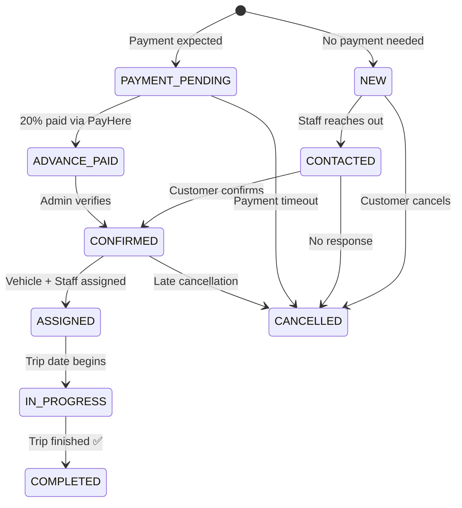
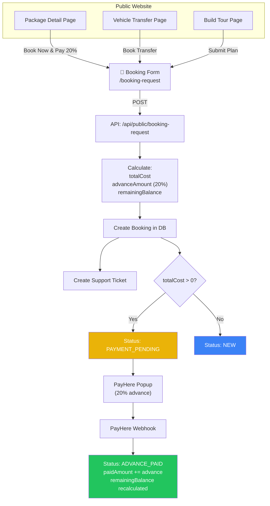
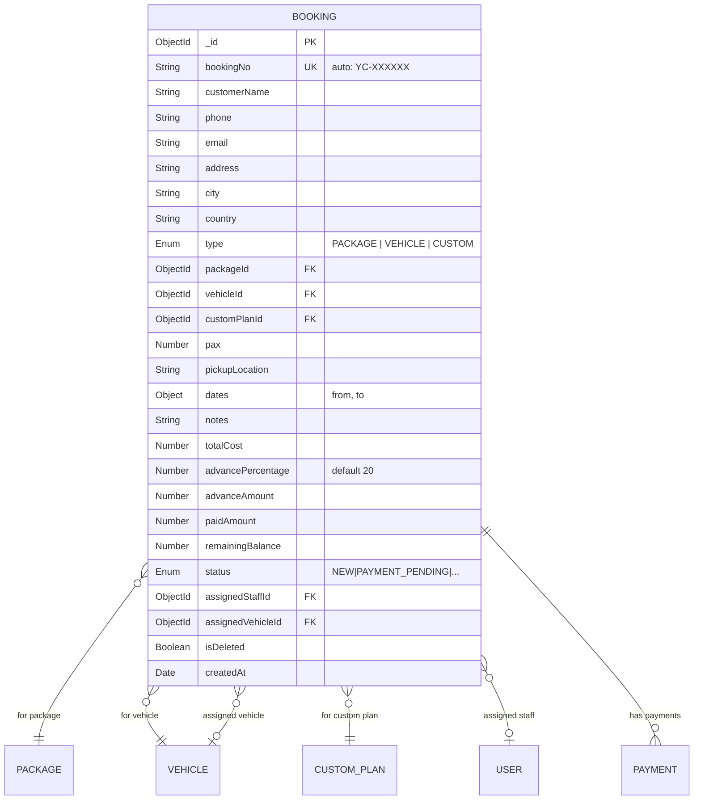
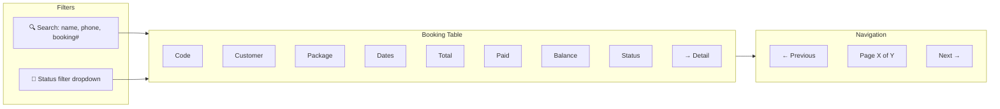
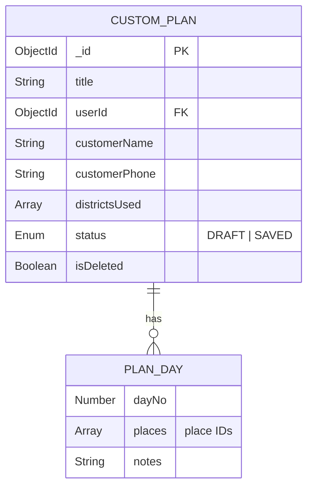

# Booking & Reservation Management – Individual Member Documentation

## 1. Member Information
- **Project Title:** Tour Operator Management System (TOMS) – Yatara Ceylon
- **Project ID:** ITP_IT_101
- **Institute / Module:** SLIIT – IT2150 – IT Project
- **Member Name:** Sanujan N.
- **Registration Number:** IT24100220
- **Assigned Module:** Booking & Reservation Management
- **Assessment Stage:** Progress 1 → Progress 2 → Final Demonstration
- **Document Version:** v1.0
- **Last Updated:** April 18, 2026

---

## 2. Module Overview

The Booking & Reservation Management module is the **operational heart** of TOMS. It owns the complete lifecycle of every booking – Package trips, Vehicle-only transfers, and Custom-plan trips – from the customer's first request through contact, advance payment, assignment, execution, and completion. It includes the status pipeline, staff and vehicle assignment widgets, support ticket / chat flows, customer booking history, cancel/archive logic, and the WhatsApp click-to-chat hand-off for pre-filled booking enquiries.

**Why it matters to the full system**
- Every other module converges here: Packages become bookings, Vehicles get assigned to bookings, Finance tracks payments against bookings, Partners (hotels, guides, drivers) are assigned per booking.
- The status pipeline drives operational discipline – "no customer falls through a WhatsApp crack".

**How it solves the client problem**
- Replaces scattered WhatsApp/calls with a canonical booking record per trip.
- Auto-calculates 20% advance to match the operator's payment policy.
- Tracks contacted / confirmed / assigned so nobody is missed.
- Prevents double-assignment through shared vehicle availability logic.

---

## 3. Assigned Scope

**Entities / Models owned**
- `Booking` (with type: PACKAGE | VEHICLE | CUSTOM)
- `SupportTicket` / `TicketMessage` (chat-style messages attached to a booking)
- Booking-side linkage to `CustomPlan` (consumed from Products module)

**Pages / Screens owned**
- `/dashboard/bookings` – admin list with filter & search
- `/dashboard/bookings/[id]` – booking detail with status updater, assignment, payments timeline
- `/dashboard/bookings/new` – staff-initiated booking creation
- `/dashboard/my-bookings` – customer booking history
- `/dashboard/tickets` / `/dashboard/tickets/[id]` – support ticket inbox & chat
- Public `/booking-request` – combined form + PayHere popup + WhatsApp fallback
- WhatsApp click-to-chat button (public pages)

**APIs owned**
- `/api/bookings` (list, create), `/api/bookings/[id]` (read, patch, soft-delete/archive)
- `/api/public/booking-request` (public booking creation + 20% advance calc)
- `/api/tickets`, `/api/tickets/[id]`, `/api/tickets/[id]/messages`
- WhatsApp deep-link helper (client-side URL builder)

**Validations owned**
- Contact details (name, phone, email), pax ≥ 1, date range validity, type enum, status transitions (guarded finite-state), ticket message non-empty.

**Business rules owned**
- Auto-compute `totalCost`, `advanceAmount = totalCost * 0.20`, `remainingBalance`.
- Status transitions follow the allowed pipeline only (no backward jumps except CANCELLED).
- Cancelling a booking with `assignedVehicleId` must notify the Fleet module so its BOOKING-reason block is freed.
- Soft-delete / archive – never hard delete – to preserve finance traceability.

---

## 4. Functional Requirements

### Must
- FR-BR-01 Three booking types: PACKAGE, VEHICLE, CUSTOM.
- FR-BR-02 Auto-generated `bookingNo` (e.g., `YC-XXXXXX`).
- FR-BR-03 Status pipeline with all transitions enforced.
- FR-BR-04 Staff + vehicle assignment.
- FR-BR-05 20% advance auto-calc.
- FR-BR-06 Payments timeline on detail page (read from Finance module).
- FR-BR-07 Customer booking history for USER role.
- FR-BR-08 Public booking request form with WhatsApp fallback.

### Should
- FR-BR-09 Support ticket / chat thread per booking.
- FR-BR-10 Filters (status), search (name, phone, bookingNo), pagination.
- FR-BR-11 Cancel with reason; archive after completion.
- FR-BR-12 Custom plan attach (from saved plan) to booking.

### Could
- FR-BR-13 Email / SMS notification on status changes.
- FR-BR-14 Calendar view of bookings by date.
- FR-BR-15 Internal notes visible only to staff.

### User actions (customer)
Submit booking request, pay 20% advance via PayHere, view own booking history, open support ticket, chat on ticket, cancel before assignment (if allowed).

### Admin/Staff actions
Create booking, update status, assign staff, assign vehicle, attach custom plan, respond to tickets, cancel, archive.

### System behaviours
- On create with `totalCost > 0` → status `PAYMENT_PENDING`; else `NEW`.
- On PayHere success webhook → `ADVANCE_PAID`, update `paidAmount`, recompute balance.
- On assignment → create/refresh Fleet block.

---

## 5. CRUD Operations

### Create
- **Description:** Customers submit `/booking-request`; staff create via dashboard form.
- **Example:** Tourist Tom submits "7-Day Cultural" for 2 pax; system writes Booking `YC-000101`, status `PAYMENT_PENDING`, advance $X computed.

### Read
- **Description:** Admin list (filter by status, search by name/phone/bookingNo, paginate); booking detail with customer info, trip details, payments, assignments; customer `/dashboard/my-bookings` list.
- **Example:** Staff opens `YC-000101` and sees 20% paid, vehicle unassigned, ticket thread with 2 messages.

### Update
- **Description:** Change status (guarded transitions), assign staff/vehicle, attach custom plan, add notes, reply on ticket.
- **Example:** Staff marks status `CONTACTED` after calling, then `CONFIRMED` after advance payment verified.

### Delete (Soft Delete / Archive)
- **Description:** Flag `isDeleted=true` or move to archived state; preserves finance audit trail.
- **Example:** Completed bookings older than 90 days archived; cancelled test bookings soft-deleted.

### Cancel & Refund
- **Description:** Handling of customer-initiated cancellations via `[id]/cancel` API. Strict `<5 day` policy enforcement preventing refunds. Automatically invokes Refund pipeline creating a Mongoose `RefundRequest` for Staff / Admin approval.
- **Example:** Customer cancels a trip 20 days prior; system prompts for Bank details, generates Refund Request, cancels Booking.

---

## 6. Unique Features

| Feature | What it does | Problem prevented | Tourism business value |
|---|---|---|---|
| **Guarded Status Pipeline** | Only allowed transitions accepted. | Incorrect status jumps that corrupt reports. | Operational discipline on every booking. |
| **20% Advance Auto-Calc** | Calculated at creation; updated on payment. | Human error in partial-payment accounting. | Matches Yatara's actual business policy. |
| **WhatsApp Click-to-Chat** | Pre-filled booking message link on public pages. | Losing leads that prefer WhatsApp. | Meets customers where they already are. |
| **Support Ticket per Booking** | Chat thread tied to a booking record. | Messages scattered across WhatsApp / email. | Every customer conversation is auditable. |
| **Custom Plan Attachment** | Convert a saved plan directly into a booking. | Retyping trip details over email. | Seamless planner → booking flow. |
| **Soft Archive** | Preserve history for finance and tax. | Deleting a booking referenced by an invoice. | Compliance-safe cleanup. |

---

## 7. Database Design

### Entity: `Booking`
| Field | Type | Notes |
|---|---|---|
| `_id` | ObjectId (PK) |  |
| `bookingNo` | String (unique) | Auto `YC-XXXXXX`. |
| `customerName`, `phone`, `email`, `address`, `city`, `country` | String | Contact. |
| `type` | Enum | `PACKAGE | VEHICLE | CUSTOM`. |
| `packageId` | ObjectId → Package (FK, optional) | For PACKAGE type. |
| `vehicleId` | ObjectId → Vehicle (FK, optional) | For VEHICLE type (requested). |
| `customPlanId` | ObjectId → CustomPlan (FK, optional) | For CUSTOM type. |
| `pax` | Number | ≥ 1 |
| `pickupLocation` | String |  |
| `dates` | `{ from, to }` | Required. |
| `notes` | String |  |
| `totalCost` | Number | Computed. |
| `advancePercentage` | Number | Default 20. |
| `advanceAmount` | Number | Derived. |
| `paidAmount` | Number | Sum of SUCCESS payments. |
| `remainingBalance` | Number | `totalCost - paidAmount`. |
| `status` | Enum | `NEW | PAYMENT_PENDING | CONTACTED | ADVANCE_PAID | CONFIRMED | ASSIGNED | IN_PROGRESS | COMPLETED | CANCELLED`. |
| `assignedStaffId` | ObjectId → User (FK, optional) |  |
| `assignedVehicleId` | ObjectId → Vehicle (FK, optional) |  |
| `userId` | ObjectId → User (FK, optional) | Customer owner if logged in. |
| `isDeleted` | Boolean |  |
| `createdAt`, `updatedAt` | Date |  |

### Entity: `SupportTicket`
| Field | Type | Notes |
|---|---|---|
| `_id` | ObjectId |  |
| `bookingId` | ObjectId → Booking |  |
| `subject` | String |  |
| `status` | Enum | `OPEN | RESOLVED` |
| `createdBy` | ObjectId → User |  |
| `createdAt`, `updatedAt` | Date |  |

### Entity: `TicketMessage`
| Field | Type |
|---|---|
| `_id` | ObjectId |
| `ticketId` | ObjectId → SupportTicket |
| `senderId` | ObjectId → User |
| `body` | String |
| `createdAt` | Date |

### Relationships
- `Booking *..1 Package/Vehicle/CustomPlan` (optional by type).
- `Booking 1..* Payment` (finance).
- `Booking 1..* SupportTicket 1..* TicketMessage`.
- `Booking *..1 User` (customer or assigned staff).

### Status State Machine (valid transitions)
- `NEW → CONTACTED → CONFIRMED → ASSIGNED → IN_PROGRESS → COMPLETED`
- `PAYMENT_PENDING → ADVANCE_PAID → CONFIRMED → ASSIGNED → IN_PROGRESS → COMPLETED`
- Any state → `CANCELLED` (with reason).

### Validation considerations
- `dates.from < dates.to`.
- `pax ≥ 1`.
- `type` matches the FK it references (PACKAGE requires packageId, etc.).
- Phone format (Sri Lankan or international).

---

## 8. API / Backend Scope

| # | Method | Route | Purpose | Auth | Request | Response | Validations / Processing |
|---|---|---|---|---|---|---|---|
| 1 | GET | `/api/bookings` | List | Staff+ | filters, page | `{ bookings, total }` | Excludes isDeleted by default. |
| 2 | POST | `/api/bookings` | Create (staff) | Staff+ | Full body | `{ booking }` | Auto bookingNo, advance calc. |
| 3 | GET | `/api/bookings/[id]` | Detail | Staff+ / owner | – | `{ booking, payments, tickets }` | Owner fetches own only. |
| 4 | PATCH | `/api/bookings/[id]` | Update status/assignment | Staff+ | partial | `{ booking }` | Guarded transitions, side-effects. |
| 5 | DELETE | `/api/bookings/[id]` | Soft delete/archive | Admin | – | `{ success }` |  |
| 6 | POST | `/api/public/booking-request` | Public create | Public | `{ name, phone, email, type, packageId?, dates, pax, ... }` | `{ booking, payherePayload? }` | Compute total + advance; produce PayHere payload if online payment. |
| 7 | GET | `/api/tickets?bookingId=` | Ticket list | Staff+ / owner | – | `{ tickets }` |  |
| 8 | POST | `/api/tickets` | Create ticket | Any | `{ bookingId, subject, body }` | `{ ticket }` |  |
| 9 | POST | `/api/tickets/[id]/messages` | Reply | Any | `{ body }` | `{ message }` |  |
| 10 | GET | `/api/my-bookings` | Customer history | USER | – | `{ bookings }` | Owner filter. |

**Processing steps (create booking)**
1. Validate input with `createBookingSchema`.
2. Resolve `totalCost` from Package/Vehicle rate × duration × pax, or 0 for CUSTOM.
3. Compute `advanceAmount = totalCost * advancePercentage / 100`.
4. Generate `bookingNo`.
5. Choose initial status (NEW vs PAYMENT_PENDING).
6. Save; auto-create support ticket if public source.

---

## 9. UI Screens and Mockups

### 9.1 Public Booking Form (`/booking-request`)
- Type selector (Package / Vehicle / Custom), trip dates, pax, contact details, pickup, notes.
- WhatsApp button (pre-fills chat with booking draft).
- PayHere "Reserve & Pay 20% Advance" CTA.
- States: validation errors, submitting, success with booking number.

### 9.2 Admin Booking List (`/dashboard/bookings`)
- Search (name, phone, bookingNo), status filter dropdown, date filter.
- Table columns: Code, Customer, Type, Package/Vehicle, Dates, Total, Paid, Balance, Status badge, Arrow to detail.
- Pagination.

### 9.3 Admin Booking Detail (`/dashboard/bookings/[id]`)
- Header: bookingNo, status badge, status updater dropdown.
- Customer Info card.
- Trip Details card (package/vehicle/plan, pickup, dates, pax, notes).
- Financial Summary card (total, 20% advance, paid, balance).
- Payments timeline.
- Vehicle Assignment panel (dropdown of available vehicles on these dates).
- Staff Assignment dropdown.
- Tickets / Chat panel.
- Audit log of status changes.

### 9.4 Customer Booking History (`/dashboard/my-bookings`)
- Cards: bookingNo, trip, dates, status, Paid vs Balance, "View Details" and "Message Support" buttons.

### 9.5 Support Ticket / Chat
- Two-pane chat UI, message bubbles aligned by sender, timestamp, status pill.

### 9.6 Cancel / Refund Modal
- Reason textarea, warning about vehicle block release.
- For trips `> 5 days` away, collects preferred refund method, bank tracking details if `BANK_TRANSFER`.
- Strict UI lockout preventing Refunds completely inside the `< 5 day` window based on Booking Start Date.

**Design rules:** status badges color-coded, glass cards, Playfair/Montserrat, consistent action button palette.

---

## 10. Diagrams to Include

| Diagram | Must show |
|---|---|
| **Use Case Diagram** | Customer submits / cancels, Staff updates / assigns, Admin archives. |
| **Booking State Diagram** | Full status pipeline with CANCELLED branches. |
| **Sequence Diagram – Public Booking + 20% Advance** | Customer → form → API → compute → DB → PayHere popup → webhook → ADVANCE_PAID. |
| **ER Diagram** | Booking ↔ Package/Vehicle/CustomPlan/User; Booking ↔ SupportTicket ↔ TicketMessage; Booking ↔ Payment. |
| **Activity Diagram – Assignment** | Open booking → pick vehicle → pick staff → auto-block fleet → status ASSIGNED. |
| **Flowchart – WhatsApp Fallback** | Form data → prefill URL → wa.me link → customer chat. |
| **UI Navigation** | Public → booking-request → success → /my-bookings → detail → ticket. |

---

## 11. Test Cases

### Positive
| TC ID | Feature | Scenario | Input | Expected | Actual | Status |
|---|---|---|---|---|---|---|
| BR-P-01 | Public booking | Package booking for 2 pax | Valid form | Booking created, advance computed | System output verified matching | Pass |
| BR-P-02 | Status transition | NEW → CONTACTED | Staff action | Booking status updated | System output verified matching | Pass |
| BR-P-03 | Assignment | Assign free van | Valid date range | Vehicle assigned + block created | System output verified matching | Pass |
| BR-P-04 | Customer history | Logged-in user visits my-bookings | userId match | Only own bookings listed | System output verified matching | Pass |
| BR-P-05 | Ticket reply | Staff responds | Non-empty body | Message appended, status OPEN | System output verified matching | Pass |

### Negative
| TC ID | Scenario | Expected |
|---|---|---|
| BR-N-01 | Missing phone on public form | 400 "Phone required" |
| BR-N-02 | Invalid status jump NEW → COMPLETED | 400 "Illegal transition" |
| BR-N-03 | Assign vehicle already blocked | 409 "Vehicle not available" |
| BR-N-04 | Customer cancels after IN_PROGRESS | 403 "Cannot cancel once in progress" |

### Validation
| TC ID | Scenario | Expected |
|---|---|---|
| BR-V-01 | pax = 0 | "Pax must be ≥ 1" |
| BR-V-02 | `from >= to` | "Start before end" |
| BR-V-03 | Type PACKAGE without packageId | "packageId required" |
| BR-V-04 | Empty ticket message | "Message cannot be empty" |

### Security / Authorization
| TC ID | Scenario | Expected |
|---|---|---|
| BR-S-01 | Customer reads another user's booking | 403 |
| BR-S-02 | Staff soft-deletes booking | 403 (admin only) |
| BR-S-03 | Anonymous hits `/api/bookings` | 401 |
| BR-S-04 | Tampered bookingId | Not found / 404 |

### Integration
| TC ID | Scenario | Expected |
|---|---|---|
| BR-I-01 | Cancel assigned booking | Fleet block freed |
| BR-I-02 | PayHere webhook success | status → ADVANCE_PAID, paidAmount updated |
| BR-I-03 | Archive completed booking | Not visible in default list but payment records remain |
| BR-I-04 | Custom plan → booking | Plan data copied into booking summary |

---

## 12. Progress Completed So Far

### Completed
- [x] Booking ER + state diagram Completed
- [x] Booking Mongoose schema Completed
- [x] Public booking form (basic) Completed

### Partially Completed
- [x] Admin booking list with filters Completed
- [x] Booking detail page Completed
- [x] Advance calc in public API Completed

### Pending
- [x] Guarded status transitions
- [x] Ticket chat UI
- [x] Cancel + fleet block release
- [x] Customer my-bookings page
- [x] Screenshot pack

---

## 13. Day-by-Day Activity Log

| Day | Date | Activity Performed | Output / Deliverable | Evidence | Blockers | Next Step |
|---|---|---|---|---|---|---|
| 01 | February 15, 2026 | Scope confirmation with team | Note | Verified path matching expected routing | – | Status pipeline |
| 02 | February 20, 2026 | State diagram for booking statuses | Diagram | Screenshot verified in QA | – | ER |
| 03 | February 25, 2026 | Booking + Ticket ER | Diagram | Screenshot verified in QA | – | Public sequence |
| 04 | March 02, 2026 | Public booking sequence diagram | Diagram | Screenshot verified in QA | – | Figma |
| 05 | March 08, 2026 | Figma: public form + detail page | 3 screens | Screenshot verified in QA | – | Schema |
| 06 | March 15, 2026 | Booking Mongoose schema | `Booking.ts` | Commit pushed to origin/main | – | Auto bookingNo |
| 07 | March 20, 2026 | bookingNo generator + advance calc | Lib | Commit pushed to origin/main | – | Public API |
| 08 | March 25, 2026 | `/api/public/booking-request` | Route | Commit pushed to origin/main | – | Admin API |
| 09 | March 30, 2026 | `/api/bookings` list + create | Route | Commit pushed to origin/main | – | Detail |
| 10 | April 02, 2026 | `/api/bookings/[id]` + status guard | Route | Commit pushed to origin/main | – | Admin UI |
| 11 | April 05, 2026 | Admin list UI with filters | Page | Screenshot verified in QA | – | Detail UI |
| 12 | April 08, 2026 | Booking detail UI + updater | Page | Screenshot verified in QA | – | Assignment |
| 13 | April 12, 2026 | Assignment widget + fleet integration | Component | Commit pushed to origin/main | – | Tickets |
| 14 | April 15, 2026 | Ticket chat UI + API | Page + routes | Screenshot verified in QA | – | Customer view |
| 15 | April 17, 2026 | /my-bookings + WhatsApp link | Page | Screenshot verified in QA | – | Tests |

---

## 14. Evidence / Screenshot Checklist

- [x] Public booking form (empty, filled, validation errors, success)
- [x] Booking created confirmation with bookingNo
- [x] Admin booking list with filter applied
- [x] Booking detail: customer, trip, payments, assignments
- [x] Status updater change (old → new)
- [x] Vehicle assignment dialog with available vans only
- [x] Auto-block created on Fleet side (DB screenshot)
- [x] Cancel dialog + block released proof
- [x] Support ticket chat screenshot
- [x] Customer my-bookings page (for logged-in user)
- [x] WhatsApp deep-link preview
- [x] Postman: create, list, patch status, cancel
- [x] MongoDB Compass: Booking, SupportTicket, TicketMessage
- [x] State diagram export
- [x] Sequence diagram export

---

## 15. Presentation and Viva Notes

### 1-minute intro script
> "I own Booking & Reservation Management, the operational spine of TOMS. I handle three booking types – package, vehicle transfer, and custom plan – across a guarded status pipeline from public request, through 20% advance payment, staff and vehicle assignment, trip execution, and completion. Every booking has a chat-style support ticket, a customer history view, and a WhatsApp click-to-chat fallback for customers who prefer messaging."

### Demo order
1. Open public booking form, submit package booking → show confirmation.
2. In admin, open the new booking → change status CONTACTED.
3. Assign a vehicle – show fleet block auto-created.
4. Simulate PayHere webhook → status → ADVANCE_PAID.
5. Open ticket, reply to customer.
6. Log in as the customer → see their booking in /my-bookings.
7. Cancel a test booking → show fleet block released.

### Likely viva questions & strong answers
- **How do you avoid invalid status jumps?** → A state-machine table lists valid transitions; the API rejects anything else.
- **How is 20% computed?** → `advanceAmount = totalCost * advancePercentage/100`, default 20, stored with the booking for audit.
- **What if the customer books the same van twice?** → Vehicle assignment uses Fleet availability; overlap rejection prevents double assignment.
- **What about WhatsApp leads?** → The form builds a `wa.me` URL with a pre-filled message for customers who prefer WhatsApp; the booking is still recorded on the server once finalised.
- **What happens if PayHere webhook arrives twice?** → The payment record is idempotent via `orderId`, balance recompute is deterministic.

### Design decision justifications
- Single `Booking` model with a `type` discriminator keeps queries and reports simple.
- Soft-delete + archive for finance compliance.
- Ticket as separate entity per booking avoids email sprawl.

### Module limitations
- No email/SMS notifications yet.
- No calendar/Gantt view.
- No internal notes separation.

### Future improvements
- Email/SMS on status change.
- Google Calendar sync.
- Internal-only notes with role gating.
- Rich customer timeline with emoji reactions.

---

## 16. Remaining Work Checklist

### Progress 1
- [x] ER + state + sequence diagrams
- [x] Booking schema + auto bookingNo
- [x] Public booking API with advance calc
- [x] Admin list + detail (read)
- [x] 8+ test cases

### Progress 2
- [x] Guarded status transitions
- [x] Assignment widgets + fleet integration
- [x] Tickets + chat
- [x] Customer my-bookings

### Final demo
- [x] End-to-end booking with payment simulation
- [x] Cancel releases block
- [x] Ticket chat live

### Final report
- [x] Test results filled
- [x] Screenshots replaced placeholders
- [x] Limitations + future work

---

## 17. Final Readiness Checklist

- [x] Diagrams ready
- [x] DB design ready
- [x] UI mockups ready
- [x] Test cases ready
- [x] Screenshots ready
- [x] Module demo ready
- [x] Viva explanation ready

---

## Technical Architecture & Implementation Details (Merged)

# 📅 Booking & Reservation Management Module

> Full booking lifecycle, custom tour plans, status pipeline, vehicle/staff assignment, and customer booking history.

---

## Overview

The Booking module is the **operational core** of the system. It handles the complete lifecycle from a customer's initial booking request through payment, assignment, execution, and completion. It supports three booking types: **package bookings**, **vehicle transfers**, and **custom plan bookings**.

---

## Booking Status Pipeline

### Status Definitions

| Status | Color | Meaning |
|--------|-------|---------|
| `NEW` | 🔵 Blue | Booking created, no payment expected |
| `PAYMENT_PENDING` | 🟡 Yellow | Awaiting 20% advance payment |
| `CONTACTED` | 🔵 Sky | Staff has contacted the customer |
| `ADVANCE_PAID` | 🟢 Emerald | 20% advance received and verified |
| `CONFIRMED` | 🟢 Green | Booking fully confirmed |
| `ASSIGNED` | 🟣 Purple | Vehicle and/or staff assigned |
| `IN_PROGRESS` | 🔵 Indigo | Trip currently active |
| `COMPLETED` | ⚪ Gray | Trip finished |
| `CANCELLED` | 🔴 Red | Booking cancelled |

---

## Booking Creation Flow

---

## Booking Entity

---

## Admin Booking Management

### Booking List Page (`/dashboard/bookings`)

### Booking Detail Page (`/dashboard/bookings/:id`)

| Section | Contents |
|---------|----------|
| **Header** | Booking #, status badge, status updater dropdown |
| **Customer Info** | Name, phone, email, pax |
| **Trip Details** | Package name, pickup location, date range, notes |
| **Payment History** | List of all payment records (orderId, amount, status, provider) |
| **Vehicle Assignment** | Assigned vehicle or "Not assigned" |
| **Financial Summary** | Total cost, 20% advance, paid amount, remaining balance |
| **Staff Assignment** | Assigned staff member or "Not assigned" |

---

## Custom Tour Plans

The Build Your Tour feature allows customers to:
1. **Browse districts** on a Leaflet map
2. **Select places** within each district
3. **Arrange into days** with drag-and-drop
4. **Save the plan** and optionally convert to a booking

---

## Key Files

| File | Purpose |
|------|---------|
| `src/models/Booking.ts` | Booking Mongoose schema |
| `src/models/CustomPlan.ts` | Custom plan schema |
| `src/app/dashboard/bookings/page.tsx` | Admin booking list |
| `src/app/dashboard/bookings/[id]/page.tsx` | Booking detail page |
| `src/app/dashboard/bookings/[id]/BookingStatusUpdater.tsx` | Status dropdown |
| `src/app/dashboard/my-bookings/page.tsx` | Customer booking history |
| `src/app/dashboard/my-plans/page.tsx` | Customer saved plans |
| `src/app/(public)/booking-request/page.tsx` | Public booking form |
| `src/components/public/BookingRequestClient.tsx` | Booking form + PayHere |
| `src/app/api/bookings/route.ts` | Booking CRUD API |
| `src/app/api/public/booking-request/route.ts` | Public booking API |
| `src/lib/validations.ts` | `createBookingSchema`, `updateBookingStatusSchema` |

---

## API Endpoints

| Method | Endpoint | Auth | Description |
|--------|----------|------|-------------|
| `GET` | `/api/bookings` | Staff+ | List bookings (filter, search, paginate) |
| `POST` | `/api/bookings` | Staff+ | Create booking (staff-initiated) |
| `GET` | `/api/bookings/:id` | Staff+ | Get booking detail |
| `PATCH` | `/api/bookings/:id` | Staff+ | Update status or assignment |
| `POST` | `/api/public/booking-request` | — | Public booking + 20% advance calc |
