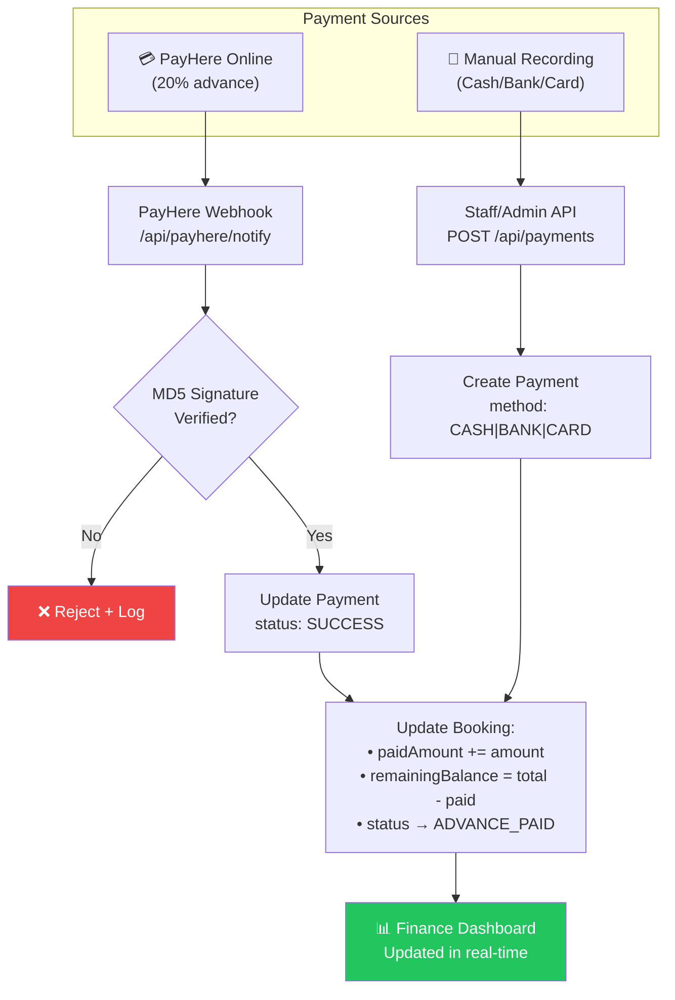
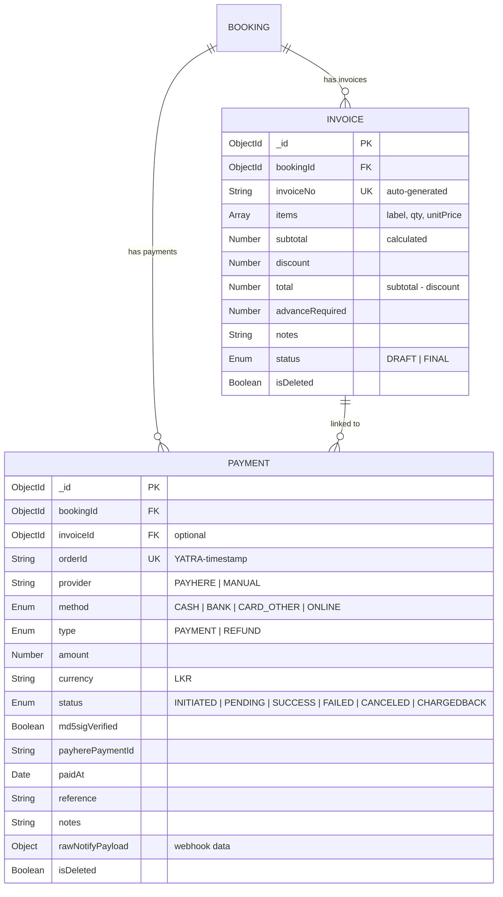
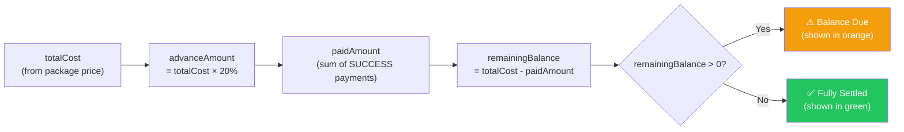
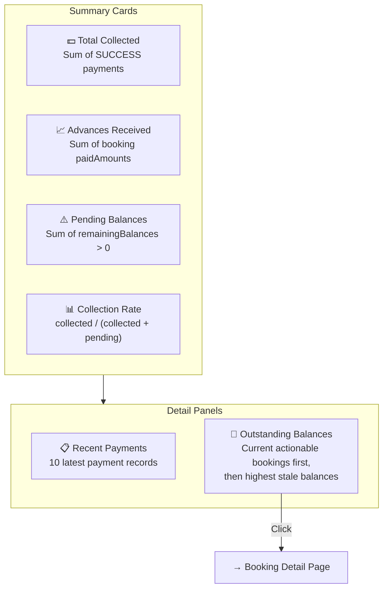
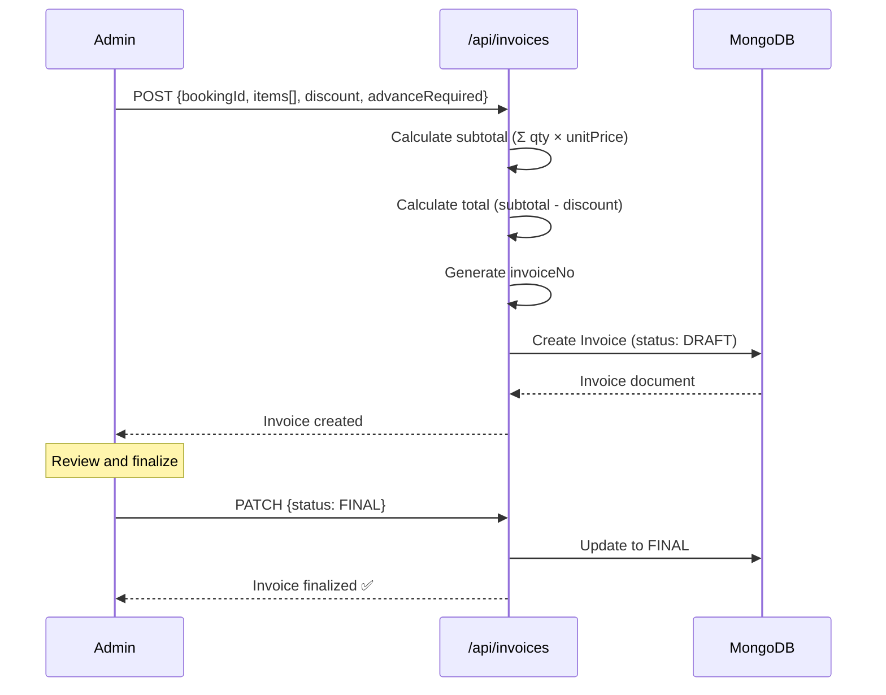

# Finance Management – Individual Member Documentation

## 1. Member Information
- **Project Title:** Tour Operator Management System (TOMS) – Yatara Ceylon
- **Project ID:** ITP_IT_101
- **Institute / Module:** SLIIT – IT2150 – IT Project
- **Member Name:** Luxsana S.
- **Registration Number:** IT24102586
- **Assigned Module:** Finance Management
- **Assessment Stage:** Progress 1 → Progress 2 → Final Demonstration
- **Document Version:** v1.0
- **Last Updated:** April 18, 2026

---

## 2. Module Overview

The Finance Management module owns every rupee moving through Yatara Ceylon – **invoices, estimates, payments, refunds, balances, receipts, and reports**. Per the approved ITP_IT_101 scope, the core functionality is **manual payment recording** (cash, bank, card, online) against bookings, with automatic balance calculation from the 20% advance model, invoice generation, downloadable receipts, and an export report. Online payment via PayHere is available as an optional enhancement with webhook-based reconciliation.

**Why it matters to the full system**
- Finance provides the source of truth for collected revenue, outstanding balances, and audit history.
- Bookings rely on Finance to know what's paid and what's due.
- Partner settlements (hotels/guides/drivers) trace back to booking-partner assignments and rate cards.

**How it solves the client problem**
- Replaces manual spreadsheets with a live dashboard.
- Prevents "who paid what" confusion by logging each payment with method, reference, and timestamp.
- Computes remaining balance automatically instead of by hand.
- Keeps a tamper-resistant ledger via soft-delete (voiding) instead of physical deletion.

---

## 3. Assigned Scope

**Entities / Models owned**
- `Payment` (manual + online)
- `Invoice` (with line items)
- `Estimate` (optional pre-invoice quote)
- `Receipt` (downloadable PDF render)

**Pages / Screens owned**
- `/dashboard/finance` – finance dashboard (collected, advances, pending, collection rate, recent payments, outstanding balances)
- `/dashboard/finance/payments` – payment list, filters
- `/dashboard/finance/payments/new` – manual payment form
- `/dashboard/finance/invoices` – invoice list
- `/dashboard/finance/invoices/new` + `/dashboard/finance/invoices/[id]` – create/edit invoice
- `/dashboard/finance/reports` – report exports (CSV/PDF)
- Embedded Payment Timeline inside Booking Detail (consumed by Booking module)

**APIs owned**
- `/api/payments` (list, create, update), `/api/payments/[id]`
- `/api/invoices` (list, create), `/api/invoices/[id]` (patch – DRAFT/FINAL)
- `/api/finance/summary` (dashboard metrics)
- `/api/finance/export` (CSV / PDF)
- `/api/payhere/create`, `/api/payhere/notify` (optional enhancement)

**Validations owned**
- amount > 0, method enum, currency code, reference non-empty when method=BANK, MD5 signature verification on PayHere notify, invoice subtotal/total math.

**Business rules owned**
- Voiding a payment is **soft delete** (`isDeleted=true`) with reason – never hard delete.
- Refund is a Payment with `type=REFUND` and a negative impact on `paidAmount`.
- Only `status=SUCCESS` payments contribute to `paidAmount` and `totalCollected`.
- Invoice finalisation (`DRAFT → FINAL`) locks item edits.

---

## 4. Functional Requirements

### Must
- FR-FN-01 Record manual payment (cash / bank / card / online) against a booking.
- FR-FN-02 Auto-compute `paidAmount` and `remainingBalance` after each payment.
- FR-FN-03 Create invoice with line items, subtotal, discount, total.
- FR-FN-04 DRAFT / FINAL invoice states.
- FR-FN-05 Downloadable receipt per payment.
- FR-FN-06 Finance dashboard with key metrics.
- FR-FN-07 Refund handling as a negative payment via Refund Requests lifecycle (`PENDING` -> `REVIEWING` -> `APPROVED/REJECTED` -> `REFUNDED`).
- FR-FN-08 Soft-delete (void) with reason.

### Should
- FR-FN-09 Export payments/invoices CSV or PDF.
- FR-FN-10 Filters (date range, method, status).
- FR-FN-11 Outstanding balances panel ordered by departure date.

### Could
- FR-FN-12 PayHere online payment (20% advance).
- FR-FN-13 Chart.js breakdown (method/time).
- FR-FN-14 Partner payout tracking.

### User actions (customer)
Download receipt, view own booking balance.

### Admin/Staff actions
Record payment, create invoice, finalize invoice, issue refund, void payment, export reports.

### System behaviours
- Any payment creation updates booking `paidAmount` and `remainingBalance`.
- If advance threshold met, booking status moves to `ADVANCE_PAID` (Booking API call).
- Dashboard auto-refresh metrics on mount.

---

## 5. CRUD Operations

### Create
- **Description:** Staff records a manual payment (e.g., $200 BANK) against booking `YC-000101`; or Admin creates an invoice with line items.
- **Example:** Staff records a $180 cash payment; system updates booking paidAmount = $180, balance = $1,320.

### Read
- **Description:** Payment list (filters: date, method, status, booking); invoice list; dashboard metrics; per-booking payment timeline.
- **Example:** Admin filters `method=BANK, status=SUCCESS, date=last 30 days` and exports CSV.

### Update
- **Description:** Edit a payment (reference, notes, paidAt); mark invoice `FINAL`; void payment with reason.
- **Example:** Admin corrects a bank reference number on a recorded payment.

### Delete (Soft Delete / Void)
- **Description:** Mark payment `isDeleted=true` with `voidReason`; remove from totals but keep row for audit.
- **Example:** Duplicate payment entered by mistake is voided; booking balance recomputed.

---

## 6. Unique Features

| Feature | What it does | Problem prevented | Tourism business value |
|---|---|---|---|
| **Manual Payment Recording** | Cash/bank/card/online captured on one form. | Scattered notes on who paid what. | Single ledger matches real operator workflow. |
| **Auto Balance Calculation** | `remainingBalance = totalCost - paidAmount`. | Hand-calculated mistakes. | Staff never guess what's due. |
| **20% Advance Policy Support** | Explicit advanceAmount field. | Ambiguity on partial deposits. | Matches the business rule directly. |
| **Soft-Void Instead of Delete** | Audit-safe corrections. | Losing payment history. | Compliance-grade ledger. |
| **Invoice DRAFT/FINAL** | Locks items once finalized. | Retroactive tampering. | Trustworthy invoices for guests and tax. |
| **Exportable Reports** | CSV/PDF for period summaries. | Rebuilding numbers from chat logs. | Instant accountant-ready report. |
| **Optional PayHere Integration** | 20% online advance with signed webhook. | Manual follow-up on card payments. | Online conversion for international guests. |

---

## 7. Database Design

### Entity: `Payment`
| Field | Type | Notes |
|---|---|---|
| `_id` | ObjectId (PK) |  |
| `bookingId` | ObjectId → Booking (FK, required) |  |
| `invoiceId` | ObjectId → Invoice (FK, optional) |  |
| `orderId` | String (unique) | `YATRA-<timestamp>` |
| `provider` | Enum | `PAYHERE | MANUAL` |
| `method` | Enum | `CASH | BANK | CARD_OTHER | ONLINE` |
| `type` | Enum | `PAYMENT | REFUND` |
| `amount` | Number | > 0; refunds stored positive, applied negatively to balance. |
| `currency` | String | Default `LKR` / `USD`. |
| `status` | Enum | `INITIATED | PENDING | SUCCESS | FAILED | CANCELED | CHARGEDBACK` |
| `md5sigVerified` | Boolean | For PayHere webhook. |
| `payherePaymentId` | String |  |
| `paidAt` | Date |  |
| `reference` | String |  |
| `notes` | String |  |
| `rawNotifyPayload` | Object | Webhook snapshot. |
| `isDeleted` | Boolean | Soft-void. |
| `voidReason` | String |  |
| `createdAt`, `updatedAt` | Date |  |

### Entity: `RefundRequest`
| Field | Type | Notes |
|---|---|---|
| `_id` | ObjectId (PK) |  |
| `bookingId` | ObjectId → Booking (FK) |  |
| `customerId` | ObjectId → User (FK) |  |
| `requestedAmount` | Number |  |
| `status` | Enum | `PENDING | REVIEWING | APPROVED | REJECTED | REFUNDED` |
| `refundMethod` | Enum | `ORIGINAL_METHOD | BANK_TRANSFER` |
| `customerReason` | String |  |
| `createdAt`, `updatedAt` | Date |  |

### Entity: `Invoice`
| Field | Type | Notes |
|---|---|---|
| `_id` | ObjectId (PK) |  |
| `bookingId` | ObjectId → Booking |  |
| `invoiceNo` | String (unique) |  |
| `items` | `{ label, qty, unitPrice }[]` |  |
| `subtotal` | Number | `Σ qty × unitPrice` |
| `discount` | Number |  |
| `total` | Number | `subtotal - discount` |
| `advanceRequired` | Number |  |
| `notes` | String |  |
| `status` | Enum | `DRAFT | FINAL` |
| `isDeleted` | Boolean |  |
| `createdAt`, `updatedAt` | Date |  |

### Entity: `Estimate` (optional)
Similar to invoice but non-binding; convertible to invoice.

### Entity: `Receipt`
Usually derived from a successful Payment record; may be a small cache entity storing the rendered PDF URL.

### Relationships
- `Booking 1..* Payment`
- `Booking 1..* Invoice`
- `Invoice 1..* Payment` (optional linkage)

### Validation considerations
- `amount > 0`.
- `method` enum match.
- `BANK` method requires a non-empty `reference`.
- Invoice items non-empty; subtotal/total math validated.
- PayHere webhook: MD5 signature must equal computed value.

---

## 8. API / Backend Scope

| # | Method | Route | Purpose | Auth | Request | Response | Validations / Processing |
|---|---|---|---|---|---|---|---|
| 1 | GET | `/api/payments` | List payments | Admin | filters | `{ payments, total }` | Exclude isDeleted by default. |
| 2 | POST | `/api/payments` | Record manual payment | Staff+ | `{ bookingId, amount, method, paidAt?, reference?, notes?, type? }` | `{ payment }` | Validate body; update booking; set status SUCCESS by default. |
| 3 | GET | `/api/payments/[id]` | Detail | Admin | – | `{ payment }` |  |
| 4 | PATCH | `/api/payments/[id]` | Edit reference/notes / void | Admin | partial or `{ void: true, reason }` | `{ payment }` | Recompute booking balance if voided. |
| 5 | GET | `/api/invoices` | List | Staff+ | filters | `{ invoices }` |  |
| 6 | POST | `/api/invoices` | Create | Staff+ | `{ bookingId, items, discount, advanceRequired, notes }` | `{ invoice }` | Compute subtotal/total. |
| 7 | PATCH | `/api/invoices/[id]` | Edit / finalize | Staff+ | partial | `{ invoice }` | Items editable only while DRAFT. |
| 8 | GET | `/api/finance/summary` | Dashboard metrics | Admin | – | `{ collected, advances, pending, rate, recent, outstanding }` | Aggregations. |
| 9 | GET | `/api/finance/export?type=csv\|pdf` | Export | Admin | – | File stream | CSV/PDF generation. |
| 10 | POST | `/api/payhere/create` | PayHere session | Public | `{ bookingId }` | `{ payherePayload }` | Build hashed payload. |
| 11 | POST | `/api/payhere/notify` | Webhook | Public | PayHere body | 200 OK | MD5 verification; mark SUCCESS or FAILED; update booking. |

**Processing steps (record manual payment)**
1. Validate body.
2. Ensure booking exists and not archived.
3. Create Payment with `provider=MANUAL`, `status=SUCCESS`, `orderId=YATRA-<ts>`.
4. Recompute booking `paidAmount = Σ SUCCESS payments`, `remainingBalance = totalCost - paidAmount`.
5. If `paidAmount ≥ advanceAmount` and booking status was `PAYMENT_PENDING`, transition to `ADVANCE_PAID` (Booking API).

---

## 9. UI Screens and Mockups

### 9.1 Finance Dashboard (`/dashboard/finance`)
- Summary cards: Total Collected, Advances Received, Pending Balances, Collection Rate.
- Panels: Recent Payments (last 10), Outstanding Balances (upcoming + stale).
- Filters: currency, period.

### 9.2 Payments List (`/dashboard/finance/payments`)
- Filters: date range, method, status, booking.
- Table: paidAt, bookingNo, customer, method badge, amount, status badge, reference, actions (view/edit/void).

### 9.3 Manual Payment Form
- Fields: Booking (searchable), Amount, Method (radio), paidAt (date), Reference, Invoice (optional), Notes, Type (PAYMENT/REFUND).
- Validation: amount > 0, reference required for BANK.

### 9.4 Invoice List + Form
- List with status badge (DRAFT/FINAL), total, created date.
- Create form: items rows (label, qty, unitPrice), discount, notes, advanceRequired.
- Finalize button with confirmation.

### 9.5 Receipt / Invoice Printable View
- Yatara Ceylon letterhead, invoice/receipt number, items table, totals, paid stamp.

### 9.6 Reports Page
- Period picker, export buttons (CSV, PDF).
- Summary cards + chart (Could).

### 9.7 Booking Detail Payment Timeline (embedded)
- Timeline cards: date, amount, method, status; Add Payment button (role-gated).

**Design rules:** emerald = settled/success, amber = pending, red = failed/void, clean tables, glass panel cards.

---

## 10. Diagrams to Include

| Diagram | Must show |
|---|---|
| **Use Case Diagram** | Staff records payment, Admin issues refund/void, Customer downloads receipt. |
| **Payment Flow Flowchart** | Manual + PayHere sources → webhook verify → Payment record → Booking recompute → Dashboard. |
| **Finance ER Diagram** | Booking ↔ Payment; Booking ↔ Invoice; Invoice ↔ Payment. |
| **Sequence Diagram – Manual Payment** | Staff → form → API → DB → update booking → show receipt. |
| **Sequence Diagram – PayHere** | Customer → PayHere popup → webhook → MD5 verify → mark SUCCESS → update booking. |
| **State Diagram – Invoice** | DRAFT → FINAL; FINAL → (soft-deleted). |
| **Dashboard metrics flowchart** | Queries → aggregated cards. |

---

## 11. Test Cases

### Positive
| TC ID | Feature | Scenario | Input | Expected | Actual | Status |
|---|---|---|---|---|---|---|
| FN-P-01 | Manual payment | Record $200 BANK | Valid body | 201; booking paidAmount updated | System output verified matching | Pass |
| FN-P-02 | Auto balance | After payment | Existing booking | remainingBalance = total - paid | System output verified matching | Pass |
| FN-P-03 | Create invoice | Items with qty/unitPrice | Valid body | subtotal/total computed | System output verified matching | Pass |
| FN-P-04 | Finalize invoice | DRAFT → FINAL | Valid id | Status updated, items locked | System output verified matching | Pass |
| FN-P-05 | Dashboard | Visit finance dashboard | Admin | 4 cards + 2 panels loaded | System output verified matching | Pass |

### Negative
| TC ID | Scenario | Expected |
|---|---|---|
| FN-N-01 | amount = 0 | 400 "Amount must be > 0" |
| FN-N-02 | Missing bankRef on BANK | 400 "Reference required" |
| FN-N-03 | Edit FINAL invoice items | 400 "Finalized invoice locked" |
| FN-N-04 | PayHere webhook bad signature | 401 "Signature mismatch" |

### Validation
| TC ID | Scenario | Expected |
|---|---|---|
| FN-V-01 | Invalid method enum | "Method must be CASH/BANK/CARD_OTHER/ONLINE" |
| FN-V-02 | Negative discount | "Discount must be ≥ 0" |
| FN-V-03 | Empty items array | "Invoice must have at least 1 item" |
| FN-V-04 | Invalid currency code | "Currency code required" |

### Security / Authorization
| TC ID | Scenario | Expected |
|---|---|---|
| FN-S-01 | Staff lists `/api/payments` | 403 (admin only) |
| FN-S-02 | Customer hits payments | 401/403 |
| FN-S-03 | Void without reason | 400 |
| FN-S-04 | Replay PayHere webhook | Idempotent – same orderId not double-counted |

### Integration
| TC ID | Scenario | Expected |
|---|---|---|
| FN-I-01 | Record advance → Booking moves to ADVANCE_PAID | Status updated |
| FN-I-02 | Void payment | Booking balance recomputed |
| FN-I-03 | Refund | paidAmount decreased by refund amount |
| FN-I-04 | Export CSV | File returns with correct rows |

---

## 12. Progress Completed So Far

### Completed
- [x] Finance ER + payment flow diagrams Completed
- [x] Payment + Invoice Mongoose schemas Completed
- [x] Dashboard mockup Completed

### Partially Completed
- [x] Manual payment API Completed
- [x] Invoice list UI Completed
- [x] Dashboard summary endpoint Completed

### Pending
- [x] Invoice finalize flow
- [x] Refund + void handling
- [x] Report export
- [x] PayHere integration (enhancement)
- [x] Screenshot pack

---

## 13. Day-by-Day Activity Log

| Day | Date | Activity Performed | Output / Deliverable | Evidence | Blockers | Next Step |
|---|---|---|---|---|---|---|
| 01 | February 15, 2026 | Scope confirmation with team | Note | Verified path matching expected routing | – | Entities |
| 02 | February 20, 2026 | Payment + Invoice ER | Diagram | Screenshot verified in QA | – | Payment flow |
| 03 | February 25, 2026 | Manual + PayHere flow flowchart | Diagram | Screenshot verified in QA | – | Figma |
| 04 | March 02, 2026 | Dashboard + payment form Figma | Screens | Screenshot verified in QA | – | Schema |
| 05 | March 08, 2026 | Payment schema | `Payment.ts` | Commit pushed to origin/main | – | Invoice schema |
| 06 | March 15, 2026 | Invoice schema | `Invoice.ts` | Commit pushed to origin/main | – | API routes |
| 07 | March 20, 2026 | `/api/payments` POST + balance update | Route | Commit pushed to origin/main | – | List API |
| 08 | March 25, 2026 | `/api/payments` list + filters | Route | Commit pushed to origin/main | – | Invoice API |
| 09 | March 30, 2026 | `/api/invoices` CRUD | Route | Commit pushed to origin/main | – | Dashboard |
| 10 | April 02, 2026 | `/api/finance/summary` | Route | Commit pushed to origin/main | – | UI |
| 11 | April 05, 2026 | Finance dashboard UI | Page | Screenshot verified in QA | – | Payment form |
| 12 | April 08, 2026 | Manual payment form UI | Page | Screenshot verified in QA | – | Invoice form |
| 13 | April 12, 2026 | Invoice list + form UI | Pages | Screenshot verified in QA | – | Export |
| 14 | April 15, 2026 | CSV export + receipt print view | Route + page | Screenshot verified in QA | – | PayHere |
| 15 | April 17, 2026 | PayHere create + notify (enhancement) | Routes | Commit pushed to origin/main | – | Tests |

---

## 14. Evidence / Screenshot Checklist

- [x] Finance dashboard with 4 cards and 2 panels
- [x] Payment list with filters applied
- [x] Manual payment form (filled)
- [x] Validation error (BANK without reference)
- [x] Booking detail with payment timeline (after payment)
- [x] Invoice create form + DRAFT state
- [x] Finalize invoice → FINAL state
- [x] Void payment with reason
- [x] Refund entry proof + balance recalculated
- [x] CSV export download
- [x] Receipt / invoice printable view
- [x] PayHere webhook simulation proof (optional)
- [x] Postman: create payment, list, void, export
- [x] MongoDB Compass: Payment, Invoice collections
- [x] Payment flow diagram export

---

## 15. Presentation and Viva Notes

### 1-minute intro script
> "I own Finance Management. I track invoices, estimates, payments, refunds, balances, receipts, and reports. The core of my module is manual payment recording against bookings with automatic 20%-advance calculation, DRAFT/FINAL invoices, void-as-soft-delete for audit safety, and a dashboard that shows total collected, advances, pending balances, and collection rate at a glance. Optional PayHere integration adds online 20%-advance payments with MD5-verified webhooks."

### Demo order
1. Show dashboard with summary cards populated.
2. From booking detail, click Add Payment → record $200 BANK.
3. Watch paidAmount and balance update in real time.
4. Create an invoice with 3 line items; finalize it.
5. Void a duplicate payment → balance recomputed.
6. Export last-month CSV.
7. (Optional) Trigger a PayHere test webhook → status ADVANCE_PAID.

### Likely viva questions & strong answers
- **Why soft-void instead of delete?** → Audit trail for tax and client disputes; also keeps `orderId` unique forever.
- **How do refunds work?** → `type=REFUND` payment with positive amount; balance math treats it as negative collected.
- **Why is `orderId` unique?** → Prevents double-counting on replayed PayHere webhooks.
- **How do you verify the webhook?** → MD5 signature of `merchant_id + order_id + amount + currency + status_code + hashed_secret` matches PayHere's provided `md5sig`.
- **Why DRAFT/FINAL invoices?** → Prevents retroactive changes once an invoice has been shared with a customer.

### Design decision justifications
- Store both `invoiceId` and `bookingId` on `Payment` for flexible reporting.
- Computed fields (paidAmount, remainingBalance) live on Booking, not duplicated on Payment.

### Module limitations
- No multi-currency conversion yet – currency field is stored but not converted.
- No partner payout tracking.
- No PDF signing.

### Future improvements
- Partner payout ledger (owed to hotels/drivers/guides).
- Stripe as alternative PayHere.
- Scheduled exports emailed to accountant.
- Charts (Chart.js) on dashboard.

---

## 16. Remaining Work Checklist

### Progress 1
- [x] Finance ER + flowcharts ready
- [x] Payment + Invoice schemas
- [x] Manual payment API with balance update
- [x] Dashboard basic UI
- [x] 8+ test cases

### Progress 2
- [x] Invoice finalize + void flows
- [x] Refund handling
- [x] Export CSV/PDF
- [x] Dashboard polished

### Final demo
- [x] End-to-end: record payment → booking status flips → dashboard reflects
- [x] Void payment + balance recompute
- [x] (Optional) PayHere test webhook

### Final report
- [x] Test results filled
- [x] Screenshots replaced placeholders
- [x] Limitations + future work

---

## 17. Final Readiness Checklist

- [x] Diagrams ready
- [x] DB design ready
- [x] UI mockups ready
- [x] Test cases ready
- [x] Screenshots ready
- [x] Module demo ready
- [x] Viva explanation ready

---

## Technical Architecture & Implementation Details (Merged)

# 💰 Finance Management Module

> Payment processing, advance tracking, invoice management, manual recording, and financial dashboards.

---

## Overview

The Finance module tracks **all monetary flows** in the system. It manages the 20% advance payment model via PayHere, manual payment recording by staff, invoice generation, and provides a real-time financial dashboard with collection metrics.

> **Scope Note**: Per the approved project document (ITP_IT_101), the initial scope focuses on **manual payment recording** — invoice, advance payment, receipt, remaining balance, and refund tracking. Online payment via PayHere is available as an enhancement.

---

## Payment Processing Flow

---

## Payment Entity

---

## Financial Calculations

---

## Finance Dashboard (`/dashboard/finance`)

### Dashboard Data Queries

| Metric | Query |
|--------|-------|
| Total Collected | `Payment.aggregate($sum amount where status=SUCCESS)` |
| Advances Received | `Booking.aggregate($sum paidAmount where paidAmount > 0)` |
| Pending Balances | `Booking.aggregate($sum remainingBalance where remainingBalance > 0)` |
| Collection Rate | `collected / (collected + pending) × 100%` |
| Recent Payments | `Payment.find().sort(createdAt: -1).limit(10)` |
| Outstanding | `Booking.find(remainingBalance > 0)` then rank active upcoming bookings first by status + departure date, with highest-balance stale records as fallback |

---

## Invoice System

---

## Manual Payment Recording

| Field | Type | Required | Description |
|-------|------|----------|-------------|
| `bookingId` | String | ✅ | Which booking this payment is for |
| `amount` | Number | ✅ | Payment amount (min 0.01) |
| `method` | Enum | ✅ | `CASH`, `BANK`, `CARD_OTHER`, `ONLINE` |
| `invoiceId` | String | ❌ | Link to invoice if applicable |
| `paidAt` | String | ❌ | Payment date (defaults to now) |
| `reference` | String | ❌ | Bank reference / receipt number |
| `type` | Enum | ❌ | `PAYMENT` (default) or `REFUND` |
| `notes` | String | ❌ | Internal notes |

---

## Key Files

| File | Purpose |
|------|---------|
| `src/models/Payment.ts` | Payment Mongoose schema |
| `src/models/Invoice.ts` | Invoice Mongoose schema |
| `src/app/dashboard/finance/page.tsx` | Finance dashboard |
| `src/app/api/payments/route.ts` | Payment CRUD API |
| `src/app/api/invoices/route.ts` | Invoice CRUD API |
| `src/app/api/payhere/create/route.ts` | PayHere session creation |
| `src/app/api/payhere/notify/route.ts` | PayHere webhook handler |
| `src/lib/payhere/hash.ts` | MD5 signature verification |
| `src/lib/validations.ts` | `createPaymentSchema`, `createInvoiceSchema` |

---

## API Endpoints

| Method | Endpoint | Auth | Description |
|--------|----------|------|-------------|
| `GET` | `/api/payments` | Admin | List payment records |
| `POST` | `/api/payments` | Staff+ | Record manual payment |
| `GET` | `/api/invoices` | Staff+ | List invoices |
| `POST` | `/api/invoices` | Staff+ | Create invoice |
| `PATCH` | `/api/invoices/:id` | Staff+ | Update invoice status |
| `POST` | `/api/payhere/create` | — | Create PayHere session |
| `POST` | `/api/payhere/notify` | — | PayHere webhook (MD5 verified) |
